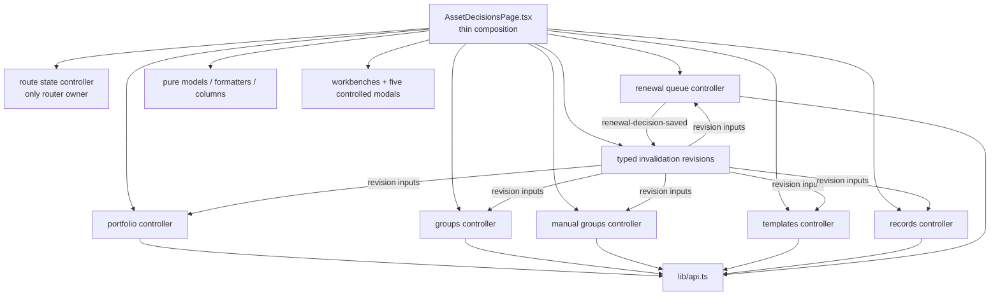

# Asset Decisions 领域拆分设计

## 1. Decision Summary

采用“七个 route-scoped controller + 薄 page coordinator + typed invalidation revisions”。每个 controller 拥有一个业务域的读取、局部 UI state、mutation 和错误；page 只组合 controller 结果、纯 model 与展示组件。URL 是实体打开状态的唯一真相。

本设计是结构重构，不改变请求/响应、可见行为或业务语义。详细基线见 `research/baseline.md`。

## 2. Alternatives

### A. 七域 controller + 明确协调（采用）

- 优点：边界与现有 API/测试自然对应；可按域迁移、验证和回滚；跨域依赖在 page 和 typed event 中可见。
- 代价：controller contract 与 page wiring 较显式，短期会增加类型和少量 adapter。
- 选择理由：这是唯一同时关闭 2,705 行总控、保留当前 React/URL 模式且不引入新 runtime abstraction 的方案。

### B. 单一 `useReducer` / `useAssetDecisionsController`（拒绝）

- 优点：集中 action，减少裸 setter。
- 缺点：读取、草稿、mutation 和导航仍聚合为新总控；只是把 2,705 行换到另一个文件，无法满足 P2-05。

### C. page Context + event bus（拒绝）

- 优点：展示树 props 较少。
- 缺点：controller 依赖变成运行时订阅，测试和失效集合更难追踪；仓库只有 Auth/Theme 两个全局 Context，本路由没有引入第三个 Context 的必要。

## 3. Target Dependency Graph



禁止边：controller → controller、controller → presentation、presentation → controller/API、route page → API。

## 4. File Ownership

### Route and composition

- Modify `web/src/pages/AssetDecisionsPage.tsx`: 七个 controller 的唯一 composition point；无 API import、无 `useEffect`、无 router hook。
- Delete `web/src/pages/AssetDecisionsPageContent.tsx` after all domains move.

### Controllers

- Create `web/src/pages/asset-decisions/hooks/useAssetDecisionRouteState.ts`
- Create `web/src/pages/asset-decisions/hooks/useAssetDecisionPortfolio.ts`
- Create `web/src/pages/asset-decisions/hooks/useAssetDecisionGroups.ts`
- Create `web/src/pages/asset-decisions/hooks/useAssetDecisionManualGroups.ts`
- Create `web/src/pages/asset-decisions/hooks/useAssetDecisionTemplates.ts`
- Create `web/src/pages/asset-decisions/hooks/useAssetDecisionRecords.ts`
- Create `web/src/pages/asset-decisions/hooks/useAssetDecisionRenewalQueue.ts`
- Create `web/src/pages/asset-decisions/hooks/invalidation.ts`: event/revision type、初始值和纯 reducer；不访问 React、API 或 router。

### Presentation/pure modules

- Reuse `businessLogic.ts`, `recordDrafts.ts`, `tableColumns.tsx`, `renderHelpers.tsx`, `formatters.ts`, `utils.ts`, `types.ts`, `constants.ts` as single owners.
- Create `components/RecordDraftMemberRows.tsx`, `components/RecordExecutionBoard.tsx`, `components/RecordFollowupRows.tsx` for JSX that currently closes over page state.
- Modify workbench/modal props from `React.Dispatch<SetStateAction<T>>` to semantic callbacks such as `onUpdateRecordDraft(patch)`, `onUpdateMemberDraft(patch)`, and `onUpdateDecisionDraft(patch)`. Components remain controlled and do not know controllers.

### Tests/contracts

- Keep `web/src/pages/AssetDecisionsPage.test.tsx` for route composition and primary workflows.
- Create colocated hook tests for each controller, modal tests for the five modal boundaries, `businessLogic.test.ts`, and shared `testFixtures.ts`.
- Create `web/src/security/assetDecisionArchitectureContract.test.ts` using the installed `typescript` compiler AST.

## 5. Common Controller Shape

Each exported hook returns an object with exactly two public namespaces:

```ts
type Controller<State, Commands> = Readonly<{
  state: Readonly<State>
  commands: Readonly<Commands>
}>
```

The generic above documents the shape; implementation may use explicit return types rather than create a shared abstraction. Public command types must not contain `React.Dispatch`, `SetStateAction`, or internal setter functions. Presentation callbacks receive values/patches; controller commands decide how state changes.

Async commands that cross a domain boundary return `Promise<Detail | null>`:

- success: owner state is already updated and the returned detail lets page open the target route;
- failure: owner records the error, returns `null`, and page leaves the current route/modal in place;
- no controller directly invokes another controller command.

## 6. Route State Contract

```ts
type AssetDecisionOpenSelection =
  | { type: 'group_id'; id: string }
  | { type: 'manual_group_id'; id: string }
  | { type: 'record_id'; id: string }
  | { type: 'template_id'; id: string }
  | null

type AssetDecisionRouteState = {
  filter: AssetDecisionGroupListFilter
  workbench: WorkbenchView
  portfolioView: MainWorkbenchView
  renewalWindow: RenewalWindow
  secondary: SecondaryWorkbench | null
  open: AssetDecisionOpenSelection
  contextFilterChips: ContextFilterChip[]
  searchSignature: string
}

type AssetDecisionRouteCommands = {
  setWorkbench(value: MainWorkbenchView): void
  setRenewalWindow(value: RenewalWindow): void
  setSecondary(value: SecondaryWorkbench | null): void
  openEntity(type: Exclude<AssetDecisionOpenSelection, null>['type'], id: string): void
  closeEntity(type: Exclude<AssetDecisionOpenSelection, null>['type']): void
  clearFilter(key: ContextFilterKey): void
  clearAllFilters(): void
  navigateToVPS(vpsID: string): void
  navigateToVPSSubscription(vpsID: string): void
}
```

Rules:

1. Only this file imports/calls `useSearchParams` and `useNavigate`.
2. Parse priority remains group → manual → record → template. `openEntity` removes the other three open keys and preserves all context keys.
3. `workbench=single_queue` remains a legacy read value, while UI tabs only write `MainWorkbenchView` values.
4. `secondary` is derived from URL first, then the user's local selection for the same search signature. Changing URL invalidates a stale local selection exactly as today.
5. The controller derives selection directly from URL; it does not mirror four selected IDs or use a timer to synchronize them.
6. Each domain keys detail/draft state by selected entity ID, so back/forward cannot show a prior entity's draft while a new detail is loading.
7. `filter` remains memoized against the complete `searchParams` object, not only semantic filter fields. This deliberately preserves the current four filtered reloads when an open key changes; request-count optimization is out of scope.

## 7. Domain Contracts

### 7.1 Portfolio

Inputs: `{filter, revision}`.

State: overview loading/error/value only. Command: `reload()` increments only the controller-local retry revision. Overview failure never clears or labels groups because groups are a different controller.

### 7.2 Groups

Inputs: `{filter, renewalWindow, selectedGroupID, revision}`.

State: group list loading/error/rows, keyed detail state, active detail panel. Commands: reload list/detail, select panel, close/reset detail UI. It owns no write endpoint. Creating a manual group is a manual-groups command; saving a record is a records command.

### 7.3 Manual Groups

Inputs: `{filter, renewalWindow, selectedManualGroupID, revision, onNotice}`.

State includes list/detail, keyed panel, candidate VPS catalog, member-add draft/advanced flag, saving/error maps, pending removal, and preserved summaries keyed by filter.

Commands:

```ts
createFromAutomatic(detail): Promise<AssetDecisionManualGroupDetail | null>
createFromTemplate(template, draft): Promise<AssetDecisionManualGroupDetail | null>
patchCurrent(input): Promise<void>
addMember(): Promise<void>
requestMemberRemoval(member): void
cancelMemberRemoval(): void
removeMember(member): Promise<void>
updateMemberAddDraft(patch): void
setMemberAddAdvanced(visible): void
selectPanel(panel): void
```

All manual mutations apply the returned detail through one `applyDetail` helper that updates keyed detail, list summary and pending removal. Candidate catalog belongs here because only manual member creation consumes unfiltered `/api/vps`.

### 7.4 Templates

Inputs: `{selectedTemplateID, renewalWindow, revision, onNotice}`.

State: list/detail, keyed panel/draft, saving/error, pending status confirmation. Commands: create from manual group, patch status, request/cancel status confirmation, update manual-group draft, select panel. Built-in templates remain non-patchable.

Creating a manual group from a template is not owned here; page invokes `manualGroups.commands.createFromTemplate(template, templates.state.manualDraft)` and opens the returned manual group.

### 7.5 Records

Inputs: `{filter, selectedRecordID, revision, onNotice}`.

State: list/detail, keyed panel, record draft/member edit, save error/saving, patch status/error/saving, follow-up drafts/per-member saving/editing.

Commands:

```ts
startFromAutomatic(detail, renewalWindow): void
startFromManual(detail): void
updateDraft(patch): void
updateDraftMember(vpsID, patch): void
cancelDraft(): void
saveDraft(): Promise<AssetDecisionRecordDetail | null>
patchStatus(): Promise<void>
updateFollowupDraft(vpsID, patch): void
saveFollowup(member, nextStatus?): Promise<void>
selectPanel(panel): void
```

Record status and member follow-up update current detail and matching list summary from the API response; they emit no cross-domain invalidation and never write VPS/subscription/monitoring/target.

### 7.6 Renewal Queue

Inputs: `{renewalWindow, revision, onNotice, onInvalidate}`.

State: current `QueueState`, queue view, selected VPS, renewal draft/submitting/error, derived visible queue/counts/maps. Commands: select/close VPS, select queue view, update draft, navigate actions, submit renewal.

`submitRenewal` preserves the exact PATCH body. It first applies `updateDecisionQueues` and subscription-linkage response locally, closes the draft, then emits `{type:'renewal-decision-saved', vpsID}`. It does not know which controller revisions change.

## 8. Typed Invalidation

```ts
type AssetDecisionReadDomain =
  | 'portfolio'
  | 'groups'
  | 'manualGroups'
  | 'templates'
  | 'records'
  | 'renewalQueue'

type AssetDecisionInvalidationEvent = {
  type: 'renewal-decision-saved'
  vpsID: string
}

type AssetDecisionRevisions = Record<AssetDecisionReadDomain, number>
```

`invalidation.ts` is the only event→targets owner. For compatibility, `renewal-decision-saved` increments all six domain revisions. The controllers' existing filter/selection inputs remain dependencies, so this reproduces 11 GET plus an open detail GET. Local retry revisions stay private and do not fan out.

No arbitrary `invalidate(['groups', ...])` API is exposed: callers emit a semantic event, and one tested mapping decides targets. This prevents a mutation from silently growing or shrinking its refresh surface.

## 9. Cross-Domain Composition

| User action | Owner command | Page coordination after success |
| --- | --- | --- |
| auto group → manual | manual `createFromAutomatic` | close group/open `manual_group_id`; set scenarios secondary；URL identity 重跑四个 filtered reads + manual detail |
| template → manual | manual `createFromTemplate` | close template/open `manual_group_id`; keep scenarios secondary；重跑四个 filtered reads + manual detail |
| manual → template | templates `createFromManualGroup` | close manual/open `template_id`; keep scenarios secondary；重跑四个 filtered reads + template detail |
| auto/manual → record | records `saveDraft` | close source/open `record_id`; set records secondary；重跑四个 filtered reads + record detail |
| record source review | no mutation | route opens existing group/manual source |
| renewal saved | renewal `submitRenewal` | invalidation coordinator bumps revisions; route selection is unchanged |

The page may own one notice state and semantic coordination callbacks. It must not parse API responses, create request bodies, or update controller internals.

## 10. Async, Error, and Stale-State Rules

- Every read effect keeps the existing cancelled flag; no state update after cleanup.
- A detail state is stored with its entity ID. While requested ID differs from stored ID, the public state is a loading state rather than stale data.
- List/detail failures remain within their owner and use existing Chinese fallback text. Successful sibling sources stay visible.
- Mutation commands set error to null at start, keep the current modal open on failure, and clear saving in `finally`.
- Confirmation commands only change pending local state; DELETE/PATCH occurs only after the explicit confirm callback.
- Draft close/reset semantics stay domain-local. Route close alone cannot leak an old draft into another ID.
- Returned API representation is the sole optimistic/local update source; no frontend reconstruction of backend business results.

## 11. Presentation Boundary

- `PortfolioWorkbench`, `SecondaryWorkbenches` and the five modal exports remain controlled components.
- Existing DOM hierarchy, roles, labels, tab IDs, modal nesting, CSS classes and text remain unchanged.
- Column factories and new record subcomponents may receive semantic callbacks and current values, never controller instances.
- Modal props may use domain types from `lib/types.ts` and local view types, but cannot import `lib/api` or `hooks/*`.
- No component exposes or receives `React.Dispatch`; functional setter expressions are replaced with typed patches computed from current props.

## 12. Architecture Contract

`assetDecisionArchitectureContract.test.ts` parses every non-test `AssetDecisionsPage.tsx` and `asset-decisions/**/*.{ts,tsx}` source with `typescript.createSourceFile`.

It must assert:

1. exact seven controller entry files exist;
2. no production basename matches `*PageContent.tsx`;
3. route page has no API import and no `useEffect`/`useSearchParams` call;
4. only route-state controller imports/calls router hooks;
5. each controller's `lib/api` named imports are within the baseline owner whitelist;
6. controllers do not import other controllers or presentation paths;
7. presentation paths do not import API/controllers;
8. page ≤400 lines, each controller ≤600, all domain production files ≤800, each controller ≤3 `useEffect` calls;
9. test includes synthetic pass/fail sources so the audit implementation itself cannot silently stop detecting forbidden edges.

Tests and fixtures are excluded by semantic filename classification, not a broad directory wildcard. Failures list path, symbol/edge, line and budget.

## 13. Test Ownership

- Characterization page tests prove wire/URL/DOM compatibility before extraction.
- Hook tests use `renderHook` + router wrapper and mock API/fetch boundaries to prove loading, partial error, cancellation, mutation and revisions.
- Modal tests prove controlled props, form patch callbacks, nested confirmation and no hidden write before confirm.
- `businessLogic.test.ts` moves derived queue/metrics/lead coverage out of the page integration file.
- Page tests retain at least one end-to-end workflow across every cross-domain transition; unit tests do not replace workflow evidence.
- Test moves are mechanical first; each moved test must pass unchanged before assertions are refactored.

## 14. Migration and Rollback

Migration order is route state → invalidation/portfolio → groups → manual groups → templates → records → renewal queue → page composition/test ownership/AST guard.

Each domain commit must leave the full current page tests green. A controller can be integrated into the existing Content during migration; `AssetDecisionsPageContent.tsx` is deleted only after the last domain leaves it.

| Batch | Rollback trigger | Rollback action |
| --- | --- | --- |
| characterization | assertion does not describe current observable behavior | correct/revert test-only commit before production edits |
| route state | query order/value, deep link, close/back/forward or secondary workbench changes | revert route commit; no domain data commit is required |
| portfolio/groups | request set, partial error or group detail differs | revert current controller commit only |
| manual/templates | payload, local summary, modal transition or confirmation differs | revert current owner commit; do not patch another domain |
| records/renewal | record payload/follow-up or renewal refresh set differs | revert current owner commit; retain earlier green domains |
| composition/guard | DOM/accessibility/browser difference or guard false positive | restore Content composition while keeping already tested controllers, then fix the final wiring separately |

No rollback path changes backend data or API. A behavior difference is not fixed by adding a cross-domain setter; it returns to the owning batch.

## 15. Risks and Mitigations

- React effect timing can create duplicate/missing detail GET: freeze call counts and keyed-selection behavior before extraction.
- URL as source of truth can expose back/forward stale drafts: key detail/draft by entity ID and test history transitions.
- Existing dead/duplicate helper modules can diverge: search before extraction, use current `tableColumns`/models, delete duplicated Content functions at their owner commit.
- Large test moves can hide lost assertions: move by named workflow groups, run focused tests after every move, and keep test count/inventory evidence.
- Structure guard can become a regex gate: use TypeScript AST plus synthetic fixtures and actionable failures.
- Browser mock cannot prove backend correctness: label evidence `mock-api asset-workflows`; final real staging remains Task 10/main-task gate.
