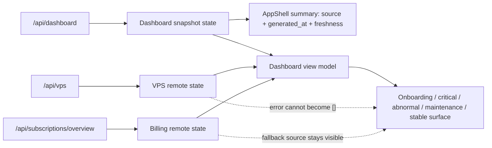

# 前端全方位审查与修复设计

## 1. 结论摘要

本轮没有发现已经能够复现的数据丢失、权限绕过或全站不可用问题，因此没有 P0。
但“现有测试全绿”不能代表前端已经可靠：审查确认 7 个 P1，分别落在嵌套弹窗、Dashboard 业务事实、Shell 状态语义、生产 CSP 和本地质量门。另有一组 P2/P3 会持续制造回归，包括原子组件语义不完整、移动端裁切、超大页面与全局 CSS 债、缺少错误边界、测试与现行设计契约脱节。

最重要的判断不是“再修一轮样式”，而是把修复对象从单个症状提升为可执行的不变量：

- 弹窗必须由栈管理，而不是每个弹窗各自监听整个 document。
- 空数据、请求失败和降级数据必须是不同状态，不能共享 `[]` / `null`。
- Dashboard 只能展示后端明确提供的事实，摘要不能冒充 Center health 或实时同步状态。
- CSP 必须用真实生产响应头验证，不能只检查响应头存在。
- 结构守护必须约束真实职责和依赖方向，不能只约束一个可被 wrapper 绕过的文件名。
- CSS 拆分要减少规则、建立所有权和预算，不能只移动原规则。
- 测试名称、断言和设计契约必须一致；“跟着当前 DOM 改到通过”不构成防回归。

推荐采用“风险优先、按领域渐进收敛”的方案：先修验证链路与 7 个 P1，再修共享交互原子和移动端，最后在行为测试保护下拆 Asset Decisions 与 CSS。不要进行一次性前端重写。

## 2. 审查范围与证据

### 2.1 覆盖面

- React 路由、AppShell、全部 route page、共享组件与 atoms。
- API client、手写 TypeScript contract、加载/错误/空态、并发与降级行为。
- 键盘、焦点、读屏语义、表单原生约束、响应式布局。
- CSS cascade、tokens、重复规则、产物体积和 route code splitting。
- Vitest、ESLint、TypeScript build、Vite build、npm audit、Makefile 与 CI。
- Center SPA 托管与安全响应头，尤其是 CSP。
- 现行 `.trellis/spec/web/`、`docs/design/current/`、近期前端任务与提交。

### 2.2 可复现基线

| 检查 | 结果 | 说明 |
| --- | --- | --- |
| `NODE_ENV=test npm run lint` | 通过 | 无 ESLint error |
| `NODE_ENV=test npm run test -- --run` | 通过 | 74 files / 578 tests |
| `npm run build` | 通过 | TypeScript build 与 Vite production build 均完成 |
| `npm audit --include=dev` | 通过 | 0 vulnerabilities |
| `npx tsc -p tsconfig.app.json --noEmit --strict` | 通过 | 当前代码可直接开启 `strict`，配置却未开启 |
| 真实 CSP 浏览器抽查 | 失败 | 每条抽查路由均有 CSP violation |
| 桌面/移动浏览器抽查 | 部分通过 | 13 条核心路由均非空白、无 document 级横向溢出；确认多处裁切与层级问题 |

环境说明：当前机器是 Node `v24.18.0`，`web/package.json` 要求 Node `22.x`，CI 使用 Node 22。当前 shell 还设置了 `NODE_ENV=production`，这直接暴露了 `verify-web` 的环境继承问题。

### 2.3 规模与结构

| 指标 | 当前值 | 判断 |
| --- | ---: | --- |
| 生产 TS/TSX | 237 files / 45,609 lines | 页面与领域逻辑已经进入需要边界治理的规模 |
| 测试 TS/TSX | 74 files / 27,957 lines | 测试量不低，但结构与浏览器契约覆盖不足 |
| 有同名 colocated test 的生产文件 | 73 / 237 (30.8%) | 仅作测试分布代理，不等同于 coverage |
| 全局 CSS 源码 | 435,865 bytes | 加独立 Login route CSS 后全部 CSS 约 440 KB |
| 全局 CSS AST | 3,044 rules / 11,892 declarations | cascade 面过大 |
| 重复完整 selector 文本 | 约 178 | 包含合理响应式覆盖，也包含遗留重复定义 |
| 生产主 CSS | 415,864 bytes / 约 52 KB gzip | 原始体积大于入口 JS，且所有路由都加载 |
| 生产入口 JS | 344,937 bytes / 约 107 KB gzip | route lazy splitting 已生效，是正面证据 |
| Asset Decisions 主编排 | 2,705 lines / 73 hook 调用点 | 单组件同时承担加载、派生、命令与弹窗状态 |

### 2.4 已确认的正面证据

- 所有页面已经通过 `React.lazy` 按路由拆包，未把全部 route page 塞进入口 JS。
- API 请求集中在 `web/src/lib/api.ts`，默认带 `credentials: 'include'`、`cache: 'no-store'`，401 有统一 hook。
- 未发现 `dangerouslySetInnerHTML`、`eval` 或 `new Function`；外链新窗口均使用 `rel="noreferrer"`。
- npm 依赖审计为 0 vulnerabilities。
- `DataTable` 已覆盖点击行的 Enter/Space 激活与子控件事件隔离，属于可以继续复用的共享实现。
- 全部核心路由在 mock contract 下可渲染，桌面与 390px 视口均未出现整页空白。
- `prefers-reduced-motion` 已有全局兜底。

这些正面结果说明项目不需要重写；问题集中在契约边界与防回归机制，而不是技术栈本身。

## 3. 严重度定义

- **P0**：已确认的数据丢失、权限绕过、敏感信息泄漏、全站不可用或无法回滚的发布事故。本轮无确认项。
- **P1**：会让用户基于错误事实决策、破坏关键操作、导致生产安全策略与页面不兼容，或使质量门不可重复。
- **P2**：常用流程明显受阻、键盘/移动端不可用，或结构债已经显著放大回归概率。
- **P3**：当前影响较低的治理、性能预算、文档与工程一致性问题。

## 4. P1 确认问题

### P1-01 嵌套 Modal 没有栈语义

**证据**

- `web/src/components/atoms/Modal.tsx:30` 为每个 Modal 独立调用 `useModalFocus`。
- `web/src/lib/useModalFocus.ts:33-72` 为每个打开的 Modal 向 `document` 注册完整 Escape/Tab handler。
- `web/src/components/atoms/Modal.tsx:56-58` 又在 overlay 上处理一次 Escape。
- `web/src/components/atoms/Modal.tsx:33-42` 由每个实例独立写入/清空 `body.style.overflow`。
- 资产决策详情中确有嵌套确认框，例如 `TemplateDetailModalContent.tsx:67-150` 与 `ManualGroupDetailModalContent.tsx:125-435`。
- 真实浏览器复现：子确认框打开后 Tab 会被父弹窗抢回；Escape 会同时关闭父子层；只关闭子层后父层仍在，但 body scroll lock 已被释放。

**影响与根因**

关键确认操作对键盘用户不可靠；误按 Escape 会丢失父层上下文。根因是“单弹窗 focus trap”被当成“多弹窗管理”，缺少 top-most 判定、栈级 focus restore、underlay inert 和引用计数 scroll lock。

**修复边界**

- 新增单一 `modalStack` 协调器，注册稳定 modal id、container、restore target，只允许栈顶处理 Escape/Tab/backdrop。
- `Modal` 只保留一条键盘事件路径，删除 overlay 与 document 的重复 Escape 处理。
- 非栈顶 dialog 设置 `aria-hidden`/`inert`，栈顶关闭后把焦点恢复到父层触发点。
- body scroll lock 使用引用计数，最后一个 Modal 关闭时才恢复原值。
- 覆盖单层、双层、三层、persistent、异步关闭和 unmount 清理。

**验收**

- 任意时刻焦点只在最上层 dialog 内循环。
- 一次 Escape 只关闭最上层；persistent 栈顶不被 Escape/backdrop 关闭。
- 子层关闭后父层仍锁住页面滚动，焦点回到父层原触发按钮。

### P1-02 Dashboard 异常监控实例重复计数

**证据**

- `web/src/pages/DashboardPage.tsx:127` 计算 `abnormal + severe`。
- `internal/center/store/dashboard.go:368-371` 明确把 abnormal 定义为 `current_health_status <> '正常'`，severe 定义为其中 `= '严重'` 的子集。

**影响与根因**

Dashboard 会把严重实例重复计入“异常监控实例”，直接夸大待处理规模。根因是前端没有把聚合字段的集合关系当作 contract，而是凭字段名再次组合。

**修复边界与验收**

- 该卡片直接使用 `abnormal_monitoring_instance_count`；severe 只作为严重度分层，不参与总数相加。
- 加 fixture：abnormal=2、severe=1 时 UI 必须显示 2；后端 contract test 同时说明 subset 关系。

### P1-03 Dashboard 把依赖请求失败伪装成真实空数据

**证据**

- `web/src/pages/DashboardPage.tsx:74-78` 把 `/api/vps` 失败吞成 `[]`，把订阅 overview 失败吞成 `null`。
- `web/src/pages/DashboardPage.tsx:133-136` 用 `vpsAssets.length === 0` 推导首次接入。
- 因此 `/api/dashboard` 成功、`/api/vps` 失败且 dashboard 计数为零时，会错误显示“先创建第一台 VPS”。

**影响与根因**

用户会被引导创建重复资产，或把订阅数据降级误认为真实零值。根因是状态模型只保存值，没有保存每个资源的 loading/success/error/source。

**修复边界**

- 将 dashboard、VPS、subscription overview 分别建模为 discriminated remote state。
- 首次接入只允许在 VPS 请求成功且数组为空时成立；请求失败显示局部降级状态与重试，不覆盖已成功的 dashboard。
- 如果使用 dashboard asset summary 作为订阅 fallback，UI 必须标明数据来源和生成时间，不把 fallback 当作同精度数据。

### P1-04 AppShell 把一次性 Dashboard 摘要冒充实时系统健康

**证据**

- `web/src/app/layout/AppShell.tsx:50-77` 仅在 mount 时调用一次 `getDashboard()`。
- `web/src/app/layout/AppShell.tsx:107-123` 根据摘要是否有异常输出“系统正常”。
- `.trellis/spec/web/state-and-data.md:408-410` 明确禁止把 Dashboard snapshot 写成 Center health、同步或全链路实时性。
- 当前测试 `AppShell.test.tsx:255-264` 反而把“系统正常”固化成期望。

**影响与根因**

长时间打开页面后，顶部状态和 nav badge 会过期；即使摘要无异常，也不能证明 Center、agent 或通知链路正常。根因是 presentation label 超出了 API contract，且没有 freshness policy。

**修复边界**

- 将 `SyncStatus` 语义改为“系统摘要”：`摘要有异常`、`摘要无异常`、`摘要不可用`、`摘要已过期`。
- 展示 `snapshot_generated_at` 的生成时间，不使用浏览器当前时间伪装同步时间。
- 在页面重新可见/窗口 focus 时刷新；如需轮询，复用 `useAutoRefresh` 并设保守间隔，避免多处重复请求。
- nav count 在 loading/error/stale 时不得让 0 暗示“无异常”。

### P1-05 Dashboard 已偏离现行信息架构，测试也发生语义漂移

**证据**

- 现行 spec 要求 asset-decision-first command surface、唯一“今日第一步”，并禁止独立 KPI strip 和最近事件列表：`.trellis/spec/web/state-and-data.md:408-413`。
- 当前 `DashboardPage.tsx:172-193` 首屏是四张等权统计卡，后续又展开关注、观测、事件、账单、经验记录与资产表。
- 390x900 实测中四张大卡占据绝大部分首屏，核心处理工作流落到首屏以下。
- `DashboardPage.test.tsx:131` 的用例仍命名为“asset-decision-first command surface”，断言却是统计卡、事件列和账单列。
- `web/src/pages/dashboard/DashboardCommandSurface.tsx` 共 692 行且没有生产调用；同目录多项原有 command-surface 组件成为不可达代码。

**影响与根因**

日常入口从“下一步行动”退回“字段概览”，移动端尤甚。更危险的是测试名称保留旧契约、断言跟随新 DOM，使全绿结果产生错误信心。根因是实现、spec 和测试没有在同一次变更中完成契约评审。

**修复边界**

- 以现行 spec 为准重建 Dashboard view model：首次接入、严重异常、一般异常、维护观察、稳定五种明确状态。
- 首屏只保留一个主行动和最多三个低权重判断摘要；资产、观测事实作为证据 lane，不恢复字段仓库。
- 评估现有 `DashboardCommandSurface`：可复用的纯派生逻辑迁入小型 model；其余删除，不能同时保留两套未使用实现。
- 重写 Dashboard 测试，使测试名、状态 fixture、可见内容、深链与禁止出现内容逐项对应 spec。

### P1-06 生产 CSP 与页面资源模型不兼容

**证据**

- `internal/center/http/middleware.go:92` 的 CSP 为 `default-src 'self'; frame-ancestors 'none'; object-src 'none'; base-uri 'self'`。
- `web/index.html:5` 请求 Google Fonts；`web/index.html:9-20` 包含 inline theme bootstrap。
- `web/src/styles/tokens.css:30,78,127` 使用 `data:` SVG 作为 select caret。
- 生产 TSX 还有 16 处 inline `style`，包括计算型 score、bar、chart、tooltip 和静态 spacing。
- 真实 Center CSP 下，所有抽查路由均产生 violation；Google Fonts、theme bootstrap、data image 和 inline style 分别受 `default-src` fallback 约束。
- `middleware_test.go:223-224` 只断言 CSP header 非空，没有验证页面资源兼容性。

**影响与根因**

生产环境会使用 fallback 字体、首屏主题可能闪烁、select caret 缺失，依赖 inline style 的条形图、score 和 tooltip 可能失去布局。根因是后端安全策略与 Vite/React 资源契约分别演进，测试只验证“有 CSP”，不验证“严格 CSP 下可运行”。

**推荐修复**

- 保持严格同源策略，不用 `unsafe-inline` 或宽泛远程域名掩盖问题。
- IBM Plex 字体改为仓库自托管 WOFF2；若不接受字体资产体积，明确退回系统字体栈。
- theme bootstrap 移到同源外部脚本，并在 CSS 前同步加载。
- select caret 改为同源静态 SVG。
- 16 处 inline style 逐类消除：静态样式迁 CSS；score/bar 使用原生 `progress` 或 SVG attribute；chart/tooltip 使用 SVG 坐标属性；Stepper 改为 flex 或有限 modifier。
- CSP 显式声明 `script-src/style-src/img-src/font-src/connect-src 'self'`，并增加 source scan、Center header contract 和真实浏览器 console 三层验证。

### P1-07 `verify-web` 继承外部 `NODE_ENV`，结果不可重复

**证据**

- `Makefile:92-95` 在同一环境直接运行 `npm ci`、lint、Vitest 和 build。
- 当前 shell 的 `NODE_ENV=production` 会令 `npm ci` 省略 devDependencies；若 node_modules 已存在，Vitest 又会加载 React production build，造成 503/575 一类的大面积测试失败。
- 显式 `NODE_ENV=test` 后 74 files / 578 tests 全部通过。
- CI 当前未设置 `NODE_ENV`，所以 CI 绿色不能证明命令在开发机、release shell 或 Docker 上可重复。

**修复边界**

- install 使用 `env -u NODE_ENV npm ci --include=dev`。
- lint/test 显式使用 `NODE_ENV=test`，production build 显式使用 `NODE_ENV=production`。
- 先检查 Node major=22，错误时给出清晰诊断；增加 `.node-version` 或 `.nvmrc`。
- CI 增加一个带外部 `NODE_ENV=production` 调用 `make verify-web` 的回归步骤，证明 recipe 自己隔离环境。

## 5. P2 确认问题

### P2-01 表单 atoms 没有完整传递原生与读屏契约

- `Select.tsx:18` 解构 `required`，但 `Select.tsx:35` 没有把它传给 `<select>`；required 目前只改变 label 样式。
- `Input.tsx` 与 `Select.tsx` 的 error/hint 都没有稳定 id、`aria-describedby`、`aria-invalid`；Select 还没有同名测试。
- 修复应落在 atoms，一次覆盖所有调用方；测试原生 `required`、label、error、hint、自定义 `aria-describedby` 合并和 ref forwarding。

### P2-02 Tabs 只实现了视觉选中，没有完整 ARIA tabs 键盘模型

- `Tabs.tsx:24-45` 给所有 tab 默认可 Tab 到达，没有 roving `tabIndex`，不处理 ArrowLeft/ArrowRight/Home/End，也不关联 tab 与 tabpanel。
- 通用 `.tabs--pill .tab` 允许文字压缩；390px 设置页实测“监控策略”等标签逐字换行。
- 修复 Tabs atom 的键盘、id/controls 和水平滚动；Settings/详情页提供明确 tablist label 与 tabpanel。

### P2-03 多处交互仍使用不可聚焦的 `div/span/tr`

- TypeScript AST 审查找到 18 个带 `onClick` 的非原生交互标签；排除 backdrop、事件隔离容器及已经实现键盘行为的表格后，仍有至少 12 个真实命令缺少等价键盘入口。
- 集中在 `DashboardPage.tsx:201-340`、`VPSPage.tsx:497`、`Sidebar.tsx:76`、`TopBar.tsx:87`。
- 导航使用 `Link/NavLink`，命令使用 `button`；不要给 `div` 叠加一组模拟 button 的属性。表格以主单元格 link 为核心，整行点击只做增强。
- AppShell 增加 skip link，用户菜单/主题菜单增加 Escape、Arrow 和 focus return。

### P2-04 移动端与窄容器缺少一致的 overflow 策略

- 设置 Tabs 在 390px 逐字换行。
- Asset Decisions 底部辅助入口把“场景与组合”裁为“场...”；其 CSS 同时存在 flex、920px grid、640px 重复 grid 覆盖。
- 服务商“组合决策”文字被 `max-width:48px` 主动裁切，且 entry-links 使用 `overflow:hidden`。
- Dashboard 420px 以下四张统计卡变为单列，核心行动被推到首屏以下。
- 修复应定义三种明确策略：命令不裁切、tabs 横向滚动、数据表在有可见 affordance 的局部区域横向滚动；不得依赖隐藏文字加 `aria-label` 掩盖可见信息缺失。

### P2-05 Asset Decisions 的结构门槛被 wrapper 绕过

- `AssetDecisionsPage.tsx` 只有 5 行，真实实现位于 2,705 行的 `AssetDecisionsPageContent.tsx`。
- `AssetDecisionsPage.test.tsx:2996-3002` 只检查 wrapper 不超过 800 行；提交 `76dadb6` 正是把原文件整体搬到 Content。
- Content 包含 73 个 hook 调用点（其中 12 个 effect）、十余个 remote state、选择状态、编辑草稿和 mutation 状态，拆出的展示组件仍由一个总控组件穿透大量 setter。
- 行数不是目标；修复要按业务域拆 controller hooks：portfolio、groups、manual groups、templates、records、renewal queue、URL selection，并用 command API 暴露行为。守护测试应扫描 route controller 与领域文件上限、禁止 wrapper-only 逃逸，并配依赖方向检查。

### P2-06 CSS 已物理拆分，但遗留 cascade 复杂度没有下降

- `index.css` 仍串联 24 个 partial；`legacy-assets.css` 约 98 KB，`legacy-vps.css` 约 43 KB，`legacy-misc.css` 约 41 KB，`legacy-dashboard.css` 约 40 KB。
- 最近三次 CSS split commit 基本保持原规则与产物体积，只改变文件位置。
- `modernize.css` 继续作为末尾 override；约 178 个完整 selector 文本重复，现有 `indexCssContract.test.ts` 只用正则检查三个 first-match 规则。
- 先建立 PostCSS AST inventory、owner map、重复 selector allowlist 和 bundle budget，再按 route/domain 删除不可达规则；不要再次做纯搬家式拆分。

### P2-07 应用没有 render error boundary 或 lazy chunk 恢复面

- `router.tsx` 没有 `errorElement`，应用顶层也没有 React ErrorBoundary。
- route render exception 或动态 chunk 加载失败时，用户可能只看到空白，当前 `RouteModuleFallback` 只覆盖 loading。
- 增加路由级错误页与顶层 boundary，提供重试/刷新/返回工作台；测试 render error 与 rejected lazy import，不把敏感对象直接输出到 UI。

### P2-08 顶栏通知按钮是无行为的假入口

- `TopBar.tsx:106-114` 渲染可点击按钮和固定 `0` badge，但没有 handler、route 或真实 notification count contract。
- 要么删除按钮，要么把它明确链接到已有 `/events?notification_only=1` 并使用真实 contract；不能保留无行为控制。

### P2-09 TypeScript 和 ESLint 配置低于代码当前可达到的安全线

- `tsconfig.app.json` 未启用 `strict`，但本轮 `--strict` 探针已经通过，说明可以零迁移成本开启。
- ESLint 使用非 type-aware recommended config，没有检查 floating promises、unsafe assignment 等跨类型问题。
- 先直接开启 `strict`；`noUncheckedIndexedAccess`、`exactOptionalPropertyTypes` 和 type-aware lint 分批引入，按目录偿还，不在一个 PR 制造海量噪音。

### P2-10 测试数量可观，但缺少能捕获本轮问题的质量层

- 74 files / 578 tests 全绿，却没有发现错误计数、嵌套 Modal、CSP、移动裁切、Tabs 键盘和 `required` 丢失。
- 未配置 coverage、Playwright、axe、bundle budget 或 browser console gate。
- Dashboard 测试标题与断言相互矛盾；Asset Decisions 结构测试可被 wrapper 绕过；CSS contract 仅三条正则 first-match 断言。
- 改为测试金字塔：纯 model/contract 单测、组件交互测试、少量核心 Playwright 流程、CSP/console/a11y/viewport gate；coverage 先记录基线并 ratchet，不直接设任意全局 80%。

## 6. P3 与风险项

### P3-01 前端规范已再次漂移

`.trellis/spec/web/directory-structure.md` 与 `styling-guidelines.md` 仍把 `styles/atoms.css`、`styles/pages.css`、`app/layout/layout.css` 描述为现行结构，实际已迁到 `styles/partials/*`，且 layout CSS 也不再单独存在。错误规范会继续诱导后续变更落错文件。应在结构方案稳定后统一刷新，而不是追着每次物理搬家改路径。

### P3-02 Node 版本只写在 engines，没有本地可执行 pin

Node 24 与 Node 22 的 `EBADENGINE` 已在五月任务中出现，本轮仍然存在。增加 `.node-version`/`.nvmrc`、Makefile preflight，并把 `@types/node` 对齐 22.x，减少“CI 绿、本机不同语义”。

### P3-03 API contract 全部靠手写类型和 `as T`

`requestJSON<T>` 对 JSON 直接 cast，没有 runtime validation；这不是已确认 bug，但 Dashboard 字段集合误用表明 contract 语义容易漂移。短期给高风险 response 建共享 fixture/contract test；只有后端准备维护 OpenAPI 或 JSON Schema 时才引入生成链，不单独添加一套无人维护的 schema。

### P3-04 缺少真实部署数据与性能结论

本轮浏览器检查使用仓库 mock contract，没有连接真实认证 Center/PostgreSQL；未执行 Lighthouse、真实网络瀑布或长会话内存分析。因此真实性能、慢 API、真实权限和生产数据极值仍是残余风险。修复完成后应在 staging 补一次 authenticated smoke，不把 mock 结果表述为生产通过。

## 7. 为什么近期修复深度不足

历史对照显示五月审查已经提出 Drawer/Modal focus、spec drift、Node 版本和样式债。近期改动确实修掉了不少局部问题，例如 DataTable 键盘测试、Settings inline style、route lazy splitting，但缺少系统性约束：

| 近期做法 | 为什么仍会复发 | 应建立的不变量 |
| --- | --- | --- |
| 给单个 Modal 加 focus hook | 多层同时监听 document | 只有栈顶 dialog 可处理键盘与 scroll lock |
| 把 CSS monolith 拆成 partial | 规则数、重复 selector 和全局加载不变 | owner、AST budget、删除目标与 route visual gate |
| 给主文件设 800 行门槛 | 整体搬到 `*Content.tsx` 即通过 | 职责/依赖方向/真实 controller 上限 |
| 修改测试适配新 Dashboard | 测试名仍说 command surface，断言却固化 KPI | spec 状态矩阵与禁止出现项 |
| 测试 CSP header 非空 | 页面资源仍被真实策略阻断 | build asset scan + exact header + browser console |
| CI 固定 Node 22 | 本地 Make recipe 仍继承 `NODE_ENV` | 命令自身显式隔离环境并做 preflight |

## 8. 方案比较

| 方案 | 优点 | 风险 | 结论 |
| --- | --- | --- | --- |
| 一次性前端重写 | 表面上能同时清债 | 回归面最大，现有 578 tests 和成熟业务流难以迁移，交付周期不可控 | 不采用 |
| 继续按页面做视觉补丁 | 单次 diff 小、短期可见 | 无法修复事实、CSP、栈管理和质量门，最容易重复当前循环 | 不采用 |
| 风险优先、按领域渐进收敛 | 每批可独立测试与回滚，先恢复信任，再处理结构 | 需要严格控制批次边界，CSS/Asset 拆分不能抢跑 | 推荐 |

## 9. 推荐目标架构

### 9.1 Dashboard 数据流

页面 JSX 只消费 view model，不再直接组合有集合关系的后端计数。每个 remote state 都保留 status、value、error 与 source；只有明确 success-empty 才能进入空态。

### 9.2 Overlay 栈

- `Modal` 注册/注销 overlay entry。
- stack coordinator 决定 top id、scroll lock count、focus restore target。
- `useModalFocus` 只处理传入 entry 且 entry 为 top 的事件。
- 嵌套业务组件不需要知道全局栈，只继续使用受控 `open/onClose`。

### 9.3 结构与样式边界

- route page 是装配点，领域 controller hook 管远端状态和 command，纯 model 管派生。
- atoms 提供完整 native/ARIA 行为，页面不重复模拟。
- CSS 先按 ownership 标记现有规则，再删除重复和不可达块；route-specific CSS 可以跟随 lazy route，但不引入 CSS-in-JS。
- 结构测试扫描真实模块集合与 import direction，文件行数仅作为告警，不再作为唯一质量门。

## 10. 兼容、发布与回滚原则

- 不改变后端 JSON 字段语义；Dashboard 修复优先只改消费方式。若需要新的 health contract，另开跨层任务，不在前端伪造。
- 每个工作流独立 PR，先加失败测试，再改实现；禁止把 Dashboard、Modal、CSP 与 CSS 大清理塞入同一 PR。
- CSP 修复不以放宽到 `unsafe-inline` 回滚；字体自托管失败时回退系统字体栈。
- Asset Decisions 拆分期保持 DOM/请求/URL contract 不变，按领域 commit，可逐个 revert。
- CSS 每次只处理一个 owner，保留 build size、route screenshot 和关键交互基线；发生视觉回归时只回滚该 owner 批次。
- 数据库与 API 不在大多数批次的 rollback 面内；若 Dashboard freshness 需要后端新增 contract，单独迁移、单独兼容。

## 11. 残余风险与未验证项

- mock 浏览器数据不能替代真实 staging 的权限、长文本、极端数量和慢请求。
- 没有真实移动设备触控、iOS Safari、Firefox/Windows 高对比模式证据。
- 没有持续 8 小时以上的 Dashboard/详情页内存与轮询稳定性证据。
- 现有手写 API types 尚未与 Go contract 自动比对；本方案先覆盖高风险 contract，不承诺一次生成化。
- CSS 重复 selector 中包含合法的 media override，删除前必须经过 AST 上下文与视觉验证，不能按数量机械去重。
