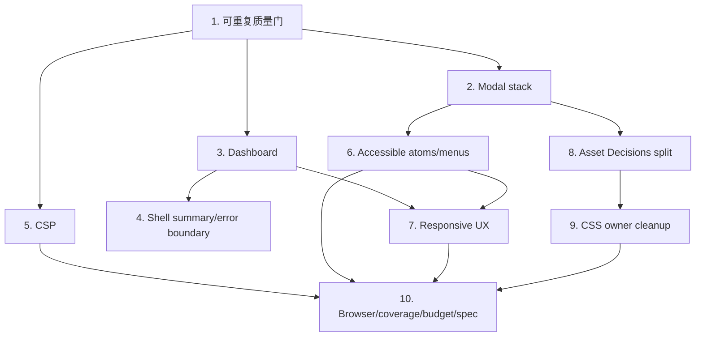

# 前端全方位修复实施计划

> **For agentic workers:** REQUIRED SUB-SKILL: Use `superpowers:subagent-driven-development` (recommended) or `superpowers:executing-plans` to implement this plan task-by-task. Steps use checkbox (`- [ ]`) syntax for tracking.

**Goal:** 在不重写前端、不改变既有后端业务语义的前提下，先消除已确认的 P1，再建立可访问、响应式、可维护且可重复验证的前端交付链路。

**Architecture:** 采用风险优先的领域批次。共享质量门先落地；Modal、Dashboard、CSP 各自独立修复；表单/Tabs/菜单等行为下沉到 atoms；Asset Decisions 与 CSS 只在行为基线完整后做结构性收敛。每个批次独立分支、独立 PR、独立回滚。

**Tech Stack:** React 19、TypeScript 6、React Router 7、Vite 8、Vitest 4、Testing Library、Go `net/http`、PostCSS AST；计划新增 Playwright 与 axe 浏览器检查。

---

## 1. 执行原则

### 1.1 分支与任务治理

- 本审查任务只保存审查与计划，不承载业务代码修复。
- 用户批准实施后，为下列每个任务创建独立 Trellis child task 与 `codex/` 非 main 分支；不要直接在 `main`/`master` 工作。
- 每个 checkout/worktree 先运行 `sh scripts/setup-git-hooks.sh`。
- 每个任务按 TDD 顺序：失败测试 -> 最小实现 -> focused test -> full web gate -> browser gate（用户可见任务）-> commit。
- 一个 PR 不跨两个高风险领域；特别禁止把 Modal、Dashboard、CSP、Asset 拆分和 CSS 清理混在一起。

### 1.2 优先级与工作量

工作量是单工程师净实现估算，不含等待 review/CI/staging 凭据的时间。

| 顺序 | 任务 | 优先级 | 估算 | 可独立发布 |
| ---: | --- | --- | --- | --- |
| 1 | 可重复质量门与 strict 基线 | P1 | 0.5-1 天 | 是 |
| 2 | Modal 栈与嵌套焦点 | P1 | 1-2 天 | 是 |
| 3 | Dashboard 事实与 command surface | P1 | 2-3 天 | 是 |
| 4 | Shell 摘要、错误边界与假入口 | P1/P2 | 1-2 天 | 是 |
| 5 | CSP 与前端资源兼容 | P1 | 2-3 天 | 是 |
| 6 | Form/Tabs/Menu 可访问性 | P2 | 2-4 天 | 是 |
| 7 | 移动端与窄容器修复 | P2 | 1-2 天 | 是 |
| 8 | Asset Decisions 领域拆分 | P2 | 4-6 天 | 是，需多 commit |
| 9 | CSS owner 化与减债 | P2 | 4-7 天 | 是，按 owner 多 PR |
| 10 | 浏览器、coverage、预算与 spec ratchet | P2/P3 | 2-3 天 | 是 |

P1 预计 6.5-11 个工程日；完整路线预计 19.5-33 个工程日。若只能投入一个短周期，完成任务 1-5 后即可形成第一道可信基线。

### 1.3 依赖图



## 2. 统一验证门

所有前端任务至少执行：

```bash
env -u NODE_ENV npm --prefix web ci --include=dev
NODE_ENV=test npm --prefix web run lint
NODE_ENV=test npm --prefix web run test -- --run
NODE_ENV=production npm --prefix web run build
npm --prefix web audit --include=dev
git diff --check
```

涉及 Center header/SPA 托管时增加：

```bash
go test ./internal/center/http/...
```

涉及用户可见页面时，浏览器矩阵至少为：

- Chromium: `1440x1000`、`1024x768`、`390x900`。
- 核心 route: `/`、`/vps`、`/asset-decisions`、`/monitoring`、`/targets`、`/events`、`/providers`、`/subscriptions`、`/settings`。
- 断言：无 page error、无 console error、无未处理 rejection、无 document 横向溢出、关键命令文本不被裁切、键盘可完成本批次流程。

## 3. Task 1：可重复质量门与 TypeScript strict 基线

**目标：** 让 `make verify-web` 不受调用者 `NODE_ENV` 影响，并把 Node/TypeScript 的真实要求变成可执行 gate。

**Files:**

- Modify: `Makefile`
- Modify: `web/package.json`
- Modify: `web/tsconfig.app.json`
- Modify: `web/tsconfig.node.json`
- Create: `.node-version`
- Create: `scripts/check-web-toolchain.sh`
- Modify: `.github/workflows/ci.yml`
- Test: CI recipe self-test 或 `scripts/check-web-toolchain.sh` shell assertions

- [ ] **Step 1: 写失败的环境隔离回归检查**

在 CI 增加显式污染环境的调用，预期当前 recipe 失败：

```yaml
- name: Verify web recipe isolates caller environment
  run: NODE_ENV=production make verify-web
```

- [ ] **Step 2: 增加 Node 22 preflight**

`scripts/check-web-toolchain.sh` 只接受 major 22，并输出实际版本与修复指引：

```bash
#!/usr/bin/env bash
set -euo pipefail

major="$(node -p 'process.versions.node.split(".")[0]')"
if [[ "$major" != "22" ]]; then
  echo "web requires Node 22.x; found $(node --version)" >&2
  exit 1
fi
```

`.node-version` 固定为审查日最新 Node 22 LTS `22.23.1`；升级由独立依赖 PR 完成。

- [ ] **Step 3: 隔离 Make recipe 的 install/test/build 环境**

目标 recipe：

```make
verify-web:
	@sh scripts/check-web-toolchain.sh
	@env -u NODE_ENV $(NPM) --prefix web ci --include=dev
	@NODE_ENV=test $(NPM) --prefix web run lint
	@NODE_ENV=test $(NPM) --prefix web run test -- --run
	@NODE_ENV=production $(NPM) --prefix web run build
```

- [ ] **Step 4: 开启当前已经通过探针的 strict**

在两个 tsconfig 明确增加：

```json
{
  "compilerOptions": {
    "strict": true
  }
}
```

本任务不同时开启 `noUncheckedIndexedAccess` 和 `exactOptionalPropertyTypes`；它们进入 Task 10 的 ratchet。

- [ ] **Step 5: 对齐 Node types 与 runtime**

把 `@types/node` 固定到 `^22`，执行 `npm --prefix web install --save-dev @types/node@^22` 更新 lockfile。

- [ ] **Step 6: 验证污染与干净环境**

```bash
NODE_ENV=production make verify-web
env -u NODE_ENV make verify-web
```

Expected: 两次均为 74 files / 578 tests 或更高，随后 production build 成功。

- [ ] **Step 7: 提交**

```bash
git add Makefile .node-version scripts/check-web-toolchain.sh web/package.json web/package-lock.json web/tsconfig.app.json web/tsconfig.node.json .github/workflows/ci.yml
git commit -m "build(web): isolate verification environment"
```

**Rollback:** 单 commit revert；不涉及运行时业务代码。

## 4. Task 2：Modal 栈与嵌套焦点管理

**目标：** 任意嵌套深度下，只有最上层 Modal 能处理键盘、backdrop 与滚动锁。

**Files:**

- Create: `web/src/lib/modalStack.ts`
- Create: `web/src/lib/modalStack.test.ts`
- Modify: `web/src/lib/useModalFocus.ts`
- Create: `web/src/lib/useModalFocus.test.tsx`
- Modify: `web/src/components/atoms/Modal.tsx`
- Modify: `web/src/components/atoms/Modal.test.tsx`
- Modify: `web/src/components/ActionConfirmationModal.test.tsx`
- Test: `web/src/pages/AssetDecisionsPage.test.tsx`

- [ ] **Step 1: 写嵌套失败测试**

测试 harness 同时打开父 dialog 与子 alertdialog，并断言：

```tsx
expect(child).toContainElement(document.activeElement as HTMLElement)
fireEvent.keyDown(document, { key: 'Tab' })
expect(child).toContainElement(document.activeElement as HTMLElement)
fireEvent.keyDown(document, { key: 'Escape' })
expect(screen.queryByRole('alertdialog')).not.toBeInTheDocument()
expect(screen.getByRole('dialog', { name: '父弹窗' })).toBeInTheDocument()
expect(document.body).toHaveStyle({ overflow: 'hidden' })
expect(openChildButton).toHaveFocus()
```

- [ ] **Step 2: 实现纯栈协调器**

稳定 API：

```ts
export type ModalStackEntry = {
  id: string
  container: HTMLElement
  restoreTarget: HTMLElement | null
}

export function registerModal(entry: ModalStackEntry): () => void
export function isTopModal(id: string): boolean
export function getModalDepth(id: string): number
export function subscribeModalStack(listener: () => void): () => void
export function acquireBodyScrollLock(): () => void
```

`registerModal` 与 scroll lock 的 cleanup 必须幂等，测试 StrictMode 双 effect 与异常 unmount。

- [ ] **Step 3: 让 focus hook 只响应栈顶**

`useModalFocus` 接受 stable id，keydown 开头先判断 `isTopModal(id)`；关闭时只恢复该 entry 的 target。Tab 查询只在栈顶 container 内进行。

- [ ] **Step 4: Modal 只保留一条 Escape 路径**

删除 overlay 的重复 `onKeyDown` Escape。Backdrop click 在调用 `onClose` 前同样检查 top id 和 `persistent`。非栈顶 modal container/overlay 设置 inert/aria-hidden。

- [ ] **Step 5: 补真实资产决策嵌套流程测试**

在模板归档或移除组合成员流程中，打开详情 -> 打开确认 -> Escape，断言只剩详情 dialog，URL、草稿和父层 tab 不变。

- [ ] **Step 6: focused 与 full 验证**

```bash
NODE_ENV=test npm --prefix web run test -- --run src/lib/modalStack.test.ts src/lib/useModalFocus.test.tsx src/components/atoms/Modal.test.tsx src/components/ActionConfirmationModal.test.tsx src/pages/AssetDecisionsPage.test.tsx
NODE_ENV=test npm --prefix web run test -- --run
```

- [ ] **Step 7: 提交**

```bash
git add web/src/lib/modalStack.ts web/src/lib/modalStack.test.ts web/src/lib/useModalFocus.ts web/src/lib/useModalFocus.test.tsx web/src/components/atoms/Modal.tsx web/src/components/atoms/Modal.test.tsx web/src/components/ActionConfirmationModal.test.tsx web/src/pages/AssetDecisionsPage.test.tsx
git commit -m "fix(web): make modal behavior stack aware"
```

**Rollback:** revert 单 commit；资产业务 API 和数据不受影响。

## 5. Task 3：恢复 Dashboard 事实可信度与 command surface

**目标：** 修正错误计数和 false empty，把 Dashboard 重新对齐现行五状态 contract。

**Files:**

- Create: `web/src/pages/dashboard/dashboardModel.ts`
- Create: `web/src/pages/dashboard/dashboardModel.test.ts`
- Create: `web/src/pages/dashboard/dashboardRemoteState.ts`
- Modify: `web/src/pages/DashboardPage.tsx`
- Rewrite: `web/src/pages/DashboardPage.test.tsx`
- Modify or delete after inventory: `web/src/pages/dashboard/DashboardCommandSurface.tsx`
- Modify or delete after inventory: unused `web/src/pages/dashboard/*.tsx`
- Modify: relevant dashboard CSS owner files only

- [ ] **Step 1: 写聚合 subset 失败测试**

```ts
const model = buildDashboardModel({
  overview: overview({
    abnormal_monitoring_instance_count: 2,
    severe_monitoring_instance_count: 1,
  }),
  vps: success([]),
  billing: success(subscriptionOverview()),
})
expect(model.observability.abnormalMonitoringCount).toBe(2)
expect(model.observability.severeMonitoringCount).toBe(1)
```

- [ ] **Step 2: 写 false-empty 失败测试**

```ts
expect(buildDashboardModel({
  overview: success(zeroOverview()),
  vps: failure('VPS unavailable'),
  billing: failure('Billing unavailable'),
}).mode).not.toBe('onboarding')
```

- [ ] **Step 3: 建立 discriminated remote state**

```ts
export type RemoteState<T> =
  | { status: 'loading' }
  | { status: 'success'; value: T; loadedAt: string }
  | { status: 'error'; error: string }
```

不要再用 `[]`/`null` 表示失败；Dashboard 主请求失败仍为整页 error，VPS/订阅失败为局部 degradation。

- [ ] **Step 4: 建立五状态纯 model**

`DashboardMode` 固定为：

```ts
export type DashboardMode =
  | 'onboarding'
  | 'critical'
  | 'abnormal'
  | 'maintenance'
  | 'stable'
```

每个 mode 输出唯一 `primaryAction`、最多三个 judgement items、证据 lanes 与 deep links。模型不得 import React。

- [ ] **Step 5: 重写 page 装配**

保留现有 API client；页面只负责加载 remote state、调用 model、渲染 command surface。删除四张等权 KPI 首屏、完整最近事件列和重复资产事实表；必要事实通过低权重 context rail 深链承接。

- [ ] **Step 6: 处理旧 dashboard 组件**

逐个记录现有 `dashboard/*.tsx` 是否被新页面调用。可复用的纯展示组件保留并缩小 props；无调用的 692 行 `DashboardCommandSurface` 或同类旧组件直接删除，不保留第二套实现。

- [ ] **Step 7: 重写契约测试而不是适配 DOM**

每个 mode 至少一个测试，包含“必须出现”和“禁止出现”：

```tsx
expect(screen.getByRole('heading', { name: '今日第一步' })).toBeInTheDocument()
expect(screen.getByRole('link', { name: /处理严重异常/ })).toHaveAttribute('href', '/events?severity=严重')
expect(screen.queryByText('最近事件摘要')).not.toBeInTheDocument()
expect(screen.queryByText('系统快捷入口')).not.toBeInTheDocument()
```

VPS 503 时必须显示局部 unavailable，且不出现“先创建第一台 VPS”。

- [ ] **Step 8: 浏览器验收**

在 `1440x1000` 与 `390x900` 检查五种 fixture。390px 首屏必须同时看到页面标题、今日第一步主行动和至少一个证据摘要，不能先滚过四张统计卡。

- [ ] **Step 9: 提交**

```bash
git add web/src/pages/DashboardPage.tsx web/src/pages/DashboardPage.test.tsx web/src/pages/dashboard web/src/styles
git commit -m "fix(web): restore trustworthy dashboard decisions"
```

**Rollback:** revert Dashboard PR；不修改 Go contract。若视觉重排需快速回退，保留 model 修正，单独 revert presentation commit。

## 6. Task 4：Shell 摘要、错误边界与顶栏假入口

**目标：** Shell 不再宣称“系统正常”，长会话能刷新摘要，render/chunk error 有恢复面，通知按钮有真实去向。

**Files:**

- Modify: `web/src/app/layout/AppShell.tsx`
- Modify or rename: `web/src/app/layout/SyncStatus.tsx`
- Modify: `web/src/app/layout/TopBar.tsx`
- Modify: `web/src/app/layout/AppShell.test.tsx`
- Create: `web/src/app/AppErrorBoundary.tsx`
- Create: `web/src/app/AppErrorBoundary.test.tsx`
- Create: `web/src/app/RouteErrorPage.tsx`
- Create: `web/src/app/RouteErrorPage.test.tsx`
- Modify: `web/src/app/router.tsx`

- [ ] **Step 1: 写摘要语义与 freshness 失败测试**

```tsx
expect(syncEl).toHaveAttribute('title', '摘要无异常')
expect(syncEl).not.toHaveAttribute('title', '系统正常')
```

使用 fake timers/visibility event 断言页面重新可见后再次请求；超过 freshness window 显示“摘要已过期”。

- [ ] **Step 2: 提取 summary model**

输出只允许：loading、available-with-anomaly、available-clear、stale、unavailable；meta 使用后端 `snapshot_generated_at`。

- [ ] **Step 3: 实现保守刷新**

先采用 visibility/focus refresh，避免立即引入常驻轮询。若产品之后要求轮询，复用 `useAutoRefresh` 并保证 shell 与 Dashboard 不形成并发风暴。

- [ ] **Step 4: 增加两层 error recovery**

`router.tsx` 为受保护 route tree 增加 `errorElement={<RouteErrorPage />}`；`AppErrorBoundary` 包住 RouterProvider 外的顶层 provider/render 异常。UI 只显示安全摘要、重试、刷新与返回工作台。

- [ ] **Step 5: 修复通知假入口**

当前没有 notification count contract，因此删除固定 `0` badge；按钮改为语义 link：

```tsx
<Link className="tp-icon-btn" to="/events?notification_only=1" aria-label="查看通知事件">
  <BellIcon aria-hidden="true" />
</Link>
```

- [ ] **Step 6: 验证**

测试无异常、异常、请求失败、stale、route render throw、lazy import reject 与 notification deep link。

- [ ] **Step 7: 提交**

```bash
git add web/src/app
git commit -m "fix(web): make shell status honest and recoverable"
```

**Rollback:** summary refresh与 error boundary 分两个 commit；若刷新有请求压力，可只 revert refresh commit，保留语义修正和错误页。

## 7. Task 5：严格 CSP 与前端资源兼容

**目标：** 在不允许 `unsafe-inline` 的情况下，让 production build 在真实策略下零 CSP violation。

**Files:**

- Create: `internal/center/http/csp-policy.txt`
- Modify: `internal/center/http/middleware.go`
- Modify: `internal/center/http/middleware_test.go`
- Modify: `web/vite.config.ts`
- Modify: `web/index.html`
- Create: `web/public/theme-bootstrap.js`
- Create: `web/public/fonts/*` and license file, or explicitly choose system-font fallback
- Create: `web/public/icons/select-caret-*.svg`
- Modify: `web/src/styles/tokens.css`
- Modify: the 7 production files currently using 16 inline styles
- Create: `web/src/security/cspContract.test.ts`
- Create: `web/e2e/csp.spec.ts`

- [ ] **Step 1: 写 source contract 失败测试**

`cspContract.test.ts` 用 raw import/AST source inventory 断言：

```ts
expect(indexHtml).not.toMatch(/<script>([\s\S]*?)<\/script>/)
expect(indexHtml).not.toMatch(/https:\/\//)
expect(allCss).not.toContain('data:image')
expect(productionTsxSources).not.toContain('style={{')
```

- [ ] **Step 2: CSP 单一来源**

`csp-policy.txt` 保存精确策略：

```text
default-src 'self'; script-src 'self'; style-src 'self'; img-src 'self'; font-src 'self'; connect-src 'self'; frame-ancestors 'none'; object-src 'none'; base-uri 'self'; form-action 'self'
```

Go 使用 `go:embed` 读取并 `strings.TrimSpace`；Vite preview/e2e 读取同一文件设置 response header，避免复制策略。

- [ ] **Step 3: 移除 remote 与 inline boot resource**

- Google Fonts 改为同源 WOFF2，并保存对应 OFL license；总字体预算在 Task 10 固化。
- `theme-bootstrap.js` 作为同步同源脚本放在 CSS 前，内容只读取经过 allowlist 校验的 preset/mode。
- select caret 改为 `/icons/select-caret-dark.svg`、`/icons/select-caret-light.svg`。

- [ ] **Step 4: 清除 16 个 inline style**

- `renderHelpers.tsx` 的 score bars 改 `<progress max="100" value={score}>`。
- `SubscriptionInsights.tsx` 的 bars 改 `<progress>` 或 SVG width attribute。
- Events 静态 spacing 移到 BEM class。
- `Stepper.tsx` 用 flex 与 tone modifier，不用动态 grid/background。
- `Sparkline.tsx`、`MetricChart.tsx` 的尺寸/tooltip 改 SVG `width/height/x/y/transform` attributes。
- `StatusGlyph.tsx` 的静态 display/align 移 CSS。

- [ ] **Step 5: 强化 Go header test**

测试 exact policy，而非只检查非空；同时保留 frame/object/base/form 限制。

- [ ] **Step 6: 浏览器 CSP gate**

Playwright 在 production build + Vite preview（读取同一 policy）下收集 `console` 与 `securitypolicyviolation`：

```ts
const violations: string[] = []
await page.exposeFunction('recordCspViolation', (value: string) => violations.push(value))
await page.addInitScript(() => {
  document.addEventListener('securitypolicyviolation', (event) => {
    void window.recordCspViolation(`${event.violatedDirective}:${event.blockedURI}`)
  })
})
expect(violations).toEqual([])
```

覆盖 login、Dashboard、图表、select 和主题切换。

- [ ] **Step 7: 验证与提交**

```bash
go test ./internal/center/http/...
NODE_ENV=test npm --prefix web run test -- --run src/security/cspContract.test.ts
NODE_ENV=production npm --prefix web run build
npm --prefix web run test:e2e -- csp.spec.ts
git add internal/center/http web
git commit -m "fix(security): align frontend assets with strict csp"
```

**Rollback:** 资源迁移按 theme/fonts/inline styles 分 commit。自托管字体出现问题时回退系统字体，不回退为 remote fonts 或 `unsafe-inline`。

## 8. Task 6：Form、Tabs、Menu 与导航可访问性

**目标：** 共享 atoms 一次修复原生/ARIA 契约，并清除常用页面的鼠标专属命令。

**Files:**

- Modify: `web/src/components/atoms/Input.tsx`
- Modify: `web/src/components/atoms/Input.test.tsx`
- Modify: `web/src/components/atoms/Select.tsx`
- Create: `web/src/components/atoms/Select.test.tsx`
- Modify: `web/src/components/atoms/Tabs.tsx`
- Modify: `web/src/components/atoms/Tabs.test.tsx`
- Modify: `web/src/app/layout/Sidebar.tsx`
- Modify: `web/src/app/layout/TopBar.tsx`
- Modify: `web/src/app/layout/AppShell.tsx`
- Modify: `web/src/pages/VPSPage.tsx`
- Modify: remaining non-semantic command sites reported by AST scan

- [ ] **Step 1: 写 Select required/error 失败测试**

```tsx
render(<Select label="状态" required error="请选择状态" options={[]} />)
const select = screen.getByRole('combobox', { name: '状态' })
expect(select).toBeRequired()
expect(select).toHaveAttribute('aria-invalid', 'true')
expect(select).toHaveAccessibleDescription('请选择状态')
```

- [ ] **Step 2: 实现共享 field description id**

Input/Select 为 error/hint 生成稳定 id，合并调用者已有 `aria-describedby`，error 时自动 `aria-invalid=true`；`required` 原样传给原生控件。

- [ ] **Step 3: 写 Tabs 键盘失败测试**

测试只有 selected tab `tabIndex=0`，其余为 -1；ArrowRight/Left/Home/End 移动 focus 并调用 onChange；tab id 与 panel `aria-controls` 对齐。

- [ ] **Step 4: 扩展 Tabs contract**

```ts
export interface TabsProps<V extends string> {
  label: string
  idBase: string
  items: readonly TabItem<V>[]
  value: V
  onChange: (next: V) => void
}
```

调用页面给对应 panel 设置 `role="tabpanel"`、`id`、`aria-labelledby`。

- [ ] **Step 5: 把模拟控件换成原生控件**

- Dashboard 导航命令在 Task 3 已使用 Link/button。
- VPS row 将资产名变成详情 Link，整行点击只作为指针增强，键盘不依赖 row。
- Sidebar user chip 改 button，带 `aria-haspopup="menu"` 与 `aria-expanded`。
- Theme options 改 menuitemradio/button，支持 Escape、Arrow、focus return。
- AppShell 增加首个可聚焦 skip link 指向 `#main-content`。

- [ ] **Step 6: AST guard**

新增小型 TypeScript AST test，禁止生产 TSX 新增带 `onClick` 的 `div/span`，只允许带注释 allowlist 的 backdrop/propagation container。不要使用正则扫描 JSX。

- [ ] **Step 7: axe 与键盘验收**

对 AppShell、Settings、VPS、Dashboard 运行 axe；手动只用 Tab/Shift+Tab/Arrow/Enter/Escape 完成菜单、tabs、row link 与 skip link。

- [ ] **Step 8: 提交**

```bash
git add web/src/components/atoms web/src/app/layout web/src/pages/VPSPage.tsx web/src/security
git commit -m "fix(web): restore native interaction contracts"
```

**Rollback:** atoms 与页面迁移分两个 commit；若页面回归，可保留 atom 修正并回滚调用迁移。

## 9. Task 7：移动端与窄容器布局

**目标：** 390px 下关键命令可见、可读、可操作，表格 overflow 被限制在明确区域。

**Files:**

- Modify: `web/src/styles/partials/atoms.css`
- Modify: `web/src/styles/partials/legacy-assets.css` 或 Task 9 后的新 owner 文件
- Modify: `web/src/styles/partials/legacy-provider.css`
- Modify: Dashboard owner CSS
- Modify: `web/src/pages/asset-decisions/AssetDecisionSecondaryNav.tsx`
- Modify: `web/src/pages/ProvidersPage.tsx`
- Add: Playwright responsive specs/screenshots

- [ ] **Step 1: 写窄视口失败断言**

在 390x900 验证：

```ts
await expect(page.getByRole('tab', { name: '监控策略' })).toHaveText('监控策略')
await expect(page.getByRole('button', { name: '场景与组合' })).toBeInViewport()
await expect(page.getByRole('link', { name: /服务商组合决策/ }).first()).toContainText('组合决策')
expect(await page.evaluate(() => document.documentElement.scrollWidth)).toBe(390)
```

- [ ] **Step 2: 定义 Tabs overflow 策略**

`.tabs--pill` 通用规则使用 `overflow-x:auto`、`scrollbar-gutter`、tab `flex:0 0 auto` 与 `white-space:nowrap`；不再让文本逐字折行。

- [ ] **Step 3: 修复 Asset secondary nav**

390px 采用单行横向滚动或两列但保证 title 不 ellipsis；badge 可换行到下一行，按钮最小触控高度 40px。删除 920px/640px 对同 selector 的矛盾重复覆盖。

- [ ] **Step 4: 修复 Provider links/table**

移除所有 entry link 的统一 `max-width:48px`；短 label 保持完整，长“组合决策”有独立 modifier。把 table 放入带可聚焦 label 的局部 scroll region，heading/toolbar 不随表格横向滚动。

- [ ] **Step 5: 验证 Dashboard 首屏与核心 route**

Dashboard 已由 Task 3 消除四卡阻塞；再验证主 action 处于 390x900 首屏。其他核心 route 检查 sticky/fixed footer 不遮挡最后一个字段或命令。

- [ ] **Step 6: 提交**

```bash
git add web/src/pages web/src/styles web/e2e
git commit -m "fix(web): close narrow viewport workflow gaps"
```

**Rollback:** Settings Tabs、Asset nav、Provider table 分 commit；截图差异能定位到单 owner。

## 10. Task 8：Asset Decisions 按业务域拆分

**目标：** 删除 2,705 行总控组件和 wrapper loophole，保持所有请求、URL、DOM workflow 与 mutation 语义不变。

**Files:**

- Modify: `web/src/pages/AssetDecisionsPage.tsx`
- Delete at completion: `web/src/pages/AssetDecisionsPageContent.tsx`
- Create: `web/src/pages/asset-decisions/hooks/useAssetDecisionRouteState.ts`
- Create: `web/src/pages/asset-decisions/hooks/useAssetDecisionPortfolio.ts`
- Create: `web/src/pages/asset-decisions/hooks/useAssetDecisionGroups.ts`
- Create: `web/src/pages/asset-decisions/hooks/useAssetDecisionManualGroups.ts`
- Create: `web/src/pages/asset-decisions/hooks/useAssetDecisionTemplates.ts`
- Create: `web/src/pages/asset-decisions/hooks/useAssetDecisionRecords.ts`
- Create: `web/src/pages/asset-decisions/hooks/useAssetDecisionRenewalQueue.ts`
- Split: `web/src/pages/AssetDecisionsPage.test.tsx` into domain test files
- Create/Modify: structural contract test using TypeScript AST

- [ ] **Step 1: 冻结行为基线**

先不拆实现，补全以下 contract 测试：initial load request set、partial allSettled error、URL open state、deep link、record save、manual member add/remove、template archive/restore、renewal update、nested confirmation focus。每个 mutation 断言 method/path/body 与成功后的最小 refresh set。

- [ ] **Step 2: 拆纯 route state**

`useAssetDecisionRouteState` 是唯一读写 `useSearchParams` 的模块，返回 typed selection 与 command：

```ts
type AssetDecisionRouteState = {
  filter: AssetDecisionGroupListFilter
  workbench: WorkbenchView
  secondary: SecondaryWorkbench | null
  open: { type: OpenStateKey; id: string } | null
  commands: {
    setWorkbench(value: WorkbenchView): void
    openEntity(type: OpenStateKey, id: string): void
    closeEntity(): void
    clearFilter(key: ContextFilterKey): void
  }
}
```

- [ ] **Step 3: 逐域提取 read hook**

按 portfolio -> groups -> manual groups -> templates -> records -> renewal queue 顺序，每次只搬一个 effect/state 集合，focused tests 通过后 commit。Hook 返回 `{state, commands}`，不向 page 暴露原始 setter。

- [ ] **Step 4: 逐域提取 mutation command**

每个 mutation command 内统一管理 saving/error、乐观或成功 refresh；页面不再同时知道 API helper 与多个 setter。禁止跨 hook 直接修改对方 state，通过明确 `onChanged` invalidation event 协调。

- [ ] **Step 5: 收缩 route page**

`AssetDecisionsPage.tsx` 只组合 route state、七个领域 controller、`PortfolioWorkbench`、`SecondaryWorkbenches` 与五个 Modal。目标不是最少行，而是 page 不含 API response merge、form mutation 细节或 12 个并列 effect。

- [ ] **Step 6: 拆测试所有权**

建立：

- `AssetDecisionsPage.test.tsx`: route composition/primary workflow。
- `asset-decisions/hooks/*.test.tsx`: loading、partial error、mutation、invalidation。
- `asset-decisions/modals/*.test.tsx`: dialog-local UI 与 command props。
- `asset-decisions/businessLogic.test.ts`: pure derivation。

- [ ] **Step 7: 替换可绕过的结构守护**

AST contract 至少断言：

- 不存在 `AssetDecisionsPageContent.tsx` 或其他 `*PageContent` 总控替身。
- route page 不直接 import `../lib/api`。
- 展示 components 不 import API/hook controller。
- controller 单文件超过约定 warning threshold 时失败信息列出职责；threshold 覆盖目录 glob，不覆盖单个文件名。

- [ ] **Step 8: 每域 commit，最后 full/browser gate**

建议 commit 顺序：route state、portfolio/groups、manual groups/templates、records/renewal、page composition、test split/guard。最后运行完整 578+ tests 与全部 Asset route browser flows。

**Rollback:** 每个领域 commit 可单独 revert；全程不改变后端 contract。任何行为差异先回滚当前领域，不在拆分 PR 顺手修 UI。

## 11. Task 9：CSS owner 化、AST 预算与减债

**目标：** 把“物理 partial”转成可治理 owner，并让规则数、重复 selector 与全局产物只降不升。

**Files:**

- Create: `scripts/analyze-web-css.mjs`
- Create: `web/css-budget.json`
- Modify: `web/package.json`
- Add direct dev dependency: `postcss`
- Modify: `web/src/index.css`
- Modify/delete: `web/src/styles/partials/legacy-*.css`
- Modify: `web/src/styles/indexCssContract.test.ts`
- Add: route visual/interaction baselines

- [ ] **Step 1: 建立 PostCSS AST baseline**

脚本输出稳定 JSON：source bytes、rules、declarations、完整 selector+at-rule context、重复 selector、literal color、`!important`、owner file、production CSS raw/gzip。初始 budget 使用审查值作为上限，不允许新增债。

```json
{
  "sourceBytesMax": 435865,
  "rulesMax": 3044,
  "declarationsMax": 11892,
  "repeatedSelectorTextsMax": 178,
  "productionCssBytesMax": 415864
}
```

实际合并前以 Task 9 分支 fresh build 重采一次；budget 只能解释性调整，不能为通过 CI 任意抬高。

- [ ] **Step 2: 替换正则 CSS contract**

`indexCssContract.test.ts` 使用 PostCSS AST 查找 selector 与 at-rule context，检查唯一最终定义或显式 allowlist；不再使用 `ruleBody` 的 first-match 正则。

- [ ] **Step 3: 建立 owner map**

先按 `app-shell`、`dashboard`、`assets`、`vps`、`observability`、`settings/subscriptions`、`shared atoms/page` 分类。每条 legacy block 只有一个 owner；无法归属的规则进入删除候选，不新建另一个 misc bucket。

- [ ] **Step 4: 先删除不可达 Dashboard 与已替代规则**

结合 Task 3 删除的组件做 class usage AST/search，按 selector 小批删除；每批运行 Dashboard desktop/mobile browser gate 与 CSS budget。

- [ ] **Step 5: 按 owner 合并重复 selector**

只合并同一 cascade intent；media/theme override 记录 context，不机械去重。优先处理 `.page-stack`、`.stat-grid`、`.dash-panels`、`.settings-save-footer`、asset support strip 等多重定义。

- [ ] **Step 6: 评估 route CSS pilot**

全局规则明显下降后，选择 Asset Decisions 作为一个 route-owned CSS entry pilot，让 Vite 随 lazy route 加载。只有在 visual gate、首屏 CSS 和缓存结果更好时继续；否则保留 owner 文件全局导入，不为了拆包制造 FOUC。

- [ ] **Step 7: 每 owner 独立提交**

```bash
npm --prefix web run css:analyze
NODE_ENV=test npm --prefix web run test -- --run src/styles/indexCssContract.test.ts
NODE_ENV=production npm --prefix web run build
npm --prefix web run test:e2e -- visual-contracts.spec.ts
```

**Rollback:** 一个 owner 一个 commit/PR；budget 脚本与 baseline 先独立合并。禁止一次删除多个领域的大段 CSS。

## 12. Task 10：质量 ratchet、浏览器覆盖与 spec 同步

**目标：** 把本轮发现转换成持续 gate，防止修复完成后再次退化。

**Files:**

- Modify: `web/package.json`, `web/package-lock.json`
- Modify: `web/vitest.config.ts`
- Create: `web/playwright.config.ts`
- Create: `web/e2e/fixtures/*`
- Create: `web/e2e/core-routes.spec.ts`
- Create: `web/e2e/accessibility.spec.ts`
- Create: `web/e2e/visual-contracts.spec.ts`
- Modify: `.github/workflows/ci.yml`
- Update: `.trellis/spec/web/*.md` through `trellis-update-spec`

- [ ] **Step 1: 安装明确依赖**

```bash
npm --prefix web install --save-dev @playwright/test @axe-core/playwright @vitest/coverage-v8 postcss
npx --prefix web playwright install chromium
```

新增 scripts：`test:coverage`、`test:e2e`、`css:analyze`、`build:budget`。

- [ ] **Step 2: 建立 coverage baseline 与 ratchet**

首次报告记录 statements/branches/functions/lines，不设置拍脑袋 80%。规则：全局不得低于 baseline；Modal stack、Dashboard model、API request helpers、auth、Asset command hooks 的 branch coverage 目标至少 90%；新/改文件必须有直接测试或在 PR 说明覆盖路径。

- [ ] **Step 3: 建立最小 Playwright 套件**

- core routes：mock API contract、route 非空白、PageState error/empty/loading。
- accessibility：axe serious/critical 为零；Modal/Tabs/menu 键盘流程。
- visual contracts：Dashboard、Asset Decisions、Providers、Settings 的 1440/390 稳定截图与文本不裁切断言。
- CSP：复用 Task 5 policy，console/securitypolicyviolation 为零。

- [ ] **Step 4: 增加 bundle 与 CSS budget**

CI 记录入口 JS/CSS gzip、最大 route chunk、字体总量、CSS AST。初始上限取修复后的 fresh baseline；超限必须在 PR 中解释并显式更新 budget，不能静默漂移。

- [ ] **Step 5: 分阶段开启更严格类型检查**

先运行探针并建 issue list：

```bash
npm --prefix web exec tsc -- -p tsconfig.app.json --noEmit --noUncheckedIndexedAccess
npm --prefix web exec tsc -- -p tsconfig.app.json --noEmit --exactOptionalPropertyTypes
```

按 `lib -> atoms -> dashboard -> routes` 顺序偿还。type-aware ESLint 先在 `lib` 与新 hooks 启用，再扩大目录。

- [ ] **Step 6: 更新 Trellis specs**

使用 `trellis-update-spec` 更新真实 CSS owner、Modal stack、Dashboard remote state、浏览器 gate、Node 22 与 CSP contract。删除不存在的 `styles/atoms.css`、`styles/pages.css`、`app/layout/layout.css` 旧路径，避免新任务继续按过时结构写代码。

- [ ] **Step 7: staging 验收**

在真实认证 Center/PostgreSQL 环境补跑：登录、Dashboard 五状态、资产决策嵌套确认、设置保存、慢请求/503、长文本/大列表、主题切换。记录浏览器/版本、响应头、console/network 与截图；明确 mock 与 staging 证据边界。

- [ ] **Step 8: 提交**

```bash
git add web .github/workflows/ci.yml .trellis/spec/web
git commit -m "test(web): ratchet browser and contract quality gates"
```

**Rollback:** coverage、Playwright、bundle gate 分 commit；若 CI 时间过长，先调整 shard/cache，不删除已经能捕获 P1 的 CSP/Modal/Dashboard tests。

## 13. 每阶段退出条件

### Gate A：P1 关闭（Task 1-5）— 已通过

- [x] `NODE_ENV=production make verify-web` 和无 `NODE_ENV` 调用均通过。
- [x] abnormal=2/severe=1 显示 2；VPS 503 不显示 onboarding。
- [x] Shell 不出现“系统正常”，stale/failure 有准确语义。
- [x] 嵌套 Modal 一次 Escape 只关闭一层，焦点与 scroll lock 正确。
- [x] production policy 下 CSP violation 为零。
- [x] Dashboard 390px 首屏显示主行动，而不是四张等权大卡。

**同版集成证据（2026-07-10）：**

- Gate A 以 `v0.58.0`（merge `783b8f3`，Task 5 集成 commit `89c2572`）为共同版本；该版本包含 Task 1–5 的合并结果，而不是分别以不同版本通过后拼接结论。
- Node `22.23.1` 下，污染环境与干净环境的 `verify-web` 已由 Task 1 和 CI 验证；归档前在 `v0.58.0` 基线上再次运行 `env -u NODE_ENV make verify`，Go fmt/vet/tests、86 个 Vitest 文件 / 633 tests、lint、strict TypeScript build 全部通过，`npm audit --include=dev` 为 0 vulnerabilities。
- Dashboard 的 subset 计数、VPS 失败语义和五状态单主行动由 Task 3 的 model/page tests 固化；Task 5 最终浏览器门在 `1440x1000`、`1024x768`、`390x900` 三种视口复验集成后的 Dashboard 与核心路由。
- Task 2 浏览器键盘证据确认嵌套 dialog 第一次 Escape 只关闭子层并保留 body lock，第二次关闭父层并恢复焦点、释放 lock；Task 4 tests 与发布版本确认 Shell 五态、freshness、错误恢复和真实通知链接。
- Task 5 使用 Chrome `150.0.7871.114` 跑 11 routes × 3 viewports = 33/33 PASS；CSP violation、console/runtime error、非预期 network error、DOM inline style 与 document/body 横向溢出均为 0。PR #352、release PR #353、main CI 和 `publish-images` run `29092689244` 均通过，镜像 manifest digest 为 `sha256:b063f8445ba9f2bc0ce15027989e17c12a0f2a82319ae852202214ac3f418f95`。
- 上述浏览器数据使用仓库 fixture，不替代真实认证 Center/PostgreSQL；staging 仍是 Task 10 / Gate C 的强制未完成项。

### Gate B：交互与移动端关闭（Task 6-7）

- Select required/description 生效；Tabs 符合 roving keyboard model。
- 核心 workflow 不依赖不可聚焦 div/span。
- Settings、Asset secondary nav、Provider decision link 在 390px 文本完整可达。
- axe serious/critical 为零，document 无横向溢出。

### Gate C：结构债关闭（Task 8-10）

- 不存在 2,705 行 Asset controller 替身；route page 不直接承载领域 API/mutation 细节。
- CSS source/rule/duplicate/bundle 指标低于 Task 9 初始 baseline，且每个 owner 有验证。
- coverage/browser/CSP/bundle/AST checks 进入 CI。
- `.trellis/spec/web` 与真实目录、命令和契约一致。
- staging authenticated smoke 完成，未验证项被明确保留而非标成通过。

## 14. 启动前 review gate

用户已于 2026-07-10 明确批准实施，并同意使用 parent/children 管理：

1. 本审查任务作为 parent/reference 保留，保持 `planning`，不直接承载业务修复。
2. 十个 child task 一次创建并关联；每个 child 独立具备 `prd.md`、`design.md`、`implement.md`。
3. 先启动并合并 Task 1；随后按依赖与 Gate A/B/C 推进，Gate A 前不启动 Asset/CSS 大拆分。
4. 每个 child task 单独完成 Trellis plan -> start -> implement -> check -> spec/commit -> PR/CI 流程。
5. 全部 children 完成后才启动 parent，执行跨任务集成、staging 证据核对和归档，不再修改业务实现。
