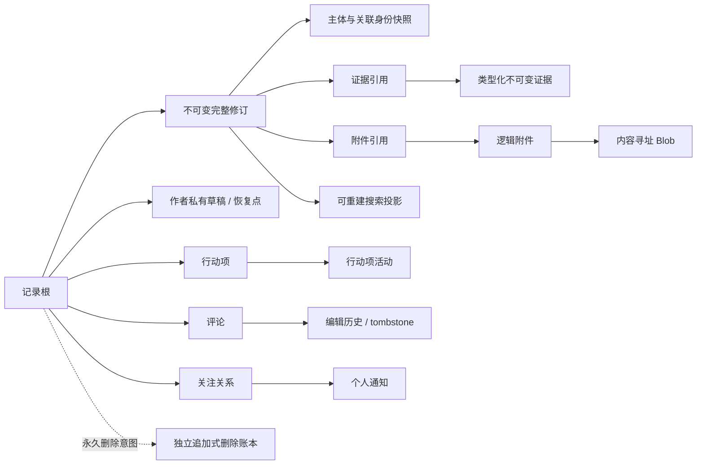
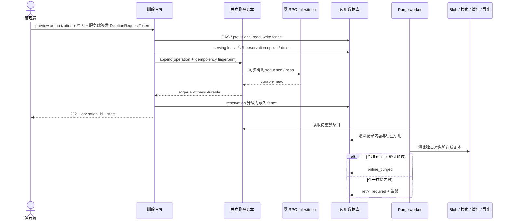
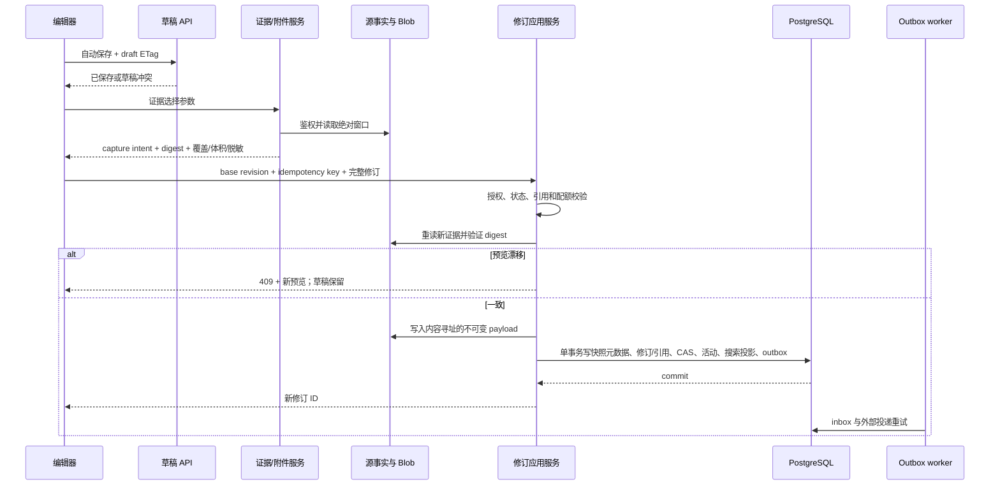

# VPS 详情页与项目级记录中心完整设计

## 1. 文档状态

- 任务：`07-13-vps-detail-experience-design`
- 状态：产品、视觉和技术设计已于 2026-07-14 获用户整文批准；2026-08-02 已按早期开发现状重划执行边界。
- 历史设计基线：候风 `v0.59.0`；当前代码基线与执行事实见 `research/development-rebaseline-2026-08-02.md`。
- 本文不是实现批准。父任务保持 planning，后续只启动拥有下一项交付的 child。
- 本文描述完整目标形态；涉及旧数据库升级、legacy backfill、APP V3、staging/cutover/release 的段落只保留为历史风险研究，不再构成当前执行合同。

## 2. 依据与问题定义

设计依据：

- `prd.md` 中逐项确认的产品合同；
- `research/current-implementation-audit.md`；
- `research/staging-walkthrough.md`；
- `research/prior-design-retrospective.md`；
- `research/external-product-patterns.md`；
- `research/evidence-snapshot-contract-audit.md`；
- `research/visual-design-contract.md`（Artifact `vps-records-visual-contract/v1`）；
- 用户提供的真实环境截图和 `v0.59.0` staging 只读走查；
- 现有前后端代码、迁移、测试和 `.trellis/spec/`。

当前页面不是未经设计的遗留页，但上一轮“用可点击标题代替通用查看按钮”的策略在真实使用中暴露了静止可发现性不足。当前页面还存在以下结构性问题：

1. 身份、订阅、监控、IP 质量和历史事实跨多个区域重复。
2. 顶部同时常驻七个操作，更多菜单包含十余个未分组动作。
3. 入口依赖 hover、透明整行按钮或细微下划线；首次用户无法快速识别。
4. 稳定态固定显示 `动作：无`，让没有内容的异常槽长期占据首屏。
5. 移动端把桌面内容机械堆叠到约 2802px，且主内容交互项普遍小于 44px。
6. 资产历史按五组卡片展示，不按真实时间合流，也没有搜索、筛选或分页。
7. experience 只有小型表单和两个自由文本字段，没有长文编辑、草稿、修订、证据、附件或协作合同。
8. 当前搜索在浏览器拉取完整列表后做子串过滤，无法承载长 Markdown、多修订和附件。
9. 当前监控、事件、权限、存储和留存合同不能直接作为长期记录证据平台。

因此，问题不是“把当前页面做得更彩色”，而是重新定义详情页职责、交互层级和长期运维记录的领域边界。

### 2.1 术语边界

| 术语 | 本文含义 |
|---|---|
| VPS / 资产 | 候风管理的 VPS 业务对象；“资产历史”是其价格、IP、规格、续费等系统事实，不是人工文档 |
| 监控实例 | 具有独立身份和采集来源的 agent 实例，可与 VPS 建立实时绑定 |
| Target / 探测对象 | 被 TCP/HTTP/TLS 等探针观测的目标，可由一个或多个监控实例产生观测 |
| 主体 | 一条人工记录主要描述的 VPS、监控实例或 Target；一条记录只有一个主要主体，可有多个关联对象 |
| 来源 | 证据或系统活动的权威生产对象/数据集，不等同于记录主体 |
| 人工记录 / 运维记录 | 用户明确保存的类型化 Markdown 文档；本文在领域/API 中统一简称“记录” |
| 系统活动 | 由资产历史、监控事件、命令审计等权威事实投影出的不可编辑活动，不是人工记录 |
| 证据快照 | 用户显式选择并预览后，由服务端从来源固化的类型化不可变材料；与用户上传附件不同 |

## 3. 目标与不可破坏原则

### 3.1 核心目标

用户进入 VPS 详情后，无需操作即可在 30 秒内回答：

1. 这是哪台 VPS？
2. 当前正常还是存在风险？
3. 最近发生了什么？
4. 现在是否需要处理，若需要从哪里进入？

### 3.2 原则

- 稳定态安静但不隐晦；异常态明确但不常驻占位。
- 颜色只承担有限状态与主操作语义，并始终配合文字、形状或图标。
- 可点击项在静止态可辨认，不能只依赖 hover 或长期使用习惯。
- 概览负责判断和导航，长文、搜索、比较和持续工作进入独立页面。
- 自动系统活动与人工记录是两个权威对象，只在展示层按时间合流。
- Markdown 源文、完整修订、证据快照和附件内容都有明确且不同的不可变边界。
- 不复制完整原始时序，不把任意 JSON、秘密或命令输出伪装成证据。
- 无权用户看不到记录存在性；前端隐藏不是授权。
- 所有历史、导出、比较和来源删除语义必须可解释、可审计、可迁移。
- 永久删除区分在线清除、受支持恢复和原始备份介质三层边界；只承诺能够验证的结果，不把备份窗口内的内容称为即时物理或密码学擦除。

## 4. 已比较的信息架构方向

### 4.1 方向 A：任务导向概览 + 独立工作区（采用）

`/vps/:id` 只承担 30 秒概览。活动、记录、证据、比较和长编辑进入可深链页面。所有 VPS 子页面保留轻量身份条和局部导航。

采用原因：

- 首次扫描和移动端优先级最清晰；
- 稳定态可以真正移除异常区域；
- 项目级记录中心不会退化成 VPS 页面内的私有标签；
- 后续路由、性能证据和协作能力可以独立成长。

代价是深度任务多一次页面跳转，因此必须保留主体身份、返回来源、筛选和滚动上下文。

### 4.2 方向 B：单页长画布 + 吸顶目录（拒绝）

优点是无需离页，代价是继续放大现有长页、移动堆叠、空区和认知负担问题。折叠区也会让首次发现性依赖试探。

### 4.3 方向 C：详情内大标签工作台（拒绝）

优点是主体上下文稳定，代价是内容被标签隐藏、移动/键盘/URL 状态复杂，并容易复制一套仅服务 VPS 的记录产品。

## 5. 路由与导航

| 路由 | 职责 |
|---|---|
| `/vps/:id` | 当前 VPS 概览 |
| `/vps/:id/activity` | 人工记录、系统活动、证据、评论/行动项合流时间线 |
| `/vps/:id/records` | 同一查询合同下，只看当前 VPS 人工记录 |
| `/vps/:id/evidence` | 当前 VPS 证据快照清单和纵向比较入口 |
| `/records` | 项目级记录中心 |
| `/records/new` | 新记录草稿，可通过 query 预选主体和类型 |
| `/records/:record_id` | 当前正式修订阅读、材料、协作与活动 |
| `/records/:record_id/edit` | 全页面 Markdown 编辑器 |
| `/records/:record_id/revisions/:revision_id` | 历史修订阅读与差异 |
| `/records/compare` | 2–6 主体或精确快照横向比较 |
| `/record-drafts` | 当前用户草稿恢复入口 |
| `/notifications` | 个人站内通知收件箱 |

监控实例和 Target 复用同样的 `activity`、`records`、`evidence` 子路由语义。侧边栏新增一级“记录中心”；VPS、监控实例和 Target 详情提供预筛入口，但不复制存储或筛选语言。

所有列表和工作台筛选写入规范化 URL。返回链接同时保存来源 URL 和列表滚动锚点；非法或过期游标回到相同查询的第一页并解释原因。

## 6. VPS 概览设计

### 6.1 稳定骨架

顺序固定为：

1. 轻量身份头；
2. 可选异常插槽；
3. 运行与续费概况；
4. 最近变化与记录；
5. 资产事实；
6. 关联上下文。

身份头包含：

- 名称和当前状态；
- 服务商、地域、用途与数据更新时间；
- `新建记录`、`查看时间线`、分组管理菜单三个首层动作；
- 概览、活动、记录、证据局部导航。

运行与续费概况只保留综合状态、监控、IP 质量和下次续费，并显示各自新鲜度。资产事实只显示稳定身份和配置，不复制健康摘要。最近变化把系统活动和人工记录按真实时间合流并标源。关联上下文使用带常驻箭头/链接形态的紧凑入口展示监控、订阅、服务和域名。

### 6.2 异常插入规则

- 稳定态不渲染异常标题、空容器、禁用按钮、`动作：无` 或预留间距。
- 异常、临期、缺证据或生命周期阻塞出现时，在身份头与常规概况之间按优先级插入状态块。
- 状态块必须包含：短标题、影响、数据来源/新鲜度、一个主动作和最多两个次动作。
- 多个异常可合并在同一状态区，但每项保持独立来源和动作；不把所有异常压缩成模糊总分。
- 恢复后对应块完全退出 DOM 和布局；系统恢复不会自动关闭人工记录。

### 6.3 管理动作

- 基础资料、关联维护和续费决策进入分组管理菜单或短 modal。
- 归档、取消、永久清理进入生命周期分组，只在允许或需要时显示。
- 异常动作只在实际异常时显示；危险动作不能与常规导航同权。

### 6.4 局部失败

概览读模型返回统一 `generated_at` 和每区 `freshness/status`。身份加载失败导致整页错误；监控、IP、订阅或最近活动局部失败只影响对应区，并显示重试与最后成功时间。局部失败本身若影响当前判断，会进入异常插槽；不会在页面中再复制一条长期错误反馈。

## 7. 记录中心与单主体时间线

### 7.1 项目级记录中心

顶部提供全文搜索、主体/关联对象、类型、状态、负责人/参与者、跟进、行动项、时间和版本范围筛选。只有确有数据时才插入待跟进、受阻和临期提示。

规范化 URL query 至少包含 `q`、`primary_type/id`、`related_type/id`、`type`、`status_group/business_status`、`owner_id`、`participant_id`、`followup_state/before/after`、`action_status`、`action_assignee_id`、`action_due_state/before/after`、`occurred/updated_from/to`、`scope=active|archived|all`、`versions=current|history` 和 `sort`。同一字段多值为 OR，不同字段组为 AND；`followup_state=overdue|due|none` 与 `action_due_state=overdue|due|none` 分开，不能把记录跟进时间和行动项截止日期混成一个“时间”筛选。行动项筛选使用服务端 `EXISTS` 语义，一条记录只返回一次；筛选规范化结果进入 cursor query hash。待跟进/受阻/临期提示使用同一查询合同，不另算一套口径。

默认结果只包含有效记录的最新正式修订。高密度列表显示：

- 类型；
- 标题与命中摘要；
- 主要主体和关联数量；
- 业务状态/跟进；
- 更新时间；
- 证据、附件、评论或修订数量。

一般笔记和重要发现不渲染空业务状态。归档和历史修订通过显式范围开关加入；历史命中标明修订号、时间和“非当前内容”。草稿只在作者草稿入口出现。

### 7.2 单主体活动

`activity` 在同一时间轴中合流：

- 人工记录与正式修订；
- 系统资产/监控/事件活动；
- 不可变证据快照；
- 评论和行动项活动。

人工、系统和证据分别使用文字、形状与颜色标源。系统活动不可编辑；人工记录可进入修订；证据条目显示关键指标、实际覆盖、桶宽、捕获时间和来源状态。

统一活动 envelope 保存 `event_kind`、`event_at`（业务发生时间）、`recorded_at`（候风记录/变更时间）、`ingest_sequence`、`source_kind/source_event_id/source_version`、`backfilled` 与权限范围。唯一键 `(source_kind, source_event_id, source_version, event_kind)` 保证 projector 重试/重建不重复；纠正事实追加新的 correction event 并引用旧事件，不原地改写。`ingest_sequence`由generation head行锁在最终事务内只为确认缺失的rows连续分配，并与projection/relations/intervals/checkpoint及`published_ingest_sequence`原子提交；existing retry只验hash不占号，禁止用裸PostgreSQL sequence max或`ON CONFLICT DO NOTHING`后的范围冒充连续已发布水位。

| 事件 | `event_at` | `recorded_at` / 去重规则 |
|---|---|---|
| 新记录 / revision 1 | 用户确认的 `occurred_at` | 首次 `saved_at`；record-created 与 revision 1 合并为一个事件 |
| 后续正式修订、状态/可见范围变化 | 本次 `saved_at` | 同 `saved_at`；原业务发生/解决时间作为字段展示，不把旧 incident 重新排到顶部 |
| legacy 迁移记录 | 原 `occurred_at` | `migrated_at`，`backfilled=true`；不再生成第二个迁移-created 事件 |
| 资产/监控/事件源事实 | 来源权威 `occurred_at` | 来源 `created/ingested_at`；source ID/version 去重 |
| 证据快照 | 实际观测终点或报告发生时间 | `captured_at`；晚捕获标 `backfilled=true` 并同时显示两种时间 |
| 评论、行动项及其变更 | 变更 `created_at` | 同值；每个不可变 event ID 一条 |

`records` 是相同服务端查询的人工记录过滤，不是第二份数据。首屏在服务端固定 `projection_generation + committed-contiguous published_ingest_sequence`，并在该水位内一次合流、按 `(event_at DESC, recorded_at DESC, source_kind, stable_id)` 排序/游标分页；view/source/event-kind/time/auth/fence与固定水位revision-validity全部在ORDER/LIMIT前生效。generation、水位、scope hash和末项键只进入固定长度桶的confidential cursor，响应不暴露全局head/checkpoint，隐藏scope推进不能改变受限用户的`new_items_available`。灾难重建递增generation并使旧cursor明确过期；分页期间迟到/回填事件只在刷新后的新水位出现，避免插入导致跳项或重复。不能把不同来源先分别`limit`再拼接，也不能先limit后过滤稀疏结果。

## 8. 横向比较工作台

工作台支持：

1. 选择 2–6 个主体和请求时间窗，由系统推荐 observation time、kind/schema 接近的候选，用户确认精确 snapshot ID 后才进入比较；
2. 直接选择具体证据快照，或选择 `record_id + revision_id`。记录入口默认固定点击当时的当前 revision，也允许显式选择历史 revision，绝不在以后打开工作台时漂移到新修订。

记录项只展开该固定修订实际引用的证据，并同时展示该修订的类型/状态/影响等结构元数据。一个修订对同一 kind 有多个快照时必须由用户选定，不能静默挑“最新”；没有证据或没有兼容 kind 时保留为明确的“仅元数据/无可比较证据”项，不生成数值、0 或空图。2–6 个篮子成员、每个 revision/snapshot ID、schema 和内容 hash 都进入比较请求摘要。

用户显式选择 baseline；默认只建议篮子第一项，切换 baseline 会生成新的规范化比较条件。对齐有两种模式：`actual_coverage` 保留各快照原始覆盖并显示偏移，`common_overlap` 只在 kind 合同允许重聚合时使用真实交集，交集为空或精度不兼容则阻止数值计算。切换模式不会改写快照，并进入 URL、请求 hash 和另存记录的 provenance。

页面先显示选择条件与可比性，再显示指标：

- 请求窗口、实际窗口、捕获时间和时间偏移；
- evidence kind/schema、单位、桶宽和计算版本；
- 实际覆盖、样本数、缺口、维护/补传语义；
- 完整、部分、截断或不兼容原因。

图表在数据截止处停止，不补零、不外推；表格只在合同允许时计算绝对差、百分比或百分点差。IP、成本、监控、路由和性能各自独立比较，不生成跨类型总分，也不从 Markdown 提取数值。

保存比较会创建新记录并固化 baseline、选定 record/revision/snapshot IDs 与 hash、请求/实际/共同窗口、对齐模式、容差、桶宽、schema、可比性告警和人工结论；不修改来源记录或快照。

## 9. 编辑、阅读与修订体验

### 9.1 编辑器

编辑器是独立页面。顶部同时展示当前正式修订、自动草稿状态和 `保存为新修订`；标题下展示适用的类型、状态、影响、主体、负责人、参与者、跟进和可见性。

记录模板使用版本化 `template_id + template_version` 注册表。模板只在新草稿或用户明确执行“插入模板段落”时生成普通 Markdown 和字段建议；已应用版本作为 revision provenance 保存，模板升级不重写草稿或历史修订。切换记录类型先预览字段/状态映射和新模板建议，正文默认保持原样；只有用户明确选择插入缺失段落才修改 Markdown，禁止静默替换或重复插入。模板不可绕过字段校验、证据确认或正式保存。

正文支持：

- 编辑、分栏、预览；
- 标题、列表、任务清单、表格、引用、链接、脚注；
- 围栏代码和语法高亮；
- 工具栏、快捷键、模板和大纲；
- 证据、附件和行动项材料侧栏；
- 桌面侧栏、移动抽屉。

预览明确区分系统证据、用户附件和作者判断。自动草稿不会产生修订、活动、搜索、比较或通知。

### 9.2 Markdown 方言和引用语法

权威内容是 UTF-8 Markdown，不保存编辑器私有文档 JSON。版本化方言为 `houfeng-markdown/v1`：CommonMark + GFM 表格/任务清单/删除线 + 脚注 + 围栏代码。原始 HTML 和可执行内容禁用。

结构化引用使用标准 Markdown 链接语法，单独成段时渲染为卡片：

```md
[系统证据：第三晚 TCP 观测](houfeng-evidence:ev_7K2P)
[用户附件：mtr-third-night.png](houfeng-attachment:att_4D8M)
```

修订同时保存引用清单，解析器只接受明确 scheme 和合法 ID。链接与清单不一致时拒绝正式保存。引用对象不可用或被合法清除时渲染 tombstone，不留空白或崩溃。Markdown 导出会把上述链接物化为可读摘要和相对文件路径。

前端使用 CodeMirror 6 作为源文编辑器；预览使用统一/remark 管线和严格 sanitize schema。后端使用 goldmark 兼容方言完成纯文本提取、导出和服务端安全渲染。两端以共享恶意输入、脚注、表格、代码和引用 golden fixtures 保证语义一致。

### 9.3 修订与冲突

- 首次正式保存生成修订 1；以后只有实际变化的显式保存生成完整修订。
- 修改标题、Markdown、类型/业务状态/影响/发生与解决时间、可见范围、主体/关联、标签、证据/附件引用、记录级负责人/参与者/下次跟进或显式模板应用均产生修订。
- 行动项和评论使用自身活动，不制造文档修订。
- 恢复旧版复制旧内容并生成新修订。
- 保存携带 `base_revision_id` 和记录版本；冲突返回服务器最新修订和差异输入，保留本地草稿并进入人工合并。
- 每次正式保存使用幂等键，网络重试不能生成重复修订。

### 9.4 草稿

- 服务端按作者私有保存。浏览器只把尚未成功同步的字段/Markdown 写入按 `user_id + draft_id` 隔离的 IndexedDB 短期缓冲，不缓存附件字节、证据 payload 或长期 object URL；最长 24 小时，服务端同步成功、明确丢弃、登出、换用户后立即清除。
- 停止输入约 2 秒自动保存，并显示保存中、已保存或失败。
- 每位作者对每条记录一个当前草稿；新记录可以有多个独立草稿 ID。
- 草稿记录基准修订；内容变化时最多每 5 分钟建立一个恢复点，保留最近 20 个且不超过 7 天。
- 默认最后活动 90 天后清理，提前 7 天提示；管理员可配置。
- 正式保存或明确丢弃后结束草稿；草稿附件遵循相同保留和孤立回收合同。
- 重开页面时先重新授权，再决定是否提供缓冲恢复。权限撤销、记录永久删除或统一无权 404 以安全为先：当前在线客户端停止自动保存并清除内存正文/预览/差异/材料/object URL、IndexedDB 和服务端草稿内容；离线设备不得在未重新鉴权时展示缓冲，并在下次启动/联网鉴权后清除。删除影响预览诚实说明系统无法远程物理擦除尚未联网设备的浏览器存储。界面只显示不泄露对象存在性的通用提示，不提供复制、下载或导出受限缓冲。

## 10. 领域模型总览



### 10.1 主要持久化对象

| 对象 | 权威内容与关键约束 |
|---|---|
| `records` | 稳定 ID、文档生命周期、当前修订、乐观锁版本，以及从当前修订投影的 visibility/owner/follow-up 等查询字段；正文和结构字段不以 root 为权威 |
| `record_revisions` | 标题、完整 Markdown、类型/状态/影响、发生/解决时间、可见范围、主要负责人、下次跟进、作者、原因、template ID/version、方言版本和内容哈希；只插入 |
| `record_revision_subjects` | primary/related 角色、实时对象引用、对象类型、当时身份快照；源删除不级联 |
| `record_revision_tags` | 当时标签集合 |
| `record_revision_participants` | 修订当时的参与者 ID 与身份快照；恢复旧修订时一并恢复，不读取当前 root 猜测历史 |
| `record_drafts` | 作者、基准修订、可变 payload、ETag、到期时间；不进入搜索 |
| `record_draft_checkpoints` | 有界恢复点；独立 TTL |
| `evidence_snapshots` | kind/schema、来源身份、capture scope、可空 source-delete authorization-floor ref、请求/实际窗口、摘要、敏感等级、捕获者、payload 哈希 |
| `evidence_payloads` | 内容寻址的规范化有界序列和静态呈现；可去重，不合并逻辑权限 |
| `attachments` | `record_id XOR draft_id` 归属、逻辑文件、原名/安全名、服务端 MIME、哈希、上传者、隔离状态、blob 引用和可选 copied-from ID |
| `blobs` | backend、storage key、字节数、哈希、创建时间和完整性状态；不可变 |
| `record_revision_evidence_refs` | 修订到证据的顺序、caption 和引用角色 |
| `record_revision_attachment_refs` | 修订到附件的顺序、caption 和引用角色 |
| `record_actions` / `record_action_events` | 行动项当前投影与不可变活动 |
| `record_comments` / `record_comment_revisions` | 平铺评论、回复上下文、编辑历史和删除 tombstone |
| `record_followers` | 自动/手动来源和取消状态 |
| `record_activities` | 新记录领域活动；现有系统事件通过读模型合流 |
| `user_notifications` | 每用户未读/已读、权限安全摘要、目标深链 |
| `record_outbox` | 事务内副作用事件、attempt、owner generation/lease 和下一重试时间 |
| `export_jobs` / `export_artifacts` / `export_record_refs` | 异步状态、服务端文件 TTL、下载授权和所含记录反向引用；产物位于独立临时存储，无法排除快照时纳入备份库存 |
| `import_jobs` / `import_plans` | 上传者、target deployment/project scope、`identity_classification=unknown|complete`/digest、状态、trust 结果、规范化 object/origin 集合、observed witness sequence/hash、审批类型、过期时间和 worker lease |
| `import_artifacts` / `import_plan_identity_refs` | 原始归档、解包/扫描临时对象的 hash、workspace、TTL、purge receipt，以及包内 object/origin 反向引用；不以 plan 过期代替物理清理 |
| `processor_workspaces` | processor/job、record/object/origin refs、source version/reservation epoch、受管本地/远端位置、lease、最大保留和 purge receipt；不保存内容本身 |
| `identity_mutation_guards` | namespace + canonical object/origin identity 的持久序列化行、mutation epoch 和 owner；import apply 与 deletion reservation 使用同一锁顺序 |
| `record_search_documents` | 当前/历史修订可重建搜索文本、tsvector 和排序字段 |
| `legacy_record_mappings` | legacy source type/id 到新记录/修订的幂等映射；永久删除后保留无内容 tombstone |
| `record_deletion_audits` | 从独立账本重建的可查询最小投影：record/operation ID、删除者、时间、原因代码和 ledger sequence |
| `record_purge_operations` | 版本/依赖 digest、reservation/owner/release epoch、delete/outcome ledger sequence、读写 fence、`not_committed` 终态、各存储 receipt、attempt 和安全失败代码；不保存被删内容 |
| `deletion_fence_leases` | serving instance/epoch、observed/applied reservation-fence epoch、observed witness head、连续已应用 ledger fence sequence/hash 和 1 秒到期时间 |
| `object_content_leases` | record/object + serving instance、request/stream count、observed reservation epoch、headers/bytes-sent 状态、≤1 秒到期/续租和取消结果；阻止未 drain 外发 |
| `content_delivery_epochs` | 每对象单调 generation、最后 delivery 类型/时间和无内容计数；preview 绑定，发送 header/字节后推进 |
| `client_content_leases` | user/session/tab/device、record/object、capability revision、最长 5 秒 expiry、SSE/poll 状态与 revoke ack；不保存页面内容 |
| `deployment_membership` | API/worker instance、deployment epoch、fence-contract version、能力、LB/queue admission、短期 heartbeat；不登记或版本过低者不得服务受保护域 |
| `deployment_contract_state` | witness-confirmed activation sequence、minimum fence、trust/inventory/policy/drain/domain-identity-set digest 与单调 projection 水位；只可由连续 projector 前移 |
| `source_deletion_tombstones` | 来源 kind/stable ID、delete sequence、最终 authorization-floor digest 与无内容重连禁令；不保留显示名或业务正文 |
| `deletion_replay_state` | 应用数据库在同一一致性快照中已完整应用的连续 ledger sequence/hash；备份恢复的唯一 replay cutoff |
| `backup_epochs` | backup/snapshot ID、创建时间和与恢复 manifest 交叉校验的快照标记；不保存备份内容 |
| `backup_attempts` / `backup_workspaces` | scope/marker、staging DB/object prefix、record/object refs、lease/state/expiry、published recovery-point ID 与逐位置 purge receipt；partial 不是隐形文件 |
| `restore_attempts` / `restore_workspaces` | 独立 recovery-control store 中的 source manifest/baseline、隔离 DB/Blob/tmp 位置、状态/lease/expiry、forensic 审批和 purge/replay receipt；不依赖被恢复 DB |
| `record_platform_domain_identity` / `record_platform_domain_attestations` | 每个 PostgreSQL 域的 immutable stable identity 与 append-only 短期 liveness proof；system identifier 或外部 stable attestation 二选一 |
| `record_platform_s3_witness_identities` / `record_platform_s3_witness_attestations` | recovery-control 中可并存 current/candidate 的 locked-S3 stable physical identity、Object-Lock/retention 合同与单调短期证明；不含访问密钥 |

所有来自 VPS、监控实例或 Target 的外键使用可空实时引用或 `on delete set null`；记录内容不得使用 cascade。记录内部拥有的修订/引用在明确永久删除记录时由受控服务清理，而不是由来源对象删除触发。

主体/关联不接受任意字符串 kind，而使用版本化 `RecordRelationKindRegistry`。首批合同固定为：

| kind | 可作 primary | 允许 related role | 身份/导航 |
|---|---:|---|---|
| `vps` | 是 | `affected/context/evidence_source` | 名称、provider/region 用途快照；VPS route 或 tombstone |
| `monitoring_instance` | 是 | `affected/context/evidence_source` | 实例名/版本快照；实例 route 或 tombstone |
| `target` | 是 | `affected/context/evidence_source` | 类型与安全展示名快照；Target route 或 tombstone |
| `subscription` | 否 | `billing_context/affected` | 周期/安全名称快照；订阅 route 或 tombstone |
| `service` | 否 | `context/affected` | 服务类型/安全名称快照；服务 route 或 tombstone |
| `domain` | 否 | `context/affected` | 规范化域名快照；域名 route 或 tombstone |
| `provider` | 否 | `context` | provider ID/名称快照；provider route 或 tombstone |
| `monitoring_event` | 否 | `trigger/evidence_source` | 稳定 event ID、类型/时间快照；事件 route 或 tombstone |
| `command_audit` | 否 | `change_source/evidence_source` | command ID、动作/时间快照，永不含输出；审计 route 或 tombstone |

每个 adapter 必须实现 ID/role 校验、当前授权、allowlist 身份快照、搜索 token、live route 解析、删除 tombstone、导入导出与反向查询。记录 DTO 按修订返回全部有序关系，不只返回数量；无权 route 不返回，来源删除后保留快照并标 tombstone，禁止按名称自动关联。新增 kind/role 必须通过权限、快照禁止字段、搜索、route、source deletion 和 export conformance tests。

永久删除另使用独立的 `houfeng_deletion_ledger` PostgreSQL 服务。它必须位于不同于应用数据库的集群/卷快照与恢复凭据边界，不能被整套应用快照一起回滚；runtime/admin 都不能直接写 immutable entry/head，只能调用 migrator-owner 创建、固定 entry kind/search path/expected head/sequence/canonical digest 且撤销 PUBLIC 的窄 `SECURITY DEFINER` 函数；数据库约束/触发器拒绝 UPDATE/DELETE/TRUNCATE。`entry_type=delete_commit|attempt_not_committed|contract_activation|domain_identity_rotation` 是判别式 union：四者共同字段只有单调 sequence、deployment/project namespace、稳定 operation identity、确认时间与前后 hash。`delete_commit` 要求 actor/route/object、`DeletionRequestTokenV1` commitment、request fingerprint、删除合同版本和原因代码，并在存在 lineage 时保存规范化 origin identity/最终 authorization floor；`attempt_not_committed` 要求同一 deletion request identity 与正数 release epoch，禁止 origin/floor/删除合同；`contract_activation` 固定 sequence 1/zero previous hash，只保存 plan/authorization/activation bundle、minimum fence、trust/inventory/policy/drain/domain-identity-set digest/epoch，actor/route/object/token-commitment/fingerprint/origin/floor/release 必须为空；`domain_identity_rotation` 固定 sequence >1，绑定 current/candidate adjacent identity set、current approval、candidate possession、intent/cutover/copy/drain、resulting trust head 与不下降的 minimum fence，并同样禁止全部删除请求字段。rotation 后的 projection、old-domain retirement 与 final proof 只进入绑定该 ledger hash 的 witnessed completion receipt，不能反向进入已提交 body。所有形状均不保存 raw token、标题、主体名、Markdown、附件名、证据摘要、payload 哈希或任何被删内容。token commitment 在 delete/outcome 两种 operation entry 间唯一；对象删除身份只对 `delete_commit` 唯一，outcome 不阻止以后用新 preview/token 删除。origin identity 使用非唯一查询索引及单独的 `source_deletion_tombstones` 投影，因为同一外部来源经显式审批重新导入为新 ID 后可能再次被删除并产生新 sequence。该账本使用独立备份流并永久保留最小条目，应用内没有清理入口；记录和来源对象的稳定 ID 均不得复用。

V1 的删除 route 闭合为 `record_permanent_delete|source_permanent_delete`，删除 reason 闭合为 `user_confirmed|source_removed|retention_replay`，trust reason 闭合为 `bootstrap_activated|key_added|key_rotated|key_retired|key_compromised|key_removed`。Go decoder、primary SQL typed encoder/CHECK、PostgreSQL full witness 与 S3 put/readback 必须调用同一闭合 validator；未知值、大小写变体、URL、路径和自由文本一律在写入前拒绝，不能由某个后端单独放宽。

VPS、监控实例、Target 等来源对象的 `delete_commit` 还必须保存删除前最终 `authorization_floor_snapshot`：显式包含 `AuthorizationFloorSnapshot.Kind`、version、project namespace、稳定 role/group IDs、policy revision 与 canonical hash，不含标题、用户名或业务内容。`Kind=project|restricted` 不能由 role/group 数组是否为空推断，因此空集合的 deny-all restricted 与 project scope 具有不同 canonical bytes。它属于恢复后继续执行最小权限所必需的安全元数据，并由 `postgres_sync` / `s3_worm` full witness 零 RPO 保存；普通记录 delete commit 不保存无关 ACL 结构。

仅靠账本自身哈希链不能证明尾部没有整体回滚。每次 append 必须在返回 durable 前，由处于另一故障域的独立 PostgreSQL full-witness store 或 write-once/WORM store 逐字确认完整 canonical entry 与 immutable sequence receipt；允许 lag 为 0。无论新写、ack-loss 还是“对象已存在”快路径，confirm 都从 genesis 枚举到 immutable far tail，验证逐字 entry、无缺口 hash chain 并拒绝 receipt/head 落后。账本提交后的 `202`、备份签发和恢复启动 gate 都以该完整证明为权威上界。账本或 witness 任一不可用、head 倒退/不一致，或无法证明当前最新尾部时永久删除与恢复均失败关闭，不允许从旧账本备份重新签发一个“最新”checkpoint。

账本 genesis/contract-activation entry 还保存单调 `minimum_fence_contract_version`。所有可从负载均衡到达的 backend、兼容旧 API route 和可领取 records/material/import/export 队列的 worker，都必须先在受保护的 deployment membership 中登记 instance ID、deployment epoch、合同版本与能力，并持续短 heartbeat；LB target 与 queue lease 由同一 admission 结果生成，未知、失联、孤立或版本过低实例不能获得流量/任务。版本提升由 witness 确认后不可下调；一旦存在永久删除 entry，后端/worker 只能向前修复或回退到仍满足该版本的构建。旧 UI 静态资源可以回退，但其请求只能落到 fence-aware 兼容 API。

`DeletionFullWitness` 提供两个等价、均需实现的部署 profile：`postgres_sync` 使用第四个独立 PostgreSQL instance/data dir/恢复与管理权限，由应用层在 primary commit 后通过窄 confirm 函数同步写完整 canonical ledger/trust entry、plan、authorization artifact、bundle、completion receipt、identity-set 三对象与 immutable sequence/rotation receipt；它不是 primary 的 physical standby，也不依赖 `synchronous_commit=remote_apply`。`s3_worm` 对每个 sequence 写入相同完整 canonical objects 与逐 sequence immutable receipt，而不只保存 hash或共享可覆盖 head，并启用 bucket versioning、Object Lock COMPLIANCE + legal hold、无 WORM root lifecycle 到期。`scope_hash` 唯一定义为 lowercase hex SHA-256(`"houfeng-record-platform-scope-v1" NUL deployment_id NUL project_id`)；current 与 candidate target 的不可变证据各自位于物理身份不同、互不重叠的 WORM bucket/namespace 下的 `record-platform/v1/<scope_hash>/` root，family key 不再重复 scope hash；可清理的 candidate staging/nonce/credential/transfer 状态则只位于另一物理身份的 `candidate-control/v1/<scope_hash>/` root，绝不进入或替代 WORM。identity-set 精确使用 `identity-sets/<20-digit-epoch>/<set|primary-receipt|witness-receipt>` 三个独立 V1 object，rotation receipt 使用 `rotations/<mutation_id>/receipts/<20-digit-sequence>/receipt`。object key、body kind/ordinal、checksum、canonical digest、schema metadata、COMPLIANCE retain-until 与 legal hold 必须逐项一致；bucket versioning/default lock、current/noncurrent/delete-marker lifecycle、multipart cleanup和 replication destination/status 全部进入控制面证明。S3 runtime/admin 可共享 current WORM 读，但写 prefix 分离为 runtime deletion 与 admin activation/rotation/trust/plans/authorizations/bundles/completion；第三个 migrator principal 只能探测 current bucket identity/Object-Lock 控制面。短期 candidate 按 phase 获得成对、不可复用的 least-privilege arms：target arm 只能向 distinct candidate WORM 写入/读回该 mutation 的 immutable imported evidence，control arm 只能读写并最终清除对应 candidate-control prefix。control policy必须是current+candidate governance threshold签名、mutation-wide单调chain，并逐代绑定credential identity commitment/IAM digest+expiry、TLS/SPKI、bucket/namespace identity、versioning、Object-Lock/default retention/legal hold/lifecycle/replication disabled、backup exclusion和encryption-at-rest；target/control/current/backup/replica任一identity、prefix或credential重叠以及live control-plane drift均在byte 1前失败。credential bundle与落盘scratch只能使用nonce-reserved AES-256-GCM local-raw-key XOR KMS-wrapped-DEK envelope；final purge/workspace-zero receipt由workspace外cleanup verifier在zero inventory后经FD返回，绝不写回control surface。任一 profile 都必须在 primary 丢失时从 genesis 独立还原 entry 与整张 governance DAG；异步复制、同卷副本、普通可覆盖文件、共享 head key、只有 identity receipt digest 或周期 checkpoint 均不满足永久删除能力。未配置合格 profile 时功能保持关闭。

candidate-control policy不是实现期隐式配置。generation-1 read-only draft创建mutation ID，只持current witness read与candidate read-control probe；current/candidate governance分别离线签名、seal后由current append/full-witness完整wrapper，challenge才可逐字绑定它，prepare/import/cutover/cleanup四个policy phase均在对应generation readback且live reprobe通过后写第1字节。same-phase renewal和phase advance都绑定previous digest，旧credential立即失权。AEAD nonce reservation使用domain-separated `(mutation,key identity,nonce)`物理唯一key，S3 conditional create、filesystem `O_EXCL`、PostgreSQL unique insert共享conformance，artifact只引用reservation digest；wrapped DEK使用只能在ephemeral surface存续且最终zero的`encrypted_key_material`。独立nonce-reservation key只签purpose-bound的`encrypted_phase_credential_bundle|transfer_scratch` reservation；candidate receipt key只签import/cutover phase receipts；独立one-shot cleanup verifier以read-control identity、strict-0400 Ed25519 key和live filesystem exclusion proof签`candidate_artifacts_purged|workspace_zero`，私钥不在center/admin/candidate/control/workspace/backup，三类signer交叉签名、错key或proof drift都fail closed。恰有六个byte-handling命令——candidate prepare、transfer import、cutover apply、credential revoke、candidate abandon、candidate cleanup——exact-one解析strict-0400 raw 32-byte local key或pinned KMS config+strict-0400 credential file，其他scope stat前拒绝；credential revoke不能打开nonce signer，abandon/cleanup仅identity-check与销毁且nonce签名调用数为0。Final绑定policy-chain head与verifier descriptor，Final后primary/PostgreSQL-witness/S3逐字禁止key/public identity/exclusion-proof/validity替换。

恢复域独立不能靠 DSN/endpoint 字符串声称。canonical namespace 先固定 `DeploymentIDV1=dp-[0-9a-f]{64}` 与 v1 `ProjectIDV1=default`，SQL、配置、签名与 S3 key builder 共用同一 ASCII validator，禁止 trim/case-fold/Unicode 别名。每个 PostgreSQL 域持有 immutable stable identity：可读取时使用 decimal system identifier 与闭合 PostgreSQL database-name token；托管 fallback 将 provider/account/cluster/physical-storage/snapshot/restore-authority 的经 adapter 规范化值分别做 domain-separated SHA-256，只持久化 fixed-width digest，并以 append-only、单调 generation 的短期 attestation 续证。S3 stable identity 绑定 canonical HTTPS authority digest、TLS/SPKI、闭合 `S3BucketNameV1`、无 slash/query/`..` 的 canonical namespace segment tuple+digest、versioning/Object Lock/retention 与备份位置不重叠证明；raw URL、path、query、任意 Unicode/free text 永不进入 immutable governance。PostgreSQL/S3 identity、liveness/possession attestation 与治理 policy 使用唯一 canonical v1 field order、大小、时间、threshold/key ID/排序和 Ed25519 签名合同；stable identity set body 与外层 digest wrapper 分离，body 不含自己的 digest。active profile 的 canonical identity set/digest/epoch 固定进入 activation plan、sequence-1 entry、projection 与 full witness；短期证明到期、live probe 漂移、alias/same physical identity、旧 identity-set 回滚或应用备份位置重叠都只会关闭受保护能力，不能自动信任新域。

`HTTPSAuthorityV1` raw input只允许exact `https`、无userinfo/query/fragment/percent/control，path只能为空或单个`/`并规范为空；host是lowercase ASCII DNS或`netip` canonical IP（IPv6带括号），default 443编码为0，其他端口是无前导零的1…65535。digest preimage精确为`HOUFENG-HTTPS-AUTHORITY-V1 || u16be(1) || u32be(len(host)) || host || u16be(port-or-zero-for-443)`。基础设施adapter kind来自闭合registry且normalization version v1精确为1；版本或规范化算法改变必须走domain rotation，renewal不能漂移。

激活后物理域不能因改 DSN/endpoint 自动改变。`domain identity rotate` 仅接受 current-scope detached threshold 和独立 candidate-domain possession。candidate admission 使用无环、可离线认证的 `control-policy draft → current/candidate governance sign/seal → current publish/full-witness → challenge draft(policy-bound) → current governance sign/seal → prepare(policy exact-match) → candidate attestation/preparation sign/seal → plan`；online control-policy draft只读取其allowlist，challenge draft对外部current适配器仍只读，但必须在输出前通过内部窄函数完成`policy_prepared→challenge_started` CAS与challenge primary/full-witness 2+3发布/readback，不能被描述为纯只读命令。所有signer离线且不连接数据库/网络，prepare不读取governance private key。完整 published policy、sealed challenge/preparation wrappers 必须逐字进入 `DomainRotationIntentV1` primary/full witness，不能用 digest-only 代替；本地 artifact 与 recovery-control 同时丢失后仍可按 mutation ID 重建。若治理 policy 同时变化，还要求 current/candidate governance thresholds 与每个 candidate-only key proof。v1 每次只替换 active profile 中一个 member，global/member epoch 都 `N→N+1`，其他 member bytes 不变；identity-set body、primary receipt 与显式绑定 primary digest 的 witness receipt 是三个独立闭合 V1 schema，PostgreSQL/S3 witness 均保存完整 bytes。planned mode 保持 current authoritative 并镜像 byte-identical append；disaster mode 只能以独立 `unreachable draft → governance sign → seal → resume` 生成并 witnessed 的 current-unreachable/quarantine proof替代双写，lost-domain adapter 调用为 0，两者严格 XOR。从 genesis 复制 ledger/trust/full-witness/plan/authorization/bundle/completion/inventory/receipt artifacts并完成受管数据 catch-up。最终 drain 的 LB、queue 与 copy-replay 输入都是具名、bounded、policy-bound signed snapshot wrappers；初始/continuation receipt 内嵌其完整 canonical bytes、wrapper digest 与 signer policy，因而本地 snapshot 清理后仍可从 primary/full witness 独立验签，单独三个 signature digest 不构成证明。current transfer exporter、cutover exporter 与 recovery-request exporter 都显式接收 `--recovery-signing-key PATH`，共享 bounded regular/no-follow exact-0400 raw Ed25519 loader；missing/unreadable/symlink/wrong-mode/wrong-length/malformed/wrong-signer 或 expired descriptor/deadline 时输出 0 bytes；transfer frame 使用 `Start|ObjectStart|ObjectChunk|ObjectEnd|Checkpoint|End`，plan/bundle/inventory 上限分别为 24/20/8 MiB并逐 chunk 验 digest、连续 offset 与 index/count。drain 后 receipt 强制 `DrainContinuation* → CandidateImportApplied → CandidateImportRevoked → Cutover`；applied 先由 current primary/full-witness/readback，随后才能撤销 import credential并生成 binding revocation，cutover bundle 只能在两者之后构造。cutover 再分为 current-side signed export、candidate-side narrow apply 与 current-side `resume --receipt-fd FD` 验签/append/full-witness，candidate 不能写 current recovery-control。rotation identity set 按 set→primary receipt→witness set+primary receipt copy+witness receipt→full readback 发布后才可投影。projector CAS active set、撤销旧域 write/EXECUTE/IAM 和路由，并由新 full witness 确认 retirement/final proof；Final readback 后进入teardown，先撤销cutover credential并由current primary/full-witness/readback revocation，再销毁candidate receipt key/bundle/workspace与AEAD/nonce key material，再full-witness purge/workspace-zero receipts，最后生成显式绑定最终rotation receipt-chain head、candidate-control policy-head generation/digest及最终primary/witness publication receipts的completion并readback整张DAG。revocation readback前销毁成功数为0。durable intent 后只能按 mutation exact-resume，retirement 后无旧配置回滚；旧域重现、candidate ahead/gap、`postgres_sync↔s3_worm` 或 total loss 均 fail closed且无 override。

rotation intent还逐字绑定witnessed current与sealed candidate `SignedAdmissionAdapterPolicyV1`；无变更时byte-identical，有变更时candidate generation=current+1并满足current+candidate governance thresholds。rotation ledger、identity五工件和full-witness readback之前，所有LB/queue/copy-replay drain、continuation和cutover snapshot只能用current policy，candidate policy提前成功数为0。projector在identity CAS内同时切换active adapter digest/generation，并把body/wrapper分离的`AdapterPolicyActivationReceiptV1`嵌入已有`projection` kind，因而15-kind chain不扩张；其full-witness后retirement/final proof才改用candidate policy。policy validity必须覆盖snapshot validity，旧current policy此后只作immutable evidence。

`ValidateDomainRotationIntentV1` 是唯一生产级 strict validator；plan/apply/import/resume、primary SQL match adapter、PostgreSQL witness confirm/readback 与 S3 put/readback 都必须调用它，递归重验 sealed challenge/preparation 的 nested schema、canonical re-encode、body/wrapper digest、闭合 purpose、exact policy bytes/digest、Ed25519 signature、threshold、排序唯一 signature set、candidate-only possession，以及 profile/相邻 epoch/domain/set/mutation/plan context 绑定，不能只校验外层 wrapper hash。所有入口共享同一正向与 single-byte/purpose/policy/threshold/order/signature/epoch/domain/mutation 负向 corpus；SQL narrow function另以 typed columns+digest exact-match防止绕过。identity set 发布固定读回 primary set+primary receipt 两个工件，以及 witness set+canonical primary-receipt copy+witness receipt 三个工件；witness receipt 绑定 primary receipt digest，五工件任一缺失或单字节差异都阻止投影与完成。

`DomainRotationReceiptV1` 是闭合 15-kind chain：`copy_manifest|dual_write_checkpoint|current_unreachable|drain|drain_continuation|candidate_import_applied|candidate_import_revoked|cutover|candidate_cutover_applied|projection|old_domain_retired|final_proof|candidate_cutover_revoked|candidate_artifacts_purged|workspace_zero`。planned/disaster 分别且只能选择 `dual_write_checkpoint`/`current_unreachable` 分支；只有 `drain_continuation` 可重复，其余 14 个均为 singleton。Go、primary SQL、PostgreSQL witness 与 S3 使用同一 kind/payload/sequence validator。

永久删除不接受调用方自选的低熵 key。preview 用 `crypto/rand` 生成 32 bytes，返回唯一 canonical `drt1_` base64url-no-pad token，并把 token commitment、actor/project capability digest、依赖图和 10 分钟 preview authorization 一起绑定；raw token 只存在于客户端与本次请求内存。commitment preimage 固定为 ASCII domain separator、NUL、严格 `DeploymentIDV1`、NUL、`ProjectIDV1`、NUL、raw 32 bytes，其他顺序、缺 separator、文本 token bytes 或跨 scope 都不等价。execute 先 constant-time 比较重算 commitment；首次 durable intent 后，即使 preview authorization 已过期，同 token 也只能查询/续跑已存在的同 fingerprint operation，不能创建新 intent。由此 ack-loss 重试不依赖永久保存、轮换或归档任何服务端 HMAC secret；低熵、非 canonical、重复 scope 和 raw-token persistence corpus 均失败。

candidate-control 的 CLI 与 canonical signer ownership 采用闭合合同：generation-1 prepare draft 必须显式读取 `--nonce-reservation-signer-descriptor PATH`、`--cleanup-verifier-descriptor PATH`与≤30天immutable mutation deadline，并从current witnessed trust读取purpose固定为`candidate_recovery_request_v1`的request-signer descriptor；same-phase renewal 和每次相邻 phase advance 只能通过完整 witnessed `--previous-policy PATH` 逐字继承deadline及三份descriptor，重新传入或覆盖在 stat 前拒绝。完整 nonce/cleanup/request-signer descriptors 逐字进入 published policy、challenge fence、sealed preparation、typed intent 与 final plan；sealed preparation/intent/plan 同时绑定独立 candidate receipt signer。nonce private key 只允许 prepare/import/cutover 调用 purpose-locked signer；credential revoke不打开，abandon/cleanup仅可定位、核验并销毁且签名调用数为0。

post-intent candidate动作只接受current从primary/full witness构造的typed recovery-request FD，本地policy/preparation是可选exact-match。pre-intent放弃走独立no-intent fence和2+3 witnessed abandon completion，不借final-proof cleanup phase或扩张15-kind rotation chain。import/cutover revoke各自先经FD返回candidate-receipt-key签名并由current full-witness/readback，随后cleanup request才可销毁receipt key/bundle/workspace。cleanup verifier仍只签purge/workspace-zero；AEAD/wrapped-DEK/nonce destruction是purge body内unsigned typed evidence且两个remaining-key count为0。Final body显式携带完整policy head与cleanup descriptor；completion primary/witness/S3 body显式携带policy-head generation/digest和最终publication receipts。

candidate-control root 的唯一状态边为 `policy_prepared → challenge_started → intent_bound → complete` 与 `policy_prepared|challenge_started → abandoning → abandoned`。`challenge_started` 允许表达 primary 2 已 durable、witness 3 或 ack 尚未完成的 publication cutpoint；在 exact primary 2 + witness 3 readback 与 ack 前，challenge 输出、intent bind 和 abandon reservation 全部禁止。只有 `policy_prepared` 或 fully acknowledged `challenge_started` 可进入 witnessed abandon，只有 `abandoned` 才允许用新 mutation/descriptors 重建 candidate。

typed recovery-request 是六臂 exact-one union：`abandon→prepare/abandon-authorization`、`import→import/intent+transfer-start`、`revoke_import→import/intent+import-applied`、`cutover_apply→cutover/intent+import-revoked+Cutover receipt+cutover-command`、`revoke_cutover→cleanup/intent+final-proof`、`cleanup→cleanup/intent+final-proof+cutover-revoked`。`cutover_apply` 的 required head 必须等于 witnessed `Cutover.ReceiptHash`，并同时要求该 receipt 的 previous hash 与 `PreCutoverReceiptChainHead` 都等于内嵌 import-revoked hash；其他每臂携带的 current full-witness chain head 与 receipt kind/hash 也必须和前置完全一致。current request signer先对purpose-bound core签名，primary保存signed core+typed primary receipt，full witness保存byte-identical core+canonical primary-receipt copy+typed witness receipt，五个物理工件readback后才组装FD wrapper；signed core 上限 32 MiB、每份 primary/witness publication receipt 上限 64 KiB、最终 FD wrapper 上限 33 MiB，所有 Go/primary SQL/PostgreSQL witness/S3/FD decoder 在 allocation 前拒绝 +1 byte；nil/both/wrong arm、未签名/自哈希/未发布、purpose/phase/receipt cross-use在candidate触碰本地或外部状态前拒绝。purge wrapper同样是结构化XOR：正常teardown内嵌完整sealed preparation，pre-intent abandon内嵌含typed primary/witness receipts的完整witnessed authorization，不能退化为开放字符串+digest。

## 11. 记录类型、状态与生命周期

### 11.1 文档生命周期

正式 `records.lifecycle` 只有两种值：

- `active`：当前有效正式记录；
- `archived`：可恢复，只在显式范围中出现。

`working_draft` 是作者私有的独立 `record_drafts` 对象，不是正式记录状态；永久删除后记录根和内容已经消失，`deleted_audit` 是由独立账本重建的最小投影，也不是可恢复记录状态。文档生命周期与问题是否解决分离。归档不改变业务状态和修订；恢复归档也不制造业务状态变化。

### 11.2 类型与状态

| 类型 | 推荐流转 | 统一状态组 |
|---|---|---|
| 排障 | 待排查 → 排查中 → 观察验证 → 已解决 / 已关闭；允许取消 | 待处理、进行中、验证中、已完成、已取消 |
| 维护 / 变更 | 计划中 → 执行中 → 验证中 → 已完成；允许取消 | 待处理、进行中、验证中、已完成、已取消 |
| 迁移 | 计划中 → 执行中 → 验证中 → 已完成；允许取消 | 待处理、进行中、验证中、已完成、已取消 |
| 服务商沟通 | 待联系 → 等待服务商 / 等待我方 → 已解决 / 已关闭；允许取消 | 待处理、等待中、进行中、已完成、已取消 |
| 账单 | 待核对 → 处理中 → 已解决 / 已关闭；允许取消 | 待处理、进行中、已完成、已取消 |
| 重要发现 | 默认无业务状态 | 无 |
| 一般笔记 | 默认无业务状态 | 无 |

状态机是引导式：正常下一步直接保存；跳过、回退或从终态重开需要原因，并生成修订和活动。重开保留旧完成周期于历史，当前投影清除当前完成时间；再次完成生成新时间。类型变化先预览模板、字段和状态映射，不兼容时由用户显式选择。

硬性阻止真正矛盾：完成状态必须有完成时间，取消必须有原因，状态必须属于当前类型。系统事件、行动项完成、监控恢复和评论只能建议状态，不自动推进。

### 11.3 永久删除、在线清除与备份边界

永久删除采用两条显式分支：`previewed → provisional_fenced → ledger_commit_unknown | witness_pending → delete_requested（delete commit + witness）→ fence_propagating → read_fenced → online_purging → online_purged`；或在先 fencing 原 append owner generation、再权威证明 delete commit 不存在后，进入 `release_pending（attempt_not_committed + witness）→ not_committed`。`retry_required` 是 `delete_requested` 之后任一投影、围栏或清除阶段失败时的显式可重试状态，修复后回到原阶段继续，不是可读写或完成状态。任何 delete/outcome 提交结果未知都保持 provisional fence，不能猜测未提交、开始 purge 或恢复可读写。

1. preview 先按当前项目上下文重新验证 `record.permanent_delete`，再计算修订、草稿、评论、行动项、通知摘要、证据、附件、共享 payload/blob、对应 legacy `experience_logs` 原行、服务端导出、导入材料/processor workspace 和其他记录合法副本的影响，签发 10 分钟 token。token 绑定 actor/project capability digest、记录版本、当前修订、依赖图 digest、逻辑证据/附件 ID 集合、包内 object/origin 反向引用、备份/processor 库存版本和当时 witness head；当前 head 可以连续单调前进，不能倒退或分叉。

   preview 还绑定目标对象的 `content_delivery_epoch`。记录/修订正文、搜索/活动摘要、比较结果、证据/附件预览与下载、导出流等所有含内容响应，在读取缓存前必须取得 ≤1 秒、可取消且持续续租的 `object_content_lease`；发送 header 或任意正文/文件字节时原子推进 delivery epoch。未取得/续租 lease 的 handler 必须在外发前失败关闭。
2. 界面在确认前显示应用管理备份的有效最长保留天数和最晚到期时间，并明确：在线清除完成不等于备份介质即时物理擦除；保留窗口内备份管理员仍可能取证恢复；已下载导出和已投递外部通知无法召回。
3. 执行先在应用数据库事务中重新授权、重算依赖图，并按规范顺序锁定 record/object/origin 的 `identity_mutation_guards`，再以记录版本 CAS 建立持久 `deletion_reservation`，递增单调 `reservation_fence_epoch`；它从一开始就是可撤销的临时读写 fence。两分钟只是不重复执行的 owner lease，过期允许 reconciler 接管，绝不自动解除安全 fence。所有读取在缓存前检查对象 reservation；所有修订/草稿、证据/附件复制或转移、attachment upload/multipart complete/scanner、evidence capture intent/payload worker、import upload/unpack/scanner/apply、scanner/renderer/browser workspace、评论/行动项、关注/通知、导出/outbox、搜索/活动/摘要 projector 和 cache warmer 都绑定 record/draft/object/origin source version + reservation epoch，并在最终 DB/Blob/投影写入或外发事务前复查。import apply 获取同一 guard：若 import 先提交，origin 依赖 digest/epoch 改变使删除必须重预览；若 deletion reservation 先提交，import 在最终事务中返回 `409 import_plan_stale`。删除服务等待全部活动 serving lease 连续应用该 reservation epoch 或在 1 秒内过期，才继续 drain 和 ledger append。只有按第 6 步先 fence 原 append owner、证明 delete commit 不存在并让 `attempt_not_committed` outcome 获 witness 确认后，才能递增 release epoch 并解除；结果未知、组件不可达或 owner 崩溃时持续 fail closed。业务依赖或库存变化返回 `409 deletion_preview_stale`，不得入账；预约后 read/write-after-preview 数均为 0。
4. reservation 同时阻止上述管线取得新 lease，并等待已有 upload/capture/import/scanner/renderer/projector/outbox/download/backup lease 结束、取消或安全撤销。包含目标 record/object/origin 的活动导入 plan、原包、解包树、扫描副本和 processor workspace 属于候风控制面的受管副本：必须取消并取得 purge receipt，或在新预览中明确列为存续副本，不能当作外部副本忽略。backup lease scope 必须与 artifact 完全一致：当前 PostgreSQL 全库快照使用 deployment-wide epoch；只有真实项目隔离的逻辑备份才可使用 project scope。backup epoch 必须在应用数据库事务中先取得该 scope lease 并原子注册 snapshot marker + object pin，才能开始快照；删除 reservation 与它互斥。全部 drain 后再次重算影响和备份库存版本。结果未知的投递/下载按“可能已交付的外部副本”处理，新增/可能副本或新完成备份都返回 `409 deletion_preview_stale` 让用户看到新预览；ledger commit 后不能再向外发送字节或生成未披露备份。

   reservation 同时拒绝新 object content lease，向每个持有实例发送取消，并等待 durable lease count 为 0 或全部过期；实例只有在该对象的活跃 handler/stream 已结束且不会再写 socket 后，才能把 applied reservation epoch 写入 serving lease。若 headers、首 chunk 或末 chunk 已在 preview 后发送，或取消结果不明，delivery epoch/possible-delivery 使执行稳定返回 `409 deletion_preview_stale`；新预览披露该可能外部副本。只有未发送任何字节且取消 receipt 明确时可不使预览失效。stream 在 lease 续租失败或到期前必须自我取消，不能靠实例 lease 过期掩盖仍在传输的请求。

   reservation 也停止目标对象的 client lease 续租并发送 SSE revoke。全部未过期在线 lease 必须 ack 清理或到期；未回执/断联 lease 作为新的“可能离线缓冲”推进影响 digest并要求重预览，不能直接写 ledger。新预览确认该无法召回边界后才可继续；客户端再次 focus/reconnect 时仍先重鉴权和清理。
5. 删除服务再以 operation ID 幂等追加 `delete_commit` primary ledger entry 并等待零 RPO witness。entry 保存 32-byte deletion-request-token commitment，以及绑定 namespace/actor/route/object/preview authorization digest 的 request fingerprint；两者均不含 raw token。`(namespace, actor, route, token_commitment)` 在 delete/outcome entry 间唯一且同 token 不同 fingerprint 返回 `409 deletion_request_token_reused`；`(namespace, object_kind, object_id)` 只对 `delete_commit` 唯一，并发不同 token 删除同一对象返回已有 delete operation。primary 已提交或结果未知时保持安全读写 fence，返回可轮询的 `202 witness_pending|ledger_commit_unknown`，同一 fingerprint 重试只解析原 operation/补齐 witness。只有 delete commit witness durable 后才进入 `delete_requested` 和 purge；ack 响应丢失按已提交处理，禁止猜测失败。
6. 若 reconciler 能先以更高 owner generation 阻止原 append 再执行，并从 fresh primary+witness 证明 `delete_commit` 从未存在，则不能直接解锁。它用同一 operation/fingerprint 追加无内容、非 tombstone 的 `attempt_not_committed` outcome 并等待 witness；期间状态为 `release_pending`、POST/GET 返回 `202 + Retry-After`，reservation 持续生效。outcome durable 后，应用事务递增 release epoch、解除 reservation，operation 进入终态 `not_committed`。同一 idempotency key 此后始终以 HTTP 200 返回同一 operation/outcome，绝不重新尝试删除；对象仍可正常读写。用户若仍要删除，必须重新 preview 并使用新 idempotency key。outcome 不占用 object delete 唯一约束、不产生 origin tombstone；outcome append 结果未知或 owner fence 无法证明时继续 fail closed。
7. delete commit + witness 一旦 durable，`delete_requested` 就是不可逆的权威读写围栏。此后 POST 无论处于 `fence_propagating`、`online_purging` 或 retry 都返回 `202`、同一 operation ID、当前 state 和 `Retry-After`；相同幂等键永远解析到同一 operation，传输结果不明时安全重试。
8. witness durable 后，应用数据库把 provisional reservation 升级为永久 fence 并投影 operation/audit。每个 records/material/search/download serving instance 只能持有最长 1 秒的 `DeletionFenceLease(instance_id, deployment_epoch, observed/applied_reservation_epoch, observed_witness_head, last_contiguously_applied_fence_sequence/hash, expires_at)`；只有 reservation epoch 已应用，且连续取得 ledger 条目、物化对象 tombstone，并使 applied sequence/hash 与 observed head 一致，或对当前对象完成线性化 ledger lookup，才能在缓存前放行。operation 在全部活动 lease 已连续应用目标 ledger sequence 或过期后进入 `read_fenced`；由于 provisional fence 已先传播，primary 可能提交后的任何 `202` 返回时在线可见命中已为 0。新实例、旧快照 failover 或 projection stale 不能只凭“看见最新 head”服务。实例无法刷新并应用任一 fence 来源时，记录、草稿、证据、附件、记录搜索/活动/比较和导入导出域整体失败关闭；无关的监控采集与不含记录内容的资产能力可继续，并把记录区显示为局部不可用。
9. 记录/材料响应使用 `Cache-Control: private, no-store`；附件与导出下载必须经过检查 mutation/deletion fence 的中心授权端点，不签发可绕过撤销的长期对象直链。浏览器已经保存或外部渠道已经收到的副本属于删除影响预览中的系统外副本。
10. purge 服务删除应用数据库内容行、对应 legacy `experience_logs` 原行正文/整行、当前/历史搜索、全局摘要/时间线/比较候选、权限与响应缓存、通知/投递队列内容、服务端导出、未完成上传/分段/capture intent、包含目标 object/origin 的 import plan/原包/解包树/扫描副本、processor workspace/profile/cache、逻辑证据与附件引用；被取消或在最终 fence 复查失败的 upload/capture/import/scanner/renderer/projector 临时对象绑定 deletion operation 并无宽限清理。目标记录独占且全局无引用的 payload/blob 立即物理删除，不进入普通 24 小时孤立宽限期；旧 source version/epoch 的迟到任务写入必须被 tombstone 拒绝，不能在 purge receipt 后复活投影或字节。

    已成功外投的 audit 同步删除 record/revision/recipient/channel/message 关联，只把无身份 `external_copy_disclosed` 聚合写入最小删除审计；外部消息本身仍属于无法召回副本。
11. 内容寻址对象仍被其他记录合法引用时保留物理字节；目标记录的逻辑身份和权限引用仍被清除。影响预览必须列明这些独立存续副本，完成提示不得称为全局擦除。
12. 每个在线存储适配器、导入临时存储和本地/远端内容 processor 都返回可验证 purge receipt。只有数据库、Blob、搜索、缓存、服务端导出、导入材料和 processor workspace 全部验证不存在后才进入 `online_purged` 并连续推进 `last_fully_applied_sequence`；否则保持不可读不可写、幂等重试并告警。
13. `record_deletion_audits` 和账本只保留最小无内容事实；自由文本删除说明不进入长期 tombstone/ledger。产品不使用逐记录 KMS/Vault 密钥销毁，也不声称密码学擦除。
14. record ID 和 operation ID 永不复用。具有 legacy/import lineage 的记录删除时，规范化 origin identity 必填并受索引；再次导入同一来源必须命中“曾永久删除”，只有新的显式重新导入审批才能分配全新 ID，不能按原 ID 或默认流程复活。
15. 删除账本同样覆盖 VPS、监控实例、Target 及其他承诺永久清理的来源对象。恢复重放来源删除时再次清除源对象并把实时导航引用置空，但保留记录修订、身份快照和合规证据，并持续显示“来源已删除”；禁止按名称自动重连。



### 11.4 终态运维元数据留存

永久删除后允许长期存在的 record/object 关联元数据使用显式 allowlist：

1. 独立 ledger/witness 的 canonical 非内容 entry，包括 `delete_commit`、`attempt_not_committed`、`contract_activation`、`domain_identity_rotation`，以及来源删除必需、带显式 Kind 的稳定 role/group authorization floor；
2. `record_deletion_audits` 的 namespace、record/object/operation ID、actor ID、reason code、ledger sequence、requested/online-purged time、`external_copy_disclosed`/无身份渠道类别计数和最终 receipt digest；
3. 防复活所需的 legacy/import origin tombstone 最小投影；
4. 仍在披露窗口内的签名 recovery inventory/manifest，以及介质到期后的 ID、策略、销毁时间/结果证明；
5. `RecoveryTrustStore`、domain identity/deployment contract，以及不含 record/object identity 的 canonical plan、authorization、bundle、闭合 15-kind `DomainRotationReceiptV1` chain 与 completion governance artifacts。

上述 allowlist 永不包含标题、Markdown、主体显示名、文件名、证据摘要/payload hash、搜索词、自由文本原因、原始路径或错误正文。`attempt_not_committed` 永久保留在 ledger 是为了同 key 不会以后突然执行删除，界面明确它是“未删除结果”，不是删除审计或 tombstone。

留存证明由 `RetentionRegistryStateV1` 的八个独立版本化 root 交叉产生，其中只有两个分类权威：`CanonicalSchemaRegistryV1` 只能由生产 bounded encoder/decoder/storage codec 登记精确 magic、version、discriminator 与 ordered leaf paths；人工审阅的 `RetentionPolicyRegistryV1` 为每个具体 surface 指定闭合 `RetentionClassV1 × AllowedSemanticV1` 和逐阶段 action/proof/survivor。`RetentionLifecycleRegistryV1` 只提供可复用 trigger/clock template，具体 anchor/expiry surface 与动作必须由 policy row 的 stage binding 给出；`PurgeParticipantRegistryV1` 提供 owner、surface/action/proof capability 与稳定 binding ID，live row set 必须和 Go/Web executable dispatch set 全等。其余 S3、managed-filesystem、terminal、managed-client roots 只提供精确 inventory grammar。初始程序清单固定 21 个 lifecycle 和 24 个 participant，由各自 first-owner child 依 ordinal add-only 引入。`RetentionSurfaceAddressV1` 必须 exact-one 选择 PostgreSQL column、canonical leaf、S3 key segment/metadata/control property、managed file 或 managed client leaf，并绑定 owner child 与 purge participant。生成器只做八 root exact join，禁止从字段名、数据库类型、数组位置、tuple 或 opaque container 推断语义；wildcard、默认分类、decoder 无 policy、policy 无真实 surface、missing/extra lifecycle/participant/binding、trailing bytes 或任一新未分类 surface 都使构建和永久删除 readiness 失败。

class显式区分`live_product_authority|live_product_derived|draft_product|managed_client_buffer`与immutable/minimal/operational/recoverability/storage/ephemeral。标题、Markdown、附件/证据bytes、canonical payload、展示元数据、文件名和safe URL在owner存续时只能位于对应live/draft/client class，owner删除或到期后内容semantic survivor必须为none；“禁止内容/URL/path/free-text”只约束immutable governance、minimal survivor、operational telemetry及transition后的residue。`ManagedClientStorageRegistryV1`只是canonical producer而非第三个policy source；v1 only `IndexedDBDraftBufferV1`由Markdown child拥有，exact same-origin database/version/store/key `(deployment,project,user,draft)`、≤256KiB、≤24h且无attachment/evidence bytes。sync/discard/logout/user-switch/revoke/delete/TTL清理；online tab用lease+BroadcastChannel ack，offline只披露`client_ack_or_expiry`，local/session storage、CacheStorage、service-worker cache内容命中为0。每个row的`ForbiddenAfterTransition`由`RequiredForbiddenAfterTransitionV1(class,semantic,lifecycle,stage,survivor)`穷举生成并要求canonical全等，作者不能删减或额外声明；逐enum omission fixture和逐row deadline corpus覆盖product content/filename/safe URL/path/free text/credential及record/origin/actor/governance/operation/recovery-source/external-delivery identity的全部存储arm。

初次交付的11个child都必须提交nonempty registry delta，不能使用`no_new_surface`逃逸；后续真正未新增surface的维护PR才允许source claim声明no-new并由scanner证实。PR/merge-queue required check生成、不写回被哈希source tree的确定性`ChildRetentionSourceClaimV1`，绑定child ID/slug、merge ordinal、exact base/source commit+tree、owner matrix、registry before/delta/after、pinned scanner identity/version/binary+rules digest、source-input Merkle digest与observed inventory digest；它不能绑定尚不存在的merge commit。feature只允许双亲`merge_commit`，合并后受保护主线CI验证first parent/base、second parent/source、required-check snapshot、合并结果中child-owned production inputs和registry delta exact-match，并以同一pinned scanner重扫merge tree；隔离 signer 再使用专用Ed25519 acceptance key签`SignedChildRetentionMergeAcceptanceV1`，wrapper逐字内嵌source claim并绑定实际merge commit/tree、前一acceptance及registry result。scanner/signer均为policy固定digest的外部构建产物；signer不执行merge-tree代码、无网络，并且私钥只在受保护环境内以regular/no-follow/bounded 0400文件提供给该进程。

签名wrapper不依赖会过期的CI artifact store。受保护自动化从feature merge commit创建只包含`attestations/record-retention/v1/<ordinal>-<slug>/<feature-merge-sha>.acceptance.v1`的metadata-only分支/PR；该PR的专用check验证exact-one文件、路径/body/feature ancestry、checked-in`RetentionAcceptancePolicyV1`、签名、previous digest和`before+delta=after`，自身不生成child source claim。metadata PR合入后才允许启动下一child。任务11 PR只能验证主线已持久化的child 1–10 acceptances和自己的source claim/delta；任务11合并后才产生并持久化第11份，父最终门先按merge ordinal验证1–11连续chain，再计算按child ID排序唯一的最终registry union并与production inventory全等。开发分支、merge-tree代码和普通runner无acceptance私钥；missing/stale/wrong-tree/replay/base-result gap、错误key/policy/workflow/scanner digest、metadata路径错误或task11替owner补policy都失败关闭。

生成的 manifest 与 PostgreSQL 每个普通/generated/key/CAS/head/storage-only 列、所有 canonical decoded leaf、S3 key segment/metadata/Object-Lock/lifecycle/noncurrent/delete-marker/replication property、受管 filesystem inventory及managed-client store/codec inventory双向全等。受管 roots 至少覆盖 `/var/lib/houfeng/record-platform/{plans,approvals,candidate,transfer,backup,restore,processor,telemetry,archive}` 与对应 `/run` 临时 roots；candidate bundle/control-policy/nonce reservation、transfer workspace、backup partial、restore DB/Blob/WAL/tmp/export、processor profile/cache/stdout/stderr、telemetry spool和 archive staging 均在写第一字节前由实际producer child登记。foundation可冻结closed grammar/tooling，但未被该child生产代码使用的reserved token不是inventory、不能预占未来child delta。未登记为受管 root 的 writable surface 必须提供 bounded `SignedFilesystemExclusionProofV1`：bootstrap arm 由 activation bundle 内完整 candidate domain-governance policy 满足 threshold，完整 proof bytes/policy/signature set 纳入 `ActivationInventoryV1`、primary 与 full witness；activation 后 arm exact-match witnessed current policy，generation 单调递增并绑定 `previous_proof_digest`，完整续证进入 `SignedRecoveryInventoryV1`/checkpoint。任何本地 proof 丢失都可从 full witness 逐代恢复；缺代、到期、policy/config/mount/helper/backup-overlap drift 即关闭永久删除。core dump 必须逐层证明 process `RLIMIT_CORE=0`、systemd `LimitCORE=0`、container core ulimit、kernel/helper与所有写入目标不会产出；任何无法证明的 dump destination 作为受管 telemetry/archive/backup surface 纳入相同字段级 policy、库存和 purge receipt。未知文件、prefix、sink、mount、helper、browser store、归档或复制目标一律失败关闭。

| 临时/详细对象 | 终态与清理规则 |
|---|---|
| `record_purge_operations`、dependency digest、adapter receipt/error/attempt | 保留到 terminal state、对应 sequence 已连续 applied、一个更新的签名库存 checkpoint 已包含该水位且无活动 workspace；再保留 30 天排障，随后删除详情，只把最终 receipt digest/time 投影到最小 audit |
| `deletion_fence_leases`、`object_content_leases`、`client_content_leases` | 过期/ack 并被 reconciler 确认无活动 handler 后 24 小时内删除；只保留无 object ID 聚合指标 |
| `content_delivery_epochs` | 记录存在时作为并发控制；`online_purged` receipt 前核对，随后与记录一起删除，不进入审计 |
| `identity_mutation_guards` | 无 owner/等待者且相关 delete/outcome terminal 后 24 小时内删除；防复活由 ledger/origin tombstone承担 |
| import/export plan、artifact、job 与 material | completed/failed/cancelled 后仍须 purge/ownership receipt 且无活动 workspace；24 小时删除 path/owner/claim/lease，30 天删除 record/object/material/provider refs与错误，只留 identity-free result aggregate + receipt digest |
| processor job/workspace/profile/cache/stdout/stderr | completed/rejected/expired/cancelled + verified workspace purge receipt 后，24 小时删除 workspace/owner/lease，30 天删除 record/material/output/error 详情，只留 processor kind/status count + purge digest |
| 未发布 backup partial、普通 restore attempt/workspace | publish/ownership-transfer 或 purge receipt、source window 未延长且无 live lease 后，24 小时删除 staging path/prefix/owner/lease，30 天删除 object/ref/operator/error，只留允许的 media/policy/status/time/receipt 字段 |
| 已批准 forensic restore workspace | 转换时固定原 source manifest/window 与 `expires_at<=source.recoverable_until`，重分类为隔离、无 HTTP/worker/export 的 `recoverability_window`；续租不得重置或越过原 expiry，只保留 exact approval/access/inventory leaves。到期必须销毁并取得 purge receipt，此后才按 24h owner/lease 与 30d operation detail 压缩 |
| 已发布 backup/恢复介质 | 在 `recoverable_until` 前由签名 inventory 管理；介质销毁后删除对象清单和 record refs，只留无内容介质销毁证明 |
| deployment membership/serving lease 历史 | 非当前 epoch 或 heartbeat 到期后 24 小时内删除；只保留当前最低合同版本与无对象聚合 |
| logs/traces/APM/DB/ingress/object/browser/processor telemetry 及 spool/archive/backup | 从采集时即禁止 record/object stable ID与内容；已登记 sink 的 request/correlation/operation ID和原始事件最多 30 天，在线、归档、备份与复制目标全部到期后只留 route/status/time-bucket identity-free aggregate |
| 站内通知/外部 delivery/outbox/inbox/provider detail | 记录存在时，产品 row 按管理员可缩短、默认且上限为 180 天的绝对 `product_expires_at` 保留；delivery terminal 不得提前把它压成 30 天。到期或永久删除时立即清 summary/content 与 record/revision/object/recipient/integration/provider-message/channel 关联并取消未发送 outbox；永久删除不等待普通 TTL。只有该去关联 purge 已 verified 后，其无内容 operation/receipt/attempt transient detail 才设置 `retention_eligible_at`，24 小时删除 live claim/lease，最多再留 30 天后只余 identity-free channel/status bucket；永久删除另把 `external_copy_disclosed` 纳入最小 audit |

“签名库存 checkpoint”在 `backup_recoverability=none` 时仍由库存 worker 生成零恢复点 checkpoint，避免详细 receipt 因没有备份而永久无法压缩。任一 compaction 前置条件无法证明时保留详情并告警，但不能把 retention 故障称为在线删除未完成；在线内容已清除与后续无内容运维元数据压缩在界面中分开。后台每日执行 allowlist 扫描：长期表之外出现已删 record/object ID、任何内容字段或超期临时行均为失败。

## 12. 证据平台

### 12.1 注册表接口

每个 evidence kind 必须实现以下版本化能力：

1. `ValidateSelection`：校验来源、时间窗、指标、精度和敏感选择；
2. `PreviewCapture`：返回版本化 preview DTO，覆盖具体 report/event/source identity、kind/schema、规范化选择、绝对请求/实际窗口、精度/桶宽/桶数/数据点、样本质量/缺口、source revision/watermark、producer/calculation version、敏感选择/脱敏、预计大小/配额和长期留存语义；
3. `Capture`：正式保存时重新读取并生成不可变快照；
4. `Summarize`：生成规范化摘要、搜索文本和安全、版本化的静态阅读模型；
5. `Compare`：声明兼容 schema、单位、转换和可计算差值；
6. `Export`：生成安全人类摘要和机器归档结构；
7. `Authorize`：返回来源当前范围和捕获时最小范围。

注册表键为 `(kind, schema_version)`。每个快照最小 envelope 必须含 requested/actual/observed/captured time、来源身份与 revision/watermark、producer/calculation version、单位、质量、敏感等级、canonical hash 和大小限制。新 kind/schema 只有通过统一 conformance suite 才能注册：禁止字段 corpus、确定性 canonicalization、大小边界、外部unsupported版本quarantine、import/export roundtrip、跨记录 copy/delete/permission 和 Compare 兼容性。

外部归档中的unsupported kind/schema只有在manifest、entry hash与outer envelope完整性验证通过后，才能在隔离quarantine/dry-run界面显示allowlisted kind、schema、捕获时间、大小、hash和“当前版本无法解释”；它不得创建record/revision/snapshot、进入普通renderer/compare/search/activity、apply或再次export，payload永不交给通用JSON renderer。archive/entry损坏时连这些不可信kind字段也不采用，只显示upload/job级安全错误、字节数与digest。本实例权威库中出现未注册contract则capability/restore失败关闭，而不是走fallback。本实例曾支持并用于合法生成、或在导入时成功解码且仍有引用的schema，其decoder/renderer/exporter必须继续保留。升级只有在引用数为0，或已经生成由已注册versioned安全阅读模型无损覆盖原导出语义后，才可移除旧renderer；原不可变payload永不改写。

### 12.2 首批 kind

- `ip_quality.report/v1`：规范化评分、风险/服务结果、coverage、新鲜度、provider 版本和脱敏诊断摘要；
- `monitoring.host/v1`：CPU、load、内存、磁盘、inode、网络和 IO 的有界序列与质量语义；
- `monitoring.probe/v2`：TCP/HTTP/TLS 成功、延迟、HTTP 状态、TLS 余量、缺口、维护与补传；
- `monitoring.event/v2`：事件身份、对象、observed/recorded time、producer、provenance、规则版本、前后状态和有界指标上下文；
- `subscription.cost/v1`：原币金额、计费周期、汇率来源/日期/新鲜度、基准币金额、预算来源与月份；
- `command.audit/v1`：命令 ID、动作、敏感级别、操作者、状态和时间；永久排除 stdout/stderr；
- 后续 `route.quality/*` 和 `performance.benchmark/*` 必须新增独立 schema 和 renderer，不复用任意 JSON kind。

### 12.3 现有监控可信度修复

记录证据不能延续当前读模型的两个缺陷：

1. Target `24h/7d/30d` 只按行数截断。证据适配器必须按绝对时间查询，返回 requested/actual coverage、桶数和 truncated 状态。
2. 事件 live/backfilled 依赖可能已被清理的 raw facts 反查。新事件必须在写入时固化 `provenance`、`observed_at`、`recorded_at`、producer、规则/阈值版本和 resulting state；旧事件迁移为 `unknown`，不得在 raw 删除后猜成 live。

Dashboard recent events 必须保留稳定 `event_id`。recovery 事件需要明确恢复后的状态，不再仅沿用恢复前 severity。上述修复属于证据与活动任务的前置合同。

### 12.4 时间序列精度

默认以每项指标约 720 桶为目标：

- ≤6 小时：1 分钟；
- ≤48 小时：5 分钟；
- ≤30 天：1 小时；
- 更长：日聚合。

诊断模式仍受限于：单指标 2,000 桶、单快照 50,000 点、结构数据 5 MiB。每桶保存样本数、缺口、维护/补传、平均/最小/最大/允许的分位数；可保存最多 20 个异常峰值时间点。完整 5 秒样本永不复制。

来源只有日聚合时不得伪装分钟精度。超限时要求用户调整窗口、指标或精度，不静默降采样。快照随记录及历史修订保留，没有独立 TTL。

### 12.5 敏感分级

| 级别 | 字段 | 行为 |
|---|---|---|
| 普通证据 | 指标、单位、覆盖、阈值、聚合和数据质量 | 可由模板推荐，仍需用户确认 |
| 敏感拓扑 | IP、主机名、SSH 用户/端口、Target host/port/path、服务 URL、容器名称/镜像/状态 | 默认关闭；显式选择、长期提示、列表/通知/普通导出掩码 |
| 永久禁止 | token、密码、密钥、Cookie、认证头、userinfo/query secret、环境变量、挂载、容器 ID、完整 fingerprint、任意 raw JSON、命令 stdout/stderr | 任何角色、设置或导出都不能绕过 |

URL 只保存规范化 scheme/host/port/path，剥离 query、fragment 和 userinfo。容器条目与字符串长度有界，不保存逐样本数组。

全部 Markdown、PDF 与机器归档导出默认使用 `safe` 模式并掩码敏感拓扑。只有同时拥有记录/全部来源读取权和独立 `record.export_sensitive_topology` 能力的操作者，才能选择 `sensitive_topology` 模式；该模式只能包含已由 evidence schema 准入且已经写入快照的敏感拓扑，永久禁止字段仍不可导出。创建任务前必须先生成影响预览，逐类列出将揭示的字段、主体/修订/证据范围、附件、预计体积、文件列表和“离开候风后不可召回”提示；操作者再次确认后用短期 preview token 创建任务。preview 与 execute 都重新授权并校验内容/权限/policy digest，漂移返回 `409 export_preview_stale`。审计保存操作者、模式、准入字段类别与数量、范围 digest、确认和结果，不保存导出正文；每次下载再次检查记录/来源权限及该独立能力。

### 12.6 捕获与防漂移

预览返回 15 分钟有效的 `capture_intent`。其 DTO 固定包含：intent/kind/schema；具体 source type/ID 与身份快照、report/event ID；指标与敏感字段选择；绝对 requested/actual/observed window；请求精度、实际桶宽/桶数/数据点与预计编码大小/配额影响；样本数、缺口、维护/补传、truncated/partial/质量；source revision/watermark、producer/calculation version 和 source digest；字段级敏感等级、掩码/剥离/永久禁止结果；不可变长期留存、来源删除后语义与可用 renderer 版本；`valid_until`。某 kind 不适用的字段返回显式 `not_applicable + reason`，不用含义不明的 null。编辑器只保存 intent。

正式修订保存时重新授权和读取，并把最终 snapshot envelope 与 preview DTO 逐字段合同对比；source digest、实际覆盖、桶数/质量、schema、敏感结果或预计体积发生变化时返回 `409 evidence_preview_stale` 和完整新预览，不能静默接受“差不多”的快照。已有快照引用不重新捕获。每个 kind 的 contract test 同时验证 preview、capture、导出和 renderer 对这些字段的必填/不适用语义。

每个 adapter 必须声明 capture consistency strategy。库内时序/事件来源使用 `REPEATABLE READ` 或固定 source watermark 在同一切片内读取；报告类来源绑定不可变 report revision；计算过程保存策略、source watermark/revision 和 calculation version。补传、retention 或并发写入导致无法获得一致切片时返回 `evidence_source_unstable`，不得把混合时间点结果标为可验证系统证据。

较大序列压缩后写入内容寻址 payload；规范化摘要和查询字段保存在 PostgreSQL。payload 写入成功后才能进入记录事务；事务失败产生可回收孤立 payload。

证据逻辑快照归属单条记录，可被该记录的多个历史修订复用。把现有快照保存到比较结果或另一记录时，创建新的逻辑快照并记录 `copied_from_snapshot_id`，允许复用相同 payload 哈希，但不跨记录共享逻辑权限。永久删除来源记录会删除它拥有的逻辑快照；其他记录已经显式复制的快照继续存在，并必须出现在删除影响预览中。

系统证据与用户附件分开计量。证据默认项目配额 10 GiB、80% 预警，管理员可调整；配额按逻辑快照字节计算，payload 去重不能绕过记录/项目配额。配额耗尽只阻止新增快照，不阻止纯文字修订、移除引用或继续引用已有快照；保存不能静默丢弃用户已确认的新证据 intent。

## 13. 附件与 Blob

### 13.1 准入

可安全预览：

- PNG、JPEG、WebP；
- PDF；
- UTF-8 纯文本、Markdown、日志；
- JSON、YAML、CSV/TSV、INI/TOML、patch/diff。

只下载：ZIP、TAR、GZIP、Zstandard 排障包，但必须先通过结构检查和 required scanner。加密包、嵌套/解压炸弹、签名/扩展名不符或 scanner 已判定危险时进入 `rejected`；scanner 暂时不可用时已接收对象保持 `quarantined`、不可引用/预览/下载并重试，超过隔离期限进入 `expired/rejected` 后清理。required scanner 未配置或健康检查失败时，创建新的压缩包上传直接返回稳定不可用错误，不接收字节，也不降级为“仅下载即可”。

拒绝：可执行文件、脚本包、HTML、SVG、宏文档、磁盘镜像和其他主动内容。远程 URL 只保存为外部链接，不自动抓取。

### 13.2 上传状态机

`created → uploading → quarantined → available | rejected | expired`。

服务端检查真实 MIME、magic、扩展名一致性、字节数、哈希、图片像素、PDF/文档复杂度和压缩结构。预览在隔离 sandbox 中完成；下载使用 `Content-Disposition: attachment`、`nosniff` 和统一授权，不能通过可猜对象 URL 访问。

### 13.3 配额

- 单文件 50 MiB；
- 单记录 500 MiB；
- 项目 10 GiB；
- 80% 预警；
- 文本内联预览最多 5 MiB。

管理员可以调整。配额耗尽只阻止新增附件，不阻止不新增附件的文字修订或移除引用。Blob 内容不可变；逻辑附件不可就地替换。只有全局无正式/历史/草稿引用且超过孤立宽限期的 Blob 可以回收。

单记录配额按逻辑附件原始字节累计，内容去重不能绕过；项目容量同时展示逻辑用量和物理去重后用量。上传/事务产生且无任何引用的对象保留 24 小时宽限期后才可回收，草稿附件则服从草稿 90 天生命周期。

每个逻辑附件任一时刻只归属一个正式记录或一个草稿，数据库以 `record_id XOR draft_id` 约束。新记录/编辑草稿上传的材料先归草稿和作者私有；上传准入同时计入项目配额与 500 MiB 草稿暂定记录配额，编辑已有记录时还要计算正式记录当前材料。生成修订 1 或后续修订的单次正式保存事务，重新校验配额并把本次引用的 available 附件从 draft 原子转移到 record 后建立 revision refs；事务失败则仍归草稿，不产生半转移。未被正式保存的草稿附件随明确丢弃/90 天到期进入普通孤立回收。

跨记录复用必须创建新的逻辑附件并记录 `copied_from_attachment_id`，可以共享相同内容哈希/blob，但权限、配额、审计和删除归属独立。永久删除按逻辑附件与全局引用关系清理，禁止仅凭内容哈希删除仍被其他记录合法使用的 Blob。

活动 backup manifest、restore/import plan 和尚未完成的正式事务都形成显式 GC pin；普通孤立回收只处理早于安全水位且不在任何 pin 中的对象，evidence payload 与附件 Blob 使用同一引用扫描合同。永久删除不受普通孤立宽限约束：尚未完成的备份/导出若包含目标记录，先取消并清理部分产物；已经完成的备份进入已披露的备份窗口，不继续阻止活动 Blob 清除。

### 13.4 存储后端

统一 `BlobStore` 接口支持：

- 单节点持久化目录：临时文件、fsync、原子 rename 到内容地址；
- S3 兼容后端：分段/预签上传、完成校验、不可变 object key。

容器文件系统不是存储后端。配置必须显式声明 backend、路径或 bucket/region/endpoint/凭据来源。普通 JSON API 的 256 KiB 上限保持不变；上传使用独立流式限制。

运行时 S3 角色只能访问当前对象，不能 `ListObjectVersions` / `GetObjectVersion`；非当前版本和 Object Lock 内容只授予独立备份/取证角色。永久删除 receipt 分别证明当前 object key 已不可读，以及历史版本已进入有界备份库存和到期策略，不能把应用角色仍可读取的版本称为“离线备份”。附件/导出下载经过中心授权与 deletion fence，不向用户签发可绕过后续撤销的对象存储直链。

### 13.5 内容处理器工作区

附件扫描/预览、机器归档解包、证据静态渲染和 Chromium PDF 导出统一使用 `ContentProcessorWorkspace` 合同。默认 profile 是本机逐任务隔离：数据库先登记 job/workspace ID 和 source version/reservation epoch，随后才允许把字节写入私有 tmpfs、浏览器 profile、cache 或转换目录；禁止共享内容缓存、core dump 和可持久化 crash report，宿主 swap 必须禁用，或使用不进入备份的启动期临时加密键。每次成功、取消、超时和进程崩溃都由幂等 janitor 枚举已登记 workspace、清除并生成 receipt；启动扫描同时处理“数据库已登记但 worker 未回报”和“目录存在但 lease 已过期”的残留。普通任务清理失败进入可见告警，永久删除关联任务则保持 operation 未完成。

远端 scanner/renderer 只能使用配置登记的 managed processor profile：必须声明数据地域、最大保留、是否产生样本/日志、稳定 job ID、取消/删除接口和可核验 receipt，并进入受管副本库存。无法证明 no-retention 或在上限内清理的 processor，不得处理启用了永久删除承诺的记录材料。processor 临时目录/profile/cache 默认通过独立 tmpfs/prefix 排除 PostgreSQL PITR、Blob manifest 和卷快照；部署平台无法排除时，该介质成为受管恢复源，纳入 `RecoveryPointManifest`、最长窗口和删除重放，而不是以“临时文件”名义忽略。

## 14. 行动项、评论、关注与通知

### 14.1 责任与行动项

业务型记录可有一名主要负责人、多名参与者和下次跟进时间。一般笔记/重要发现默认隐藏，用户显式开启跟进后才显示。

行动项字段：内容、`todo/in_progress/blocked/done/cancelled`、负责人、截止/完成时间和关联主体。它是独立子对象；状态变化写 `record_action_events`。Markdown 清单不会自动创建行动项，用户可显式提升。全部完成只建议关闭记录，不自动改状态或调用业务写 API。

### 14.2 评论

- 安全 Markdown 子集，不含原始 HTML、引用块或附件内联执行；
- 平铺时间线，`reply_to_comment_id` 只提供回复上下文，不形成无限嵌套；
- 编辑产生不可变 comment revision；
- 删除清正文但保留作者、时间和 tombstone；
- 评论不会修改权威记录正文或产生文档修订。

### 14.3 关注和站内通知

作者、负责人、参与者自动关注；有权用户可手动关注/取消。取消关注不能屏蔽直接提及、分配和权限/安全强制通知。

触发：提及、分配、回复、受阻、临期/逾期、重要状态和正式修订。本人操作和草稿自动保存不通知；高频事件按记录和类型聚合。

站内通知只保存权限安全摘要、类型、actor、时间和深链。打开和列表读取时重新鉴权；权限撤销后隐藏并清理不再允许显示的摘要。记录仍存在时，站内通知和外部投递审计默认保留 180 天并允许管理员缩短；权威活动仍在记录时间线。Telegram/飞书只发送更短摘要和站内链接，不包含受限正文、评论全文、证据或附件。

外投 outbox 只持久化 event/record/revision、目标 integration/recipient、模板版本和幂等身份，不保存已渲染正文。每一次首次发送和重试都重新检查 deletion/reservation fence、记录与全部来源权限、当前 recipient/channel 绑定和 integration 状态，再从当前允许的最小字段重新渲染；最终发送前再次检查 fence。权限撤销、目标解绑、记录永久删除或可见范围收窄时取消任务并清除旧 payload/cache，不发送曾经渲染的内容。投递失败按相同合同重试，不回滚业务事务；已经成功交付的外部消息仍属于无法召回副本。

永久删除会清除站内摘要、待发送/重试 payload、服务端投递缓存，以及已成功 delivery audit 中的 record/revision、recipient、integration/channel 关联；180 天普通保留不覆盖永久删除。最小删除审计只保留 `external_copy_disclosed=true|false` 和无身份的渠道类别聚合计数/最终 receipt digest，不保留接收者或消息 ID。已经投递到 Telegram、飞书或其他外部渠道的消息本身无法召回，必须与已下载导出一起出现在删除影响预览中。

## 15. 授权模型

### 15.1 范围

- 草稿：仅作者；
- 正式记录：默认项目共享；
- 受限记录：项目角色/权限组，不做逐用户临时 ACL；
- 匿名公开链接：不提供。

高风险能力单独授权：`record.permanent_delete` 当前只授予项目管理员；`record.deletion.status.read` 只授予 operation initiator 与当前项目管理员；`record.deletion_audit.read` 只授予项目管理员；`record.export_sensitive_topology` 当前也只授予项目管理员，且不能代替记录与全部来源读取权。记录作者、编辑权限、知道 operation ID 或曾经能阅读记录都不自动获得这些能力。

有效允许集合取以下范围交集：

1. 记录可见范围；
2. 当前仍存在的所有来源对象权限；
3. 捕获时写入快照的最小来源范围；
4. 已删除来源在 delete commit 中固化并由 witness 保存的最终 `authorization_floor_snapshot`；
5. 附件或比较结果自身要求的范围。

这些范围使用版本化 typed `VisibilityScope`/`SourceAuthorization`，不接受客户端或 adapter 的任意 visibility/source 字符串。每个 source authorization 始终保存 capture scope，并固定 registry kind、stable ID、project、role/group stable IDs、policy version/revision 与 canonical digest；final floor 还显式保存 `AuthorizationFloorSnapshot.Kind`，不能从 role/group 是否为空猜测 project 或 deny-all restricted。shape 是严格 union：`live` 当且仅当 current scope 存在且 final floor 为空，`tombstoned` 当且仅当 current scope 为空且 full-witness final floor 存在。有效来源范围为 `capture scope ∩ current scope/final floor`。规范化时排序去重并重算 hash；未知/缺失 floor kind、registry kind/role/version、project 不符、current 比 capture 更宽、XOR 形状错误或 floor/witness digest 不符全部 deny-by-default，且普通日志不记录 source stable ID、显示名或正文。

来源删除事务先锁定当前 auth revision，把删除前最终 floor kind、project role/group stable IDs、policy version/revision 和 canonical hash 规范化为最小 `authorization_floor_snapshot`，并绑定 preview/fingerprint；授权变化使 preview stale。source `delete_commit` 与 full witness 保存这份可执行非内容快照，而不只保存不可反解 digest。来源删除后，有效范围使用 `record visibility ∩ capture scope ∩ final authorization floor`；floor/Kind 缺失、Kind/version 未知或 witness 不可验证时相关记录/material 失败关闭，绝不回退到更宽的捕获范围。任何放宽都需要显式有权修订/安全审计，不能由 live object 消失触发。

恢复重放即使从“来源收窄之前”的旧备份开始，也必须从 source delete commit 重建 authorization floor，再断开 live ref 和开放搜索/详情/附件/导出；因此 shared→restricted→deleted 不能因恢复丢失中间 ACL。权限组修改生成审计；记录可见范围变化属于正式修订。

### 15.2 执行位置

统一 `recordauth.Policy` 在服务端执行：详情、列表 SQL、搜索、统计、活动、比较、证据、附件下载、通知、导入导出，以及永久删除 preview/execute/status/audit。preview 和 execute 都重新授权，execute 在建立 reservation 的最终事务中再次检查 `record.permanent_delete`；权限在两步之间变化则稳定失败，不建立 fence/ledger entry。

记录 purge 后，operation/status 不再依赖已消失的记录 ACL。GET 先从 primary ledger/witness 或最小审计投影解析 immutable deployment/project namespace、operation initiator 和 object kind，再与请求的服务端项目上下文比对并执行 `record.deletion.status.read`；audit 使用独立能力。跨项目、其他普通用户、伪造/枚举 operation ID 均返回不泄露存在性的 404，日志只记录安全 reason code，不返回 actor/reason/state。前端只根据 capability 调整操作，不作为安全边界。

浏览器打开记录/修订/证据/附件预览或编辑器时取得最长 5 秒的 `ClientContentLease`，通过项目级 SSE security channel 续租；SSE 不可用时用带抖动的短轮询，租约过期即先遮蔽内容并清引用，不能继续离线展示。权限撤销或 deletion reservation 会广播 `content_revoked(object, capability_revision, reservation_epoch)`：活动 tab 必须 abort fetch/autosave，替换为无内容 revoked shell，清 React/editor state、IndexedDB 对应草稿/缓冲和 object URL，通过 `BroadcastChannel` 通知同源 tab，完成后回 ack。服务端在删除 ledger append 前等待所有未过期在线 lease ack 或到期；未回执/断联客户端按“可能存在的离线设备缓冲”推进影响 digest、要求重预览并披露，不能谎称已远程擦除。

后台/冻结 tab 在重新可见、focus、pageshow、网络恢复或 SSE reconnect 时，必须在解除遮蔽和读取 IndexedDB 前重新鉴权并校验 witness/reservation epoch；失败则清理且不闪现旧 DOM。客户端内存垃圾回收本身不可证明，合同保证删除所有受管引用与可见内容；真正离线设备仍服从已披露的不可召回边界。

当前 `admin` 映射项目管理员。引入第二角色前，HTTP middleware 必须提供 actor/role/group scope，所有对象读取迁移到统一策略；不得先增加只在前端判断的角色。

## 16. 搜索与活动投影

### 16.1 搜索

默认索引有效记录最新正式修订：标题、Markdown 纯文本、标签、类型/状态、主要主体与全部关联对象的当时身份快照、规范化证据摘要和附件安全展示名。结构化文档同时保存 primary/related 的 object type、稳定 ID、可空实时 route 和 tombstone 状态，支持按主要主体或关联对象分别筛选。归档和历史修订分别显式加入；草稿和永久删除审计永不加入。

记录详情和搜索结果可以从任一 primary/related identity 反向导航：实时对象仍存在且有权时进入当前对象页面；已删除或无权时只显示权限安全的历史身份/tombstone，不生成按名称猜测的链接。主体/关联删除后索引从不可变修订身份快照重建，不能因 live join 为空而丢失可搜索历史，也不能因此扩大权限。

PostgreSQL 使用：

- 规范化纯文本；
- `pg_trgm` GIN 支持中文和子串；
- `tsvector` 支持英文、代码 token 和结构化字段；
- 结构化 B-tree/GIN 筛选；
- 相关度 + 更新时间 + 稳定 ID 的确定排序。

游标通过共享versioned AES-GCM confidential envelope封装查询摘要、范围/水位、授权scope hash、排序键和最后ID，并使用随机nonce、固定长度桶、一小时TTL与跨实例0400 keyring；仅签名但可解码的JSON不合规，客户端不可读取/比较内部状态。查询变化使旧游标失效。顶部全局搜索只返回少量当前记录摘要和“查看全部”。搜索投影可以幂等重建，并有root/current revision一致性检查。

### 16.2 活动

本节复用 7.2 的唯一 canonical activity envelope，不定义第二套 DTO：`activity_id/event_kind/source_kind/source_event_id/source_version/primary+related subject refs/event_at/recorded_at/ingest_sequence/backfilled/actor/title/summary/severity/provenance/auth_scope`。新记录域活动在业务事务中写入；资产历史、监控事件和命令审计 adapter 把各自权威 `occurred_at` 显式映射为 `event_at`，并保存来源记录/摄入时间为 `recorded_at`。唯一 source identity、event-time 映射和 revision 1 去重均按 7.2 表执行。

统一时间线在服务端固定`projection_generation + committed-contiguous published_ingest_sequence`后一次合流、排序和分页；所有view/source/kind/time/auth/current-validity predicate在LIMIT前生效，不能分别limit后拼接或先limit后过滤。全/部分重复retry只为missing rows分配连续sequence；灾难重建递增generation并使旧cursor过期。generation/head只进入confidential cursor，响应不暴露global checkpoint，隐藏scope推进不能改变受限用户freshness。自动活动不可编辑；修正只能追加纠正事件或修复源事实。

## 17. 可移植性

全部人类可读与机器归档格式共享 12.5 的 `safe | sensitive_topology` 导出模式、影响预览、短期 token、再次确认、独立授权和无内容审计合同；格式选择不能绕过字段分级。默认始终为 `safe`，不得沿用上次的敏感模式。

### 17.1 人类可读导出

- Markdown 目录包：当前修订默认，可显式包含历史；引用物化为可读摘要，附件放相对目录；
- PDF：使用同一服务端安全阅读模型和打印 CSS，由异步 Chromium export worker 生成；
- 两种格式共享权限、脱敏、引用和来源状态合同，禁止内容漂移；
- 创建导出和每次下载前都提示：文件离开候风后无法由后续永久删除召回；操作者必须确认目标位置符合其保留要求。
- 导出计划绑定明确的 record/revision ID、证据/附件 ID 和内容哈希；生成前重新授权并检查计划未漂移，每次下载再按当前权限和来源权限交集授权，权限撤销不会因旧下载 URL 继续泄露。
- 完成的服务端导出产物默认保留 24 小时，单次授权下载 URL 最长 15 分钟。产物使用独立临时卷/prefix，明确排除应用 Blob manifest、PITR 和卷快照；若部署平台无法排除，该位置必须注册为受管备份源并纳入最长窗口与删除重放，不能仍声称“不进入备份”。任务保存所含 record ID 反向引用，永久删除会取消运行中任务、撤销链接并立即清除全部含目标记录的服务端产物。已经下载到用户或第三方位置的文件不受系统控制。

### 17.2 机器归档

归档包含版本化 manifest、记录根、修订、主体身份、状态、证据 schema/payload、附件元数据/blob、行动项、评论、活动、权限范围、哈希和导出审计。每个文件有 SHA-256，manifest 有整体版本和生成器版本。

SHA-256 只证明包内完整性，不证明签发者真实性。实例可使用配置的 Ed25519 签名键对规范化 manifest bytes 签名；签名 envelope 固定包含 algorithm、`signer_instance_id`、`key_id` 和 signature。导入保存 `import_trust_state = unverified | signature_verified`、`verified_at` 和 trust-policy version，只有签名能由显式信任的实例公钥验证时才显示“签名来源已验证”。历史验证结果不因以后撤销公钥而改写，但阅读面同时显示当前 trust 为 trusted/revoked/unknown。未签名或未知签名是 dry-run warning/trust state，不是伪装成损坏包的错误。

两种 trust state 都只能形成带来源标识的历史记录/快照，包内 actor、producer、source 和“系统证据”声明都不能成为本实例当前事实或本实例自动验证结论。包内 ACL、role、group、capability 永不授予目标实例权限；导入管理员必须选择目标项目可见范围，导入结果继续与已解析来源的当前权限取交集，原授权声明只作为 untrusted provenance 元数据。

导入先在隔离区 dry-run：校验版本、哈希/签名状态、权限、重复、体积/条目数、规范化路径、重复路径、symlink/hardlink、压缩炸弹、缺失来源、冲突、删除账本 object/origin tombstone 命中和空间；Markdown 重新走安全解析，附件重新走 MIME/签名/复杂度/恶意内容隔离检查，不能因包自称来自候风或签名通过而跳过。无法解析来源时保留身份快照并标记未解析；只在用户显式确认后重新关联，不按名称自动绑定。导入证据始终是历史快照，绝不写回监控、IP、成本或资产源表。导入记录必须保存规范化来源实例/record ID lineage；任一 object/origin tombstone 命中时禁止复用原 ID，只有新的显式“重新导入已删除内容”审批才能获得新 ID 和明确标记。该新记录以后再次删除可以产生新的 ledger sequence；origin 查询命中任一历史 tombstone 即触发相同审批。

导入原包、解包树、扫描副本和 partial artifact 位于独立隔离临时 prefix。`import_job` 必须在接收第一字节前创建并绑定 target deployment/project scope，初始 `identity_classification=unknown`；每个 upload part/artifact 从创建起记录内容 hash、workspace、状态、到期时间和 purge receipt。manifest/identity 全量解析后，服务端原子写入规范化 object/origin 全集、classification digest 并转 `complete`，不能据半包猜测。dry-run 产生的 `import_plan` 默认有效 1 小时，并保存该全集反向引用、observed witness `(sequence, hash)`、权限/容量 digest，以及不可变审批类型 `normal_import | reimport_deleted`。apply、明确取消或过期立即撤销 worker lease并进入无宽限清理；worker 崩溃和半解包由 workspace janitor 接管。计划过期只表示不可执行，不表示其字节已经清除。

当同 target scope 存在任一 `identity_classification=unknown` 的上传/半包/解析失败 job 时，该 scope 的任何永久删除 preview 都列出“身份未知导入副本”，execute 必须取消、drain 并清原包/parts/workspace取得 receipt，或等待完整分类后用新 digest 重预览；不能因为尚无 object/origin refs 而降为无关。只有 classification complete 且 digest 锁定后，删除互斥范围才可从 project/deployment 收窄到具体 identity。

apply 与 deletion reservation 对规范化 object/origin 按同一顺序锁定持久 `identity_mutation_guards`。apply 在最终 PostgreSQL 写事务内重新授权、重算容量和来源解析，取得 fresh serving lease/witness head，并对计划中每个 object/origin 做线性化 ledger/tombstone 查询；head 前进本身不使无关计划失效，但出现新的相关 tombstone、head 不连续/不可证明、包或权限 digest 漂移时返回 `409 import_plan_stale`。若 apply 先提交，它原子递增 identity mutation epoch，使随后基于旧 preview 的删除返回 `409 deletion_preview_stale`；若 deletion reservation 先提交，apply 不能越过 guard/fence。`normal_import` 不能被重试或旧 UI 自动升级为 `reimport_deleted`；只有新的显式审批计划才可为 tombstoned origin 分配全新 ID。import upload/unpack/scanner/apply 都携带 source version + reservation epoch；相关 object/origin 的 deletion reservation 会阻止新 lease、drain 旧 lease，并在 ledger append 前取消和清除活动 plan/artifact。旧 epoch 或删除后迟到的 apply 即使已经解包也必须在事务中被拒绝。

导入临时 prefix 默认从应用 Blob manifest、PITR 和卷快照排除；若平台不能证明排除，则该 prefix 注册为受管恢复源并进入最长保留窗口、`RecoveryPointManifest` 和 deletion replay。永久删除预览必须列出所有反向引用命中的 plan/artifact；在线清除 receipt 覆盖数据库计划、原包、每个解包/扫描对象和 processor workspace，不能把候风控制面的导入材料描述为用户外部副本。

## 18. 模块边界

系统保持 Go 单体和 React 前端，不引入需要分布式事务的微服务。

### 18.1 后端

| 模块 | 职责 | 不允许 |
|---|---|---|
| `records` | 记录、修订、草稿、状态、行动项、评论、关注与领域校验 | 直接读取监控/IP/成本源表或具体 Blob 实现 |
| `evidence` | kind 注册表、capture intent、适配器、快照、比较 | 接受客户端任意 payload 或通用 JSON kind |
| `attachments` | 上传会话、隔离、扫描、配额、Blob 与下载 | 把容器临时目录或 PostgreSQL JSON 当文件库 |
| `recordauth` | actor、组、记录/来源交集和 capability | 依赖前端隐藏 |
| `recordsearch` | 当前/历史索引、游标和重建 | 成为权威内容 |
| `activity` | 系统/人工活动 envelope、合流分页 | 修改来源历史 |
| `recordnotify` | inbox、聚合、outbox delivery | 在业务事务内调用外部网络 |
| `portability` | 导出、导入 dry-run、恢复计划 | 绕过正式写入服务 |
| `deletionledger` | 通用对象删除条目、连续性/checkpoint、恢复重放和启动 gate | 保存被删内容或替代各领域 purge 规则 |
| `recorddeletion` | 影响预览、独立账本、在线 purge 编排、receipt 与最小审计 | 把普通 GC、归档或备份过期冒充永久删除完成 |
| `vpsoverview` | 概览聚合、新鲜度和局部错误 | 承担写操作 |

HTTP handler 只负责严格 JSON/multipart 解码、条件头、幂等键、错误映射和响应。应用服务编排模块接口；PostgreSQL store 遵循当前显式列和事务模式。

### 18.2 前端

页面边界：VPS overview、subject activity/records/evidence、record center、record read/edit/revision、comparison、drafts、notifications。共享组件只承担单一职责：

- `SubjectIdentityBar`；
- `RecordQueryState` 与 URL codec；
- `UnifiedTimeline`；
- `MarkdownSourceEditor`；
- `RecordMaterialDrawer`；
- `EvidenceRendererRegistry`；
- `RevisionDiff`；
- `AuthorizedDownloadLink`。

当前 `VPSDetailPage` 的大量 modal/draft/submit state 必须拆到路由页面或领域化 modal owner；不得把新功能继续挂在同一组件中。

## 19. API 合同

下表定义资源边界；具体字段以版本化 DTO 和 OpenAPI/contract tests 固化。

### 19.1 记录与草稿

| Method / path | 用途 |
|---|---|
| `GET /api/records` | 服务端搜索、筛选、排序和游标分页 |
| `GET /api/records/:id` | 当前正式修订、capabilities 和材料摘要 |
| `POST /api/record-drafts` | 创建新记录草稿或现有记录编辑草稿 |
| `GET /api/record-drafts` | 当前用户草稿恢复列表 |
| `GET/PATCH/DELETE /api/record-drafts/:id` | 读取、ETag 自动保存、明确丢弃 |
| `POST /api/records` | 从新草稿产生记录与修订 1 |
| `POST /api/records/:id/revisions` | 以 base revision 和幂等键保存新修订 |
| `GET /api/records/:id/revisions` | 修订列表 |
| `GET /api/records/:id/revisions/:revision_id` | 历史修订和引用 |
| `POST /api/records/:id/revisions/:revision_id/restore` | 复制旧版为新修订 |
| `POST /api/records/:id/archive|restore` | 文档归档与恢复 |
| `POST /api/records/:id/permanent-delete-preview` | 要求 `record.permanent_delete`；返回在线清除范围、合法存续副本、备份最长保留/到期时间、账本健康和 10 分钟确认 token |
| `POST /api/records/:id/permanent-delete` | 最终 reservation 事务内重验 `record.permanent_delete`；pending/delete commit 返回 `202` 与同一 operation，已证明未提交的同 key 返回 `200 not_committed` 且不重试删除；再次删除需新 preview/key |
| `GET /api/record-deletions/:operation_id` | 以 ledger namespace + initiator/project-admin 授权返回 pending/delete receipt 或 `200 not_committed`；应用投影缺失时从 primary ledger+witness 权威回退重建，未授权 404，无法证明状态时 503 而非假 404/完成 |

PATCH 草稿使用 `If-Match: <draft-etag>`。正式保存请求包含 `base_revision_id`，并要求 `Idempotency-Key`。无变化保存返回当前修订且 `created=false`。

### 19.2 证据、比较与附件

| Method / path | 用途 |
|---|---|
| `POST /api/evidence/capture-previews` | 生成 capture intent 和保存前预览 |
| `GET /api/evidence/:id` | 权限安全的结构化/阅读模型 |
| `POST /api/evidence/comparisons` | 服务端可比性检查和对齐结果 |
| `POST /api/attachment-uploads` | 创建上传会话、校验配额 |
| `PUT /api/attachment-uploads/:id/content` | 本地 backend 流式上传；S3 返回预签步骤 |
| `POST /api/attachment-uploads/:id/complete` | 完成哈希、隔离和检查队列 |
| `GET /api/attachments/:id` | 状态和安全元数据 |
| `GET /api/attachments/:id/content` | 每次重新授权的预览/下载流 |

记录修订保存接收已有 evidence ID 和新的 capture intent；服务端在事务前把 intent 转为快照。附件只有 `available` 才能进入正式修订。比较请求只接收 2–6 个已固定的 `record_id + revision_id` 或 snapshot ID、显式 baseline、对齐模式/容差和请求窗口；服务端展开 revision 引用并返回规范化选择摘要，客户端不能用浮动“当前记录”替代不可变 ID。

### 19.3 协作、活动与可移植性

| Method / path | 用途 |
|---|---|
| `GET /api/subjects/:type/:id/activity` | 合流时间线 |
| `POST /api/records/:id/actions`、`PATCH /api/record-actions/:action_id` | 行动项创建和独立更新 |
| `POST /api/records/:id/comments`、`PATCH/DELETE /api/record-comments/:comment_id` | 评论、编辑历史和 tombstone |
| `PUT/DELETE /api/records/:id/follow` | 手动关注/取消 |
| `GET/PATCH /api/notifications` | 个人收件箱和已读状态 |
| `POST /api/record-export-previews` | 绑定格式、范围和 `safe | sensitive_topology` 模式生成影响预览；敏感模式要求独立能力并返回短期确认 token |
| `POST /api/record-exports` | 以 preview token 再授权、再校验 digest 后创建异步 Markdown/PDF/机器归档任务；漂移返回 409 |
| `GET /api/record-exports/:id` | 当前授权下读取生成状态、到期时间、内容绑定和失败原因 |
| `GET /api/record-exports/:id/content` | 当前权限重鉴权并确认外部副本提示后下载；敏感模式同时重验独立导出能力 |
| `POST /api/record-imports/dry-run` | 上传 manifest 后生成导入计划 |
| `POST /api/record-imports/:plan_id/apply` | 对未过期计划重新授权并以 fresh serving fence/ledger head 复查全部 object/origin；相关 tombstone/漂移返回 `409 import_plan_stale`，审批类型不可升级 |
| `GET /api/vps/:id/overview` | 专用 VPS 概览读模型 |

### 19.4 错误码

错误响应包含稳定 `code`、用户可读 message、field errors 和可选 recovery payload。关键 code：

- `record_revision_conflict`；
- `draft_conflict`；
- `evidence_preview_stale`；
- `evidence_source_unavailable`；
- `evidence_source_unstable`；
- `evidence_incompatible`；
- `attachment_pending`；
- `attachment_rejected`；
- `storage_quota_exceeded`；
- `blob_store_unavailable`；
- `cursor_invalid`；
- `cursor_expired`；
- `resource_not_found`（外部统一 404；仅服务端安全审计记录权限拒绝原因）；
- `import_plan_stale`；
- `import_archive_invalid`；
- `import_integrity_failed`；
- `deletion_preview_stale`；
- `idempotency_key_reused`；
- `deletion_safety_unavailable`；
- `deletion_status_unavailable`；
- `deletion_ledger_stale`；
- `deletion_ledger_gap`；
- `deletion_ledger_witness_mismatch`；
- `restore_blocked_by_deletion_replay`。

冲突/漂移和幂等键复用使用 HTTP 409，资源不存在与权限拒绝的外部语义统一为 404，大小/配额分别使用 413/422，临时依赖或状态不可证明使用 503。`provisional_fenced`、`ledger_commit_unknown`、`witness_pending`、`release_pending`、`not_committed`、`delete_requested`、`fence_propagating`、`read_fenced`、`online_purging`、`retry_required`、`online_purged` 是 deletion operation state，不伪装成错误码；delete/outcome 仍 pending 时 POST/GET 使用 HTTP 202，`not_committed` 使用 HTTP 200，delete commit durable 后的 POST 重试保持 HTTP 202。

## 20. 正式保存数据流



内容对象先写最终不可变 key，数据库再引用；数据库失败只留下可回收孤立对象。事务同时写完整修订、全部引用、当前指针 CAS、活动、当前搜索投影和 outbox，避免半份记录。外部网络调用永不在事务内。

## 21. 失败与恢复语义

| 场景 | 系统行为 |
|---|---|
| 草稿网络失败 | 保留浏览器缓冲，显示未同步，离开警告 |
| 草稿被另一设备推进 | 返回差异，不覆盖；用户选择合并或保留一个版本 |
| 正式修订冲突 | 返回最新修订与 merge 输入，本地草稿保持 |
| 证据 intent 过期/漂移 | 阻止正式保存，刷新预览；已有记录不变 |
| 来源不可用 | 新证据不能捕获；用户移除 intent 后可保存其他内容 |
| 附件 pending/rejected/超额 | 草稿继续；未就绪引用不能进入正式修订 |
| Blob backend 不可用 | 含新材料保存整体失败；只引用既有材料的文字修订可继续 |
| PostgreSQL 事务失败 | 当前指针、修订、活动、索引和 outbox 全部不变；幂等重试 |
| 通知外投失败 | 修订成功；outbox 退避重试并展示投递状态 |
| 权限编辑期间撤销/记录永久删除 | 统一无权 404；停止保存并清除内存、IndexedDB、object URL 和恢复列表内容，不提供复制/导出受限缓冲 |
| 未知 Markdown parser version | 只读安全render model或失败关闭；禁止编辑覆盖，先显式迁移 |
| 权威 evidence unknown contract | evidence capability/restore失败关闭；外部unsupported只在integrity-valid quarantine/dry-run显示allowlisted envelope metadata，不得apply/render/compare/export |
| 局部概览来源失败 | 对应区显示最后成功/重试，必要时插入异常；其他区继续 |
| 删除账本/witness 不可用、回滚或不连续 | 禁用新永久删除；records/material 等受 fence 保护域在 1 秒 serving lease 到期后读写失败关闭，不能伪造新 checkpoint |
| primary ledger 提交结果未知或 witness ack 超时 | 持久 reservation 升级为安全读写 fence；POST 返回 `202 ledger_commit_unknown|witness_pending`，重试只解析/补 witness，witness durable 前不 purge |
| fencing 原 append owner 后证明 delete commit 不存在 | 先追加并 witness `attempt_not_committed`；`release_pending` 期间仍 202/fenced，durable 后递增 release epoch、返回 `200 not_committed`，同 key 不重试删除，新请求必须重新 preview/key |
| 删除请求已由账本+witness 确认、应用 read-fence 投影失败 | 权威 ledger fence 使相关读取失败关闭；POST 幂等返回 `202 fence_propagating` 与同一 operation，reconciler 重试投影和实例追平 |
| 删除意图已入账、在线 purge 部分失败 | 记录持续 404，operation 显示待清理；worker 幂等重试并告警，不能撤销或谎报完成 |
| 旧/未知 backend 或 worker 尝试加入 | deployment membership/readiness/queue admission 拒绝；不因未登记 `DeletionFenceLease` 而漏出活动实例全集 |
| 恢复时账本过旧、断链或无法获取 | 恢复环境保持隔离，启动 gate 失败；不得以跳过重放方式启动服务 |

## 22. 迁移与兼容

2026-08-02 起，本项目没有用户或部署，开发数据库允许重建。当前只支持“新鲜数据库建立当前 embedded migrations 的精确 manifest/catalog”和“相同 build 重复启动”；任何不同 migration set 的旧开发数据库在 mutation 前明确要求重建。每个新增 root migration 同时登记 owned objects、runtime/admin privileges 与 admission tests。

不迁移、回填或双写 `experience_logs`。不提供混合 binary/schema 版本、滚动升级或 release 周期 compatibility adapter。下列旧增量/cutover与 legacy 方案仅保存设计风险，不是当前 implementation gate。

### 22.1 Historical incremental/cutover design (non-gating)

1. 建立独立删除账本数据库、专用角色、独立备份流、受保护 deployment membership、minimum fence-contract version 和启动/流量/queue gate；在账本健康、全部可达成员版本合格、备份窗口可计算及恢复重放演练通过前，不启用永久删除。
2. 增加统一授权接口、记录/修订/草稿、outbox/idempotency、Blob 和搜索 schema；旧页面不变。
3. 部署 worker 和存储 preflight，验证本地/S3、备份和搜索重建。
4. 幂等安装legacy migration合同并在本地/CI生成对账报告；所有新capability仍off。
5. 子任务11先经PR required checks、双亲feature merge和main CI；protected-main再重扫/sign并通过ordinal 11 exact-one-file metadata PR持久化acceptance。父门先验证`MergeOrdinal=1..11`连续chain、对应ChildID序列`1,2,3,4,9,5,6,7,8,10,11`及按ChildID排序的唯一final union receipt；只有这些工件全部合入后，才可批准/合并Release Please、发布release image并执行五binary smoke，随后以全部records flags=off把精确digest部署到staging并核对commit/version/digest。此前的branch/local或缺ordinal-11 acceptance的main结果不能成为release、staging或cutover receipt。
6. 在该已发布digest上通过preflight后进入shadow，对照身份、计数、时间和局部错误；对账为0后以单一CAS停止旧experience写并启用records写，不存在双写窗口。
7. 新路由成为默认；旧读路径只通过fence-aware compatibility adapter保留一个发布周期，每次读取先查reservation/mapping/ledger tombstone。完成备份恢复、删除账本重放、导出、容量、安全、视觉/人类理解和回退/soak后进入verified，仍不删除旧表。

不做新旧双写。回退通过前端/路由flag和向前修复完成，不执行破坏性down migration。回退旧页面时新记录仍保留，不能被旧页面改写；账本激活后禁止部署低于minimum fence-contract version的旧backend/worker，旧页面只能指向fence-aware API。滚动发布期间，永久删除只在LB/queue membership能证明所有可达成员均已登记且达标时开放。任一staging修复必须回到新非main分支，重新走受保护PR→main CI→release/image→all-flags-off精确digest部署并使旧receipt失效，禁止现场热补或branch image。

### 22.2 Historical legacy experience design (non-gating)

每条旧记录以 `(legacy_source_type, legacy_source_id)` 唯一映射：

- `summary` → 标题；
- `details` → Markdown 原文；
- 分类、级别和 `occurred_at` 原样保留；
- 主体为原 VPS，并保存身份快照；
- 无可靠类型映射 → 一般笔记；
- 无作者 → 系统迁移 actor，界面显示“历史迁移”。

不根据文本猜根因、状态或作者。迁移重复执行不得新增第二条记录。现有价格/IP/规格/续费历史继续作为系统活动，不转换人工记录。

永久删除带 legacy mapping 的记录时，`legacy_record_mappings` 不随内容 purge，而是转为不含正文的 `permanently_deleted` tombstone；删除账本条目同时保存 allowlist 的 `(legacy_source_type, legacy_source_id)` origin identity。对应 `experience_logs` 原行仍是含 `summary/details` 的在线内容副本：provisional reservation 后 compatibility API 必须先检查 reservation/mapping/ledger 并统一返回 404；`read_fenced` 后 purge adapter 按 origin identity 删除原行正文/整行并生成数据库 receipt，只有该 receipt 与新记录内容 receipt 均通过才能 `online_purged`。

迁移器读取旧行后、分配新 ID 前必须同时检查 mapping tombstone 和独立账本，命中时报告 `skipped_permanently_deleted` 并重建缺失 tombstone。恢复到迁移前旧库时，恢复工具在放行任何旧 UI/API/worker 或执行普通 migrator 前，先用 ledger origin identity 删除 `experience_logs` 原行并验证 SQL 内容命中为 0；未知旧 binary 由 minimum fence-contract gate 拒绝启动。这样在“迁移→永久删除→旧 API 读取/重跑迁移”以及恢复旧库的全部阶段，旧正文都不会以原行或新 record ID 复活。

### 22.3 搜索迁移

启用 `pg_trgm`，分批生成规范化纯文本、trigram/tsvector 索引。构建期间旧全局搜索继续工作；切换前验证计数、代表性中文查询、排名、权限过滤和游标。索引失败可幂等重建。

## 23. 运行配置、后台任务与备份

### 23.1 配置

新增配置族：

- Blob backend、local root 或 S3 endpoint/bucket/region/凭据文件；
- 项目、记录和单文件配额；
- 草稿/孤立对象/capture intent 保留；
- attachment scanner endpoint 和 required policy；
- worker 并发、lease 和重试；
- export Chromium 路径/worker；
- import 隔离 prefix、plan/artifact TTL 和 workspace janitor；
- content processor profile、逐任务 tmpfs/profile/cache、core/swap policy，以及远端 processor 保留/删除 receipt；
- 机器归档 Ed25519 签名键来源和受信实例公钥集合；
- 应用备份 manifest 专用 Ed25519 当前签名 key ID、版本化 `RecoveryTrustStore`、独立 trust-store 备份/checkpoint、witness/WORM recovery-trust anchor 和不可变目录配置；
- 独立故障域的删除账本 DSN、专用 append/read 角色、零 RPO PostgreSQL/S3 full witness 和最新独立检查点来源；
- `HOUFENG_RECORDS_ENABLED`、`HOUFENG_RECORD_PERMANENT_DELETE_ENABLED` 与唯一 `HOUFENG_DELETION_WITNESS_MODE=postgres_sync|s3_worm`；off/off 不读取平台外部输入，records-only 只打开 APP runtime，delete-on 只打开选定 profile；
- 独立的 center/admin/migrator base env；`migrate --scope app` 只打开 APP migrator，`migrate --scope permanent-delete` 先验证 APP 再按 profile 打开 ledger/witness/recovery 或 locked-S3 control plane；短期 candidate env 按 prepare/import/cutover/cleanup 阶段原子替换，独立 pinned-current/candidate governance policy、nonce-reservation signer、candidate receipt signer、local/KMS exact-one key-source arm与 cleanup credential 均不进入任一 base env；
- independently monotonic APP ACL evidence chain：released R1/R2保留0001…0051的52-file/22-table/4-sequence/204-tuple历史，runtime/admin persistent-function `EXECUTE`精确为空，0051两个projector只作为PUBLIC-revoked、migrator-owned、无caller的catalog evidence。五个released migrations逐字不可变；root children保留0052–0060，foundation使用0061–0063，isolated schema使用0002+。V3从exact R2 FINALIZED在released advisory lock与一个SERIALIZABLE closure中完成真实schema/data/owner转换，append只进evidence/head；`schema_owner`/`definer_owner`是分离NOLOGIN owners，所有operational callers拥有对象数与owner membership为0，bootstrap provisioner只在显式owner phases短暂存在。V3 catalog readback分别校验owner dependencies和caller grants，成功后V3 runtime接受而released R1/R2 admission拒绝successor；
- deletion request token commitment validator、serving instance identity/deployment epoch 和硬上限 1 秒的 fence lease；
- project security SSE、最长 5 秒 client content lease、poll fallback 与跨 tab revoke channel；
- witness 确认的 minimum fence-contract version、deployment membership、LB target/queue admission 和 heartbeat 上限；
- 应用管理备份库存、最长保留期和外部备份披露；
- backup staging/recovery-control DSN、backup/restore workspace roots、24 小时普通 restore TTL、7 天硬上限、`expires_at ≤ source recoverable_until` 门禁与 forensic 审批；
- managed telemetry inventory/config hash 与 ≤30 天在线/归档 TTL；
- 短期 rollout flags。

Compose 增加专用数据卷；systemd 增加可写数据目录。启动 preflight 验证路径权限、原子写/读/删、S3 round-trip、数据库扩展、processor tmpfs/no-core/swap-or-ephemeral-key、临时 prefix 的备份排除、RecoveryTrustStore 到 fresh witness anchor 的连续链和配置一致性。附件功能配置不完整时明确不可用，不能写容器临时目录。删除账本独立恢复域、witness 零 lag/current head、最新检查点、全部可达 deployment member 合同版本或备份/processor 保留库存不可验证时，永久删除 capability 关闭；低于 minimum fence-contract version 的 backend/worker 不能通过 record-platform admission readiness、LB 或 queue admission，旧 binary 的普通 `/ready` 200 不构成记录域准入。`DeletionFenceLease` 到期后，记录、草稿、证据、附件、记录搜索/活动/比较和导入导出读写整体失败关闭。无关的监控采集与不含记录内容的资产能力可继续，界面把记录区显示为局部不可用；恢复环境则保持整体启动关闭。

### 23.2 Worker

- outbox/inbox/外部通知；
- 通知聚合与临期扫描；
- 草稿和 capture intent 过期；
- 附件隔离检查；
- import 原包/解包/扫描/apply 与过期材料清理；
- processor workspace/profile/cache 崩溃恢复和 receipt janitor；
- 孤立 Blob/payload 回收；
- 永久删除在线 purge、跨存储 receipt 核验与失败告警；
- Blob 哈希完整性巡检；
- 备份库存/到期销毁核对、账本/witness head 一致性和独立检查点；
- backup partial 与 restore workspace 对账、超时清理和 purge receipt janitor；
- 搜索投影重建/修复；
- export/import jobs。

所有 worker 使用数据库 lease、attempt、`next_attempt_at` 和幂等处理，并在 queue admission 时验证 deployment epoch、minimum fence-contract version 与对象 reservation epoch。管理页展示队列深度、最老任务年龄、失败原因、隔离数量、processor/import 残留、孤立容量和最后成功时间。

### 23.3 备份恢复

应用备份先取得与 artifact scope 一致的 backup lease；当前 PostgreSQL 全库 artifact 使用 deployment-wide lease。应用数据库事务原子注册唯一 backup/snapshot ID、`backup_epochs` marker 和当前引用对象 pin 后才能开启一致性快照；任一 deletion reservation 与全库 lease 互斥。快照生成数据库 artifact 和引用 Blob manifest 后才发布备份，失败/取消清理 partial artifact 与 pin。`deletion_replay_state.last_fully_applied_sequence/hash` 只按下面的 entry-type receipt contract 连续推进，不能跳过中间 sequence。manifest 必须从同一个应用数据库快照读取 applied watermark，并绑定 backup/snapshot ID、数据库 artifact SHA-256、应用 schema、Blob/evidence payload object-list digest、策略标识、`backup_created_at` 和 `recoverable_until`；禁止把备份结束时看到的外部 ledger head 当 replay cutoff。

- `delete_commit`：应用/legacy 数据库、Blob、搜索、缓存、服务端导出、导入临时材料、受管 processor/restore workspace 和来源 authorization floor 的全部 purge/replay receipt 已验证；
- `attempt_not_committed`：同 operation 的 `not_committed` 投影和 release epoch 已持久应用，reservation 已解除，且不会生成 tombstone/purge；
- `contract_activation`：minimum fence-contract version、activation inventory/genesis 和 deployment membership/start/queue gate 已持久应用并实际采用。
- `domain_identity_rotation`：candidate identity set、projection/replay/inventory watermark、旧域 retirement 与绑定 rotation ledger hash 的 final proof/completion receipt 已由新 full witness 逐字确认。

只有当前 sequence 的 receipt 成功且此前所有 sequence/hash 已连续完成，watermark 才原子前移；未知 entry type/contract version保持原位并失败关闭。

backup worker 在写第一字节前创建 `backup_attempt/workspace`，登记 job ID、artifact scope、snapshot marker、staging DB/object prefix、对象 pin/record refs、lease 和状态；数据库 dump、multipart/object copy、sidecar、manifest 与签名的每个 partial 从创建起都可枚举。只有签名 `RecoveryPointManifest` 原子发布并登记库存后，attempt 才转为 `published`；签名/上传/发布失败、取消、lease 超时或进程崩溃都进入 janitor，无宽限清理全部 staging bytes/pin 并生成逐位置 receipt。receipt 前 partial 仍是受管副本并阻止命中 refs/scope 的永久删除，不能因没有正式 manifest 而消失于库存。

backup staging prefix 默认从所有应用备份、PITR、卷快照和对象版本策略排除，避免 partial 被递归备份；平台无法证明排除时，该 prefix 本身成为受管恢复源并纳入 `RecoveryPointManifest`/最长窗口。启动恢复 janitor 会对“有 attempt 无 worker”“有 prefix 无活动 lease”和 multipart 残片对账，未知 partial 使永久删除 capability fail closed。

canonical backup manifest 使用独立 Ed25519 备份键签名，并与签名一起写入不可覆盖的备份目录/object；签名 envelope 固定包含 algorithm、`key_id` 和 signed-at，`recoverable_until` 和 applied watermark 都在签名范围内。内容寻址对象不可变，备份可以增量。删除账本服务不进入该快照、不能被应用恢复覆盖；它使用独立故障域、独立凭据和独立备份流并永久保留最小条目。

恢复公钥使用独立、版本化 `RecoveryTrustStore`，不依赖待恢复的应用数据库，且具有单独备份和恢复演练。每次 key 新增、退役、妥协或删除都递增单调 trust revision，canonical trust entry 完整保存 public key、active-from、retired-at、status、原因、依赖库存 digest、previous/current hash。变更生效前，必须由独立故障域的零 RPO full witness 确认：`postgres_sync` 由第四个独立 PostgreSQL store 通过应用层同步 confirm 写入完整 trust entry、canonical plan、authorization artifact、ordered bundle、completion receipt 与 immutable revision receipt；`s3_worm` 在独立 recovery-trust namespace 每 revision 保存相同完整 canonical 非秘密 objects 和逐 revision immutable receipt，不存在共享可覆盖 head key。恢复时从 immutable far tail 连续验证 genesis 全链与 governance DAG；主 trust store、recovery-control 与 checkpoint 同时丢失时可只靠 full witness 重建。receipt/head 倒退、far tail 落后、任一完整 artifact 缺失/不一致或 profile 不可用都失败关闭；本地 checkpoint/备份只作缓存。

每个 key 记录 public key、active-from、retired-at、status=`active|retired|compromised|removed` 与原因；私钥正常轮换只影响新 manifest，旧 public key 至少保留到库存证明最后一个依赖它的 `RecoveryPointManifest`、PITR base/sidecar 或 activation manifest 已过 `recoverable_until`，进入 removed 前再次签名盘点。`retired` key 在其有效区间内签发的旧 manifest 继续可验；`compromised` key 的全部 manifest 默认失去受支持恢复资格，不信任可伪造的 signed-at，受影响恢复点必须由独立已验证来源重新生成/重新证明，否则恢复失败关闭。`removed` 是不可逆运行时终态：append-only witness 继续保留历史非秘密 public key bytes，但重建后的 store 不再用它验签，同 key ID 不得复活。公钥缺失、trust chain 损坏或 key 状态不明同样禁止启动；被标记 compromised/removed 的元数据保留用于拒绝和取证。

首次信任激活不使用启动时 seed-on-empty。部署先安装 exact-204 LB/queue admission并由 `activation drain` 读取严格 adapter snapshots，证明 legacy target/connection/record consumer/lease 全为 0，生成绑定 deployment/project/epoch/config/minimum version 的短期 receipt。独立 `houfeng-record-platform-admin` 再执行只读 `activation plan`：验证 trust/ledger primary 与 full witness 的完整预期 head，枚举全部 pre-activation recovery source/partial/workspace，验证 active profile 的 PostgreSQL/S3 stable identity 与短期 attestation，派生候选公钥指纹，固定 mutation ID、canonical domain identity set/digest/epoch、完整 candidate approval policy、drain scope/receipt、initial signed inventory/activation manifest、minimum fence version 与 contract activation，输出不可变 plan 和完整 SHA-256 digest。普通 center 只读取既有 trust chain；revision 0 或未完成 activation 始终局部 fail closed。

`activation apply` 只接受 candidate policy 明确允许的本地 TTY 全 digest 确认或 candidate-scope detached Ed25519 threshold approval，不提供 `--yes`、digest 前缀或自由文本 actor 授权。commitment DAG 固定为 leaf canonical bodies → ordered bundle → raw plan → canonical authorization artifact → final trust entry → final ledger entry → witnessed completion receipt；body 不含自己的 digest，pre-entry 不含 `TrustHeadHash`、最终 entry/head 或未来 receipt。首次 durable intent 前 plan/approval/原 drain receipt 必须有效，live domain/drain/expected head exact-match；第一事务以 `mutation_id + plan_digest` 固化完整 plan、二选一 canonical authorization bytes、bundle/intent 与 equality guards，并逐字确认到 full witness。此后只允许同一 canonical mutation只前进：trust primary → full witness → 从 witness 重建 trust 后发布 initial signed inventory/manifest → ledger `contract_activation` primary/full witness → fence projection/membership/replay → completion receipt primary/full witness → full-DAG readback → `complete`。原 artifacts 后来到期不阻断 ack-loss reconciliation，但每次续跑需 fresh continuation 证明同一 drain scope/config 仍为零；旧目标重新出现时暂停，重新排空后继续原 mutation。删除本地 plan/approval/TTY 环境或 recovery-control 后，`status|resume --mutation-id` 从 primary/full witness 重建并 exact-resume；可选本地文件只能逐字匹配。任一 ack 丢失先读取原 canonical bytes，完全相同才续跑；不同 authorization mode/principal/approval set/domain/digest/head 冲突，已 witness 的条目不回滚。`none` 策略也必须有签名的零恢复点 inventory。

后续 `add/rotate/retire/compromise/remove`、approval-policy rotation 与 domain identity rotation 使用同一版本化 mutation envelope，但按动作使用精确授权矩阵：bootstrap 可用 candidate policy 明确允许的 TTY 或 candidate detached threshold；add/rotate/retire/remove 可用 witnessed current policy 明确允许的 TTY 或 current threshold；compromise 与 approval-policy rotation 禁止 TTY，后者同时满足 current/candidate threshold；domain identity rotation 禁止 TTY且只接受 current-scope detached threshold。新 recovery/domain candidate possession、candidate-only governance key proof 与 retire/remove dependency inventory 都独立验签且永不计入 approver。scope 互不跨计，TTY/detached 互斥。轮换要求旧 active key 授权和新 key possession proof；compromise 由首次 activation 锚定的离线 approver threshold 授权；进入 `removed` 终态前必须有新签名库存证明所有恢复点、PITR sidecar 和 activation manifest 依赖为 0。当前 quorum 全部丢失或疑似 compromised 时没有自动 TOFU/单管理员覆盖捷径，只能保持关闭并进入隔离取证治理。canonical trust/activation/rotation entry 长期保留 mutation、operator/approval principal IDs 和 approval/bundle/policy/domain-identity-set digests，但不保存私钥、自由文本或恢复内容；只有各 mutation kind 所需 receipt、连续 checkpoint 和 workspace 条件全部满足的 `complete` 才能在 30 天后压缩 attempt/error/approval 详情。

`backup_recoverability` 没有隐式默认值，部署者必须显式声明 `none`（0 天）或配置有界策略。库存覆盖 PostgreSQL 全量备份、PITR/WAL、卷/文件系统快照、Blob 备份、S3 noncurrent version/Object Lock 保留和其他候风管理的恢复源；任一来源未知、无界或过期销毁不可核对时不签发永久删除 token。删除预览据此计算最长保留期和最晚到期时间，并另行固定提示候风无法判断或召回组织自行维护的外部备份。

首次启用前先创建由 witness 确认的 ledger genesis/activation sequence，并生成签名 activation manifest，列出所有仍在窗口内、尚无 `deletion_replay_state` 的旧备份 ID、artifact/object digest 和创建时间；只有明确早于 activation 的已盘点备份可映射到 replay baseline sequence 0。未知旧备份、创建时间不可信或 activation 之后仍缺 watermark/signature 的备份一律不能走受支持恢复。永久删除 capability 只有在该盘点完成，或旧备份全部到期销毁后才启用。

所有受管恢复源统一产生签名 `RecoveryPointManifest`，但按来源定义不同绑定：

- 全量/逻辑数据库备份绑定唯一 DB artifact hash、snapshot marker、Blob object-list digest 和同快照 applied watermark；
- PITR 绑定签名 base-backup manifest、PostgreSQL timeline/起始 LSN、连续 WAL 归档范围、目标时间/LSN，以及签名的内容寻址 Blob durability catalog。WAL 回放后数据库内可能出现更高 watermark，只用于验证它是 ledger 合法前缀；删除 replay cutoff 永远使用较低的 base-backup signed watermark，不能据恢复后 DB 值上调；
- 卷/文件系统快照必须在同一冻结点 sidecar 绑定 snapshot ID、DB checkpoint/timeline、applied watermark、Blob version/object digest、策略和到期时间；没有 sidecar、sidecar 不匹配或无法证明原子冻结时只能隔离取证，不能受支持启动；
- S3/Blob 恢复明确选择 manifest/catalog 中的 object version/hash，恢复出的 DB 每个引用都必须能在相同或更早 durability point 解析。

恢复工具先把具体来源规范化为 `RecoveryPointManifest + replay_baseline`；任何 PITR/WAL、卷快照或对象版本都不能绕过签名、对象完整性和删除重放门禁。

删除完成文案固定区分：活动在线副本已清除；受支持恢复会重放删除；原始备份介质在披露窗口内仍可能被备份管理员取证；所有已离开候风控制面的副本——包括下载导出、已投递 Telegram/飞书消息、浏览器手工保存内容和未联网设备上的短期缓冲——无法远程召回，设备再次联网并鉴权时才清理受管缓冲。S3 非当前版本、Object Lock 对象和卷快照属于备份介质而不是活动 Blob，必须纳入同一最长窗口。旧介质到期销毁只记录介质/对象 ID、策略、时间和结果，不记录被删内容。

恢复控制器在复制任何 DB/Blob/WAL 前，先在不依赖目标应用数据库的 `recovery-control` store 创建 `restore_attempt/workspace`：绑定 source `RecoveryPointManifest`/baseline、隔离 network/volume/prefix、操作者、lease、状态和 expiry。普通 workspace 使用一小时活动 lease，默认最后进度 24 小时后清理，管理员只能显式续租；其 `expires_at = min(last_progress_at + 24h, created_at + 7d, source.recoverable_until)`，任何续租都不得越过来源恢复点已签名的 `recoverable_until`。preflight 根据固定恢复预算判断剩余窗口不足时直接拒绝，不能通过新建/续租工作区扩大此前向删除用户披露的最晚备份到期时间。它还必须证明工作区排除所有数据库备份、PITR/WAL 归档、卷/文件系统快照、对象 version/Object Lock、外发、索引和普通 processor。若云平台无法证明 DB/Blob/WAL/tmp volume/prefix 不被备份或版本化，该派生 workspace 从写第一字节起注册为新的受管 recovery source，拥有自己的 inventory、`RecoveryPointManifest` 和 deletion replay；派生 `recoverable_until` 仍必须不晚于 source `recoverable_until`，平台最短保留/Object Lock 无法满足该上限时 preflight 在写第一字节前失败关闭。失败、取消、超时或任一步 gate 阻塞都会停止进程，由 janitor 物理清理恢复出的 PostgreSQL data dir、Blob/object、WAL/tmp、导出和 processor workspace，并生成逐位置 purge receipt；仅“保持隔离”不算完成。

普通 restore workspace 是候风控制面的活动受管副本：生产删除 preview/inventory 能看到其 source baseline/scope，相关 deletion reservation 会要求 workspace 追平并出 purge receipt，或取消/销毁后才能 ledger append。若确需保留失败环境取证，必须由备份管理员显式转为 `forensic`、记录原因/审批/访问审计和不超过原备份 `recoverable_until` 的到期时间；转换不能重置或延长原 expiry。它随后按备份窗口例外披露，禁止普通 HTTP/worker/外发，结束后仍需销毁 receipt。成功恢复只在 step 6 gate 通过且未越过 source expiry 后原子转移 workspace 所有权为新 deployment，不能同时留下 staging 副本。

恢复必须在隔离网络中按以下顺序执行：

1. dry-run 先验证 `RecoveryPointManifest` 签名、来源专属绑定、backup/snapshot/base ID、数据库/WAL/sidecar hash、object-list/catalog digest、应用 schema、空间、配置和库存；未验证前不能信任 replay baseline 或到期时间。
2. 在隔离环境恢复应用数据库和 Blob，但不开放 HTTP/worker。全量备份/原子快照把 DB marker/watermark 与 manifest 逐字比对；PITR 校验 base ID、timeline、连续 WAL、目标 LSN/时间和恢复后 DB watermark 的合法前缀，但仍保留 base signed watermark 作为较低 replay baseline。重新校验全部 DB 引用的对象版本/hash；任一串包、缺失或不一致即停止。服务端导出缓存默认不恢复，若历史包包含则按 record ID 纳入重放清理。
3. 从独立 witness 取得在本次恢复开始后确认的权威 current head，验证账本服务与 witness 完全一致；再取得从已交叉验证的 `replay_baseline` 到该 head 的连续条目。head 落后、尾部缺失、任意断序/哈希不一致或无法证明 witness 新鲜度即停止。
4. 按 ledger entry type 顺序幂等重放：`delete_commit` 再按 object kind/contract version 清理记录内容、对应 legacy 原行、逻辑引用、被恢复的导入/processor/export 临时副本和在线衍生物，并基于恢复后全局引用做 payload/blob GC；来源对象 delete commit 先从 full witness 重建含显式 Kind 的最终 authorization floor，再清理来源、断开实时引用并重建 legacy/import origin tombstone，但保留受该 floor 约束的身份快照和合规证据。`attempt_not_committed` 只重建同一 operation 的终态与 release epoch，绝不生成 tombstone、清除对象或占用删除唯一身份。`contract_activation` 重建 genesis/activation inventory 与 minimum fence-contract version，并在继续前配置 membership/readiness/queue gate。`domain_identity_rotation` 验证 current→candidate 相邻 identity set、copy/cutover chain、projection/replay/inventory、旧域 retirement 与由新 full witness 确认的 final proof/completion，再推进 active domain epoch；不能把任一治理 entry 当无操作 sequence 跳过。其他记录合法副本继续存在。
5. 从清理后的权威事实重建搜索，清空缓存，验证每个 deletion operation 的应用/legacy 数据库、Blob、搜索、导出、导入材料、processor receipt 和全部存续引用哈希。
6. 启动前再次读取 witness current head、确认 ledger 尾部一致并重放新增条目；启动 gate 只有在没有序列缺口、没有待重放删除且 deployment fence 阻止旧实例继续写入时才放行。任何未知 object kind/contract version 立即失败关闭。

备份管理员若在保留窗口内为了取证直接恢复旧介质，该环境必须网络隔离、禁止普通应用与 worker 启动、禁止外部通知/导出、限时授权并记录访问；取证结束后销毁临时工作副本和环境，原始备份介质仍按已披露的正常策略到期销毁。取证环境禁止直接写回生产；如以后确需重新使用内容，只能走与外部归档相同的显式导入、重新授权、全新 ID 和审计流程。

所有仍可能出现在应用管理备份中的 deletion contract replay adapter 都必须保留；升级只能在相关备份/介质到期销毁且兼容矩阵通过后移除，未知版本永远不能跳过。备份成功不以“文件复制命令退出 0”为准；必须证明每个正式/历史引用都能解析。至少在每个存储 backend 上完成一次自动化或 staging 恢复演练，并额外覆盖“先备份、后永久删除、再恢复”的不复活场景，账本中段缺失/尾部截断/主账本回滚，manifest 交换、applied watermark 上调到合法 witness head、`recoverable_until` 篡改、签名错误，未知合同版本和重放失败；上述场景错误放行均为 0。

故障注入还覆盖 backup marker 前后、DB dump、Blob copy、manifest/signature/publish 的每个 cutpoint，以及 restore step 2–6 的 DB/Blob 已落盘、ledger gap、receipt 失败和二次追平失败；额外把恢复开始时间推进到 source `recoverable_until` 前后，验证 preflight 拒绝不足窗口、普通/forensic 续租均不能越界。强杀后重启 janitor，未发布 backup partial 与未转 forensic 的失败 restore workspace 最终残留数必须为 0，且每个 attempt 都有成功 publish/ownership-transfer 或 purge receipt，不能悬空。

### 23.4 日志与遥测不是内容副本

受管 telemetry inventory 覆盖应用 HTTP/worker/logger/trace/APM/error reporter，也覆盖 ingress/LB、CDN/object access、PostgreSQL、DB proxy/audit/slow-query、备份/恢复工具、browser error collector 和本地/远端 content processor；每个 sink 及其归档/备份都必须登记 owner、配置 hash、位置与最长保留。未知 sink、无法读取配置或无法证明内容 allowlist 时，永久删除 capability 失败关闭，或先把该 sink 作为受管恢复源纳入最长窗口与清理合同。

所有 sink 永久禁止记录请求/响应体、raw URL/query/header、SQL bind parameter、Markdown、搜索词、标题/摘要、评论/行动项文本、原始或安全文件名、证据 payload/摘要、外部通知内容、导出片段/路径、对象 storage key 中的可读文件名、预签 URL、临时删除说明、DOM/input 和浏览器缓冲。一般 observability 只允许 route template、短期 request/correlation ID、删除 operation ID、规范化 SQL fingerprint、状态、字节数、耗时、reason code、安全错误码和无内容计数；record/object 稳定 ID 只允许进入 11.4 的最小审计，不进入普通日志/trace/APM。结构化字段、异常链、processor stdout/stderr 和第三方 SDK breadcrumb 执行同一 allowlist/redaction。

PostgreSQL/代理固定禁止 statement bind values 和 error/slow-query 参数采集；SQL 使用占位符，`log_statement=none`、`log_min_duration_statement=-1`、`log_parameter_max_length=0`、`log_parameter_max_length_on_error=0`，审计/代理只允许规范化 statement fingerprint。Ingress/CDN/object 日志只记 route/prefix template，不记 record/object 稳定 ID、raw query、签名、header 或可读文件名；browser collector 不采集 DOM、表单值、网络 body 或 URL query。

测试使用秘密 + record-content corpus 穿过 HTTP、数据库成功/错误/慢查询、对象下载、后台任务、processor、浏览器错误、导入导出和全部失败路径，对 inventory 中每个在线 sink 及其日志备份逐一断言命中数为 0。内容域 observability 与其归档/备份硬上限 30 天，管理员只能缩短；到期后 request/operation correlation 全部删除，长期指标只能按 route/status/time bucket 聚合且不可反查对象。外部 sink 无法配置或核验 ≤30 天 TTL 时永久删除 capability 关闭。启用前必须审计旧版本中心/数据库/ingress/object/processor/browser 日志、日志备份和外部 sink：能证明无内容且满足 TTL 才排除，否则先可验证清理/到期；合规后日志不成为单次 record purge 的内容扫描目标。

## 24. 可访问性与响应式

`research/visual-design-contract.md` 是五组已确认页面的版本化布局与状态基线。闭合 `PageGroupV1` 按 raw-byte 顺序固定为 `comparison_workbench|evidence_selector|markdown_editor|records_center_and_subject_timeline|vps_overview`；闭合 `VisualStateV1` 固定为 `authorization_revoked_or_permanently_deleted|first_empty|initial_loading|local_failure|query_no_results|submitting_or_background`。`records_center_and_subject_timeline` 是一个page group，必须在同一顶层fixture中分别提供`records_center`与`subject_timeline`两个具名route subfixture；两者各自保留Artifact v1页面矩阵中的区域、空态、权限和失败语义，缺任一项即顶层fixture失败，subfixture不另计顶层数量。顶层 fixture ID 只能是 `<PageGroupV1>__<VisualStateV1>`，完整闭集固定如下，不能由路由行数推导成36项：

```text
comparison_workbench__authorization_revoked_or_permanently_deleted
comparison_workbench__first_empty
comparison_workbench__initial_loading
comparison_workbench__local_failure
comparison_workbench__query_no_results
comparison_workbench__submitting_or_background
evidence_selector__authorization_revoked_or_permanently_deleted
evidence_selector__first_empty
evidence_selector__initial_loading
evidence_selector__local_failure
evidence_selector__query_no_results
evidence_selector__submitting_or_background
markdown_editor__authorization_revoked_or_permanently_deleted
markdown_editor__first_empty
markdown_editor__initial_loading
markdown_editor__local_failure
markdown_editor__query_no_results
markdown_editor__submitting_or_background
records_center_and_subject_timeline__authorization_revoked_or_permanently_deleted
records_center_and_subject_timeline__first_empty
records_center_and_subject_timeline__initial_loading
records_center_and_subject_timeline__local_failure
records_center_and_subject_timeline__query_no_results
records_center_and_subject_timeline__submitting_or_background
vps_overview__authorization_revoked_or_permanently_deleted
vps_overview__first_empty
vps_overview__initial_loading
vps_overview__local_failure
vps_overview__query_no_results
vps_overview__submitting_or_background
```

实现必须生成上述完整 `5×6=30` 个 fixture，并为每项固定桌面/390px 区域顺序、焦点顺序、DOM/几何/overflow/Axe 语义；不得用通用 skeleton/empty/error 组件抹平差异，也不得把“六种状态”误写成六个页面。

- 所有按钮、链接和菜单在静止态具有文字、边框、箭头或图标形态；不能只靠 hover。
- 状态使用文字 + 形状/图标 + 颜色；符合 WCAG AA。
- 主任务完全可用键盘完成；菜单使用正确 roving focus，modal/drawer 恢复触发焦点。
- 390px 下概览按语义优先级重排，不复制桌面全量顺序；筛选进入 drawer，宽表使用有明确名称的局部滚动区。
- 触摸目标至少 44px；辅助小字不承担唯一关键信息。
- 编辑器在移动端默认单面板，预览和材料用切换/抽屉；不把两个窄列强行并排。
- 尊重 reduced motion；动态异常插入不造成无法控制的焦点跳转。

## 25. 验证与性能门槛

### 25.1 测试矩阵

| 层级 | 覆盖 |
|---|---|
| 领域单元 | 类型状态、修订 hash、引用语法、证据 schema、比较、脱敏、权限集合 |
| 数据库集成 | CAS、幂等、事务原子性、外键存续、游标、outbox lease、GC 引用保护、删除账本只追加/连续性 |
| API contract | 严格解码、条件头、错误码、分页、无权 404、上传流/配额、import plan fresh-head/apply 和 deletion operation |
| 安全 | Markdown XSS、IDOR、SSRF、MIME 欺骗、SVG/HTML、压缩炸弹、secret corpus、日志/trace/APM 零内容、processor workspace 清理和导出泄露 |
| 前端组件 | 三态保存、差异合并、未知 schema、局部错误、URL 往返和引用 tombstone |
| 可访问性 | Axe、键盘、focus、读屏名称、AA、44px、390px |
| E2E | 创建→草稿→材料→修订→协作→搜索→比较→导出→归档→永久删除/待清理 |
| 迁移运维 | legacy 原行 purge/对账、fence-aware flag 回退与混版 membership、import/delete 排序、processor 强杀、恢复 key 轮换/妥协、搜索重建、worker retry、备份恢复、删除账本重放/启动 gate、本地/S3 |
| staging | 真实数据稳定/异常态、长文、部分覆盖、源删除、权限撤销和移动端 |

解析器、import manifest、游标、MIME/文件名和证据选择使用 fuzz/property tests。前后端 Markdown 使用同一 golden corpus。

### 25.2 量化门槛

- 首次接触者完成“识别、判断、最近变化、下一入口”，成功率 ≥90%，时间 ≤30 秒；
- 稳定身份区最多三个首层动作，无异常占位；
- Axe 无 critical/serious，主要流程纯键盘可完成；
- 基准数据：10,000 当前记录、200,000 修订、1,000,000 活动；
- VPS 概览 API p95 ≤750ms；
- 搜索首 25 条、时间线首 50 条 p95 ≤1s；
- 草稿保存 p95 ≤500ms；
- 纯文字正式修订 p95 ≤1s；
- 最大允许证据预览/捕获 p95 ≤10s，并展示进行状态；
- comparison candidate/summary p95 ≤1s，6×2,000 aligned-bucket detail p95 ≤2s、response≤2MiB；单请求cgroup peak-idle≤96MiB，4GiB应用容器的aggregate comparison budget=512MiB、admission等待≤2s、取消/断连后worker/writer/token drain≤5s；
- migration 对账差异 0；
- 备份恢复后受引用 Blob 哈希通过率 100%；
- `provisional_fenced_at - reservation_committed_at ≤ 1s`；primary 可能提交后的任何 `202` 状态中，被删记录在全部在线读取入口的可见命中数为 0；
- 备份后永久删除再恢复时，被删记录及其独占在线内容复活数为 0；账本缺失/陈旧/断链/尾部截断、主账本与 witness head 不一致、未知合同版本或重放失败时错误放行启动数为 0；
- 永久删除后 legacy API/UI/SQL、旧 import plan、processor/import/export 临时存储的内容命中数为 0；低于 minimum fence-contract version 的实例流量/任务接纳数为 0；
- secret/record-content corpus 与 record/object stable ID 在全部 telemetry inventory sink/归档/备份和 core dump 中的命中数为 0；30 天后 request/correlation/operation ID 残留数为 0；强杀 processor 后 janitor 收敛时已登记 workspace/profile/cache 残留数为 0；
- 权限、永久禁止字段和不可比数据无已知泄露、补零、外推或静默覆盖。

### 25.3 可复现测量协议

性能参考环境固定为 x86-64 Linux：应用容器 4 vCPU/4 GiB，PostgreSQL 4 vCPU/8 GiB、独占本地 NVMe（持续随机 IOPS ≥10k）、app↔DB RTT ≤1 ms；S3 profile 使用独立 2 vCPU/2 GiB MinIO，另跑 local Blob profile。报告必须记录 CPU 型号、内核、容器限制、PostgreSQL/浏览器/对象存储版本与配置 hash、代码 commit、schema migration、数据 seed/hash，环境不符的结果只能作为附录，不能替代门槛。

固定 seed 数据至少包含 10,000 条当前记录（类型/状态/主体/权限按生产预期分层）、200,000 个完整修订、1,000,000 条跨来源活动、每记录中位 3 个证据/2 个附件并包含 5 MiB 最大证据 fixture；中文、英文、代码 token、已归档/受限/来源删除/部分覆盖均有固定比例。每轮从干净数据库 restore seed、`ANALYZE`，启动应用后做 5 分钟预热，再做 15 分钟测量；独立重复 3 轮，每一轮都必须过线，不使用三轮合并掩盖抖动。另报告冷启动首请求，但当前 p95 门槛适用于已声明的 steady-state warm profile。

门槛测试使用固定到达率的混合负载：overview 20 rps、搜索首屏 10 rps、时间线首屏 10 rps、草稿保存 5 rps、纯文字修订 2 rps、comparison candidate/summary 2 rps、6×2,000 detail 0.2 rps、最大证据 preview/capture 0.2 rps；读请求 query/主体均按 seed 均匀与热点 80/20 两组运行，写入使用独立记录避免人为 CAS 冲突。overview/search/timeline每轮至少5,000个成功样本，draft/revision/comparison summary每轮至少1,500个，comparison detail与证据每个profile至少150个；客户端端到端时长计算p50/p95/p99，非预期错误率必须为0，预期409/404/429单列而不从分母静默删除。另在同一profile注入comparison 512MiB并发饱和/取消，报告admission wait/reject、active weight、5秒drain、cgroup peak/events、吞吐、CPU/内存/IO、DB connection、慢查询fingerprint与代表性`EXPLAIN (ANALYZE, BUFFERS)`，一条命令可重建seed并运行全套。

30 秒理解测试最少20名未参与本项目需求规划、视觉/技术设计、产品或代码实现、代码审查、测试/fixture实现、Trellis/Codex规划复核的目标参与者：至少10名从未使用候风，其他人在过去6个月使用不超过3次，均具备基本VPS/监控概念。使用两组数据等价的稳定/异常场景并平衡桌面与390px、反平衡顺序；从页面主要内容first paint开始计时，参与者在无提示下正确说出VPS身份、正常/风险、最近变化和下一入口后停止。四项全对且≤30秒才算成功，目标为≥18/20；记录匿名任务答案、耗时、错误入口、设备/viewport和屏幕录像，经同意后保存报告摘要与原始计时CSV。自动化Playwright/browser cue检查只验证结构存在和可操作性，不能冒充、替代或计入这20人的理解结果。Axe、键盘、触摸目标和响应式检查使用同一commit/fixture；任何中途指导、重复参与者或加载失败必须单独标记，不能从结果中无说明剔除。

## 26. Trellis 父子任务图

当前任务成为父任务，拥有完整需求、任务图、跨子任务验收和最终集成审查，不直接承载实现。

2026-08-02 重基线后的默认执行顺序为 `1 -> 2 -> 3 -> 4 -> 9 -> 5 -> 6 -> 7 -> 8 -> 10 -> 11`。这是依赖和评审顺序，不要求同时维护多个分支或 worktree。

| 序号 | 子任务 | 直接依赖 | 独立验收焦点 |
|---|---|---|---|
| 1 | 统一授权与平台基础 | 无 | 已关闭：auth/idempotency/outbox/deletion/delivery primitives 与 current-development migration/ACL admission 均已合入；不继续 APP V3 successor |
| 2 | 记录、修订、草稿与状态核心 | 1 | schema、CAS、完整修订、草稿、生命周期、read fence、record purge saga 和审计投影 |
| 3 | Blob、附件、配额与扫描 | 1, 2 | local/S3、上传状态机、准入、配额、GC pin、无宽限 purge、下载授权与 Blob backup/restore adapter |
| 4 | 证据注册表与首批适配器 | 1, 2 | IP/监控/事件/成本/命令 schema、捕获、脱敏、可信度修复 |
| 5 | Markdown 编辑、阅读、差异与材料 | 2, 3, 4, 9 | 方言、引用、协作组件集成、编辑/预览、修订、冲突和 tombstone；Artifact v1 编辑器/证据选择器桌面与 390px 合同 |
| 6 | 搜索、记录中心与全局搜索 | 1, 2, 5, 9 | Markdown 纯文本、协作筛选、pg_trgm/tsvector、游标、URL、历史范围和权限；Artifact v1 记录中心桌面/390px 与列表状态 |
| 7 | 活动投影、单主体页面与 VPS 概览 | 2, 4, 6, 9 | 合流排序、评论/行动项活动、局部错误、稳定/异常概览和主体路由；Artifact v1 VPS 两态与单主体时间线 |
| 8 | 横向比较工作台 | 2, 4, 5, 7 | 主体证据入口、可比性、图表/矩阵、部分覆盖和保存记录；Artifact v1 比较工作台桌面/390px 合同 |
| 9 | 负责人、行动项、评论、关注与通知 | 1, 2 | 独立活动、提及/聚合、inbox、外部安全摘要 |
| 10 | 导入导出与可移植性 | 2, 3, 4, 5, 6, 7, 8, 9 | human/machine export、安全 import、可追溯 origin、服务端产物 purge 和删除后防复活；不转换 `experience_logs` |
| 11 | 集成验证、备份恢复与终验 | 1–10 | 接入全部 backup/restore/replay adapter，完成真实跨存储恢复、删除不复活、安全/容量/性能、desktop/390px、keyboard/Axe 和最终功能 gate；不承担 staging/release cutover |

所有子任务均为必交付范围。依赖写入每个子任务 `prd.md` / `implement.md`，不靠树位置暗示。父任务只有在全部子任务独立验收和跨层验收通过后关闭。

## 27. 关键取舍与明确排除

| 决策 | 采用 | 拒绝及原因 |
|---|---|---|
| 页面 IA | 任务概览 + 独立工作区 | 长页继续过载；大标签复制记录产品 |
| 文档存储 | Markdown + 结构化引用清单 | 编辑器私有 JSON 不可移植 |
| 历史 | 完整不可变修订 | 可变单行无法审计和恢复 |
| 草稿 | 作者私有服务端草稿 | 纯 localStorage 不跨设备且易丢 |
| 证据 | schema kind 注册表 | 任意 JSON 无法安全比较/渲染 |
| 时序 | 有界自适应聚合 | 全量 raw 复制容量失控 |
| 搜索 | PostgreSQL trigram + tsvector | 浏览器全量过滤不可扩展；外部搜索服务暂无必要 |
| 文件 | 内容寻址 Blob + 逻辑附件 | PostgreSQL JSON/容器临时盘不适合文件 |
| 写一致性 | 修订强事务 + outbox | 全异步会出现“已保存但材料缺失” |
| 迁移 | 当前开发基线、fresh/repeat、无 legacy backfill | 尚无用户/部署，旧库 successor 与双写只增加复杂度 |
| 永久删除 | 在线清除 + 独立追加账本 + 备份窗口披露 | 绝对“即时不可恢复”无法覆盖保留中的原始备份；逐记录密钥销毁引入不必要 KMS/Vault 硬依赖 |
| 协作 | 评论、关注、轻量行动项 | 聊天、看板、Sprint、工时、无限子任务超出运维记录边界 |
| 权限 | 项目角色/组 + 来源交集 | 逐用户临时 ACL 难审计；匿名公开链接泄露风险高 |

明确不建设：通用项目管理器、聊天系统、所见即所得私有文档格式、跨证据总分、自动业务执行、命令输出长期归档、匿名共享、自动抓取远程 URL、逐记录 KMS/Vault 密钥销毁、备份保留窗口内的即时密码学擦除、对用户外部归档的召回承诺。

## 28. 后续子任务审阅门槛

Child 1 closeout 后遵守：

- 父任务保持 `planning`，Child 1 已完成并归档，父任务进度为 `1/11`；
- 当前 closeout 不修改产品代码、数据库迁移或部署配置；
- Child 2 仍须先与最新 main 对齐规划并获得单独启动批准；
- 旧总控 goal、旧 worktree 或旧 branch 的存在不构成执行授权或进度证据。
